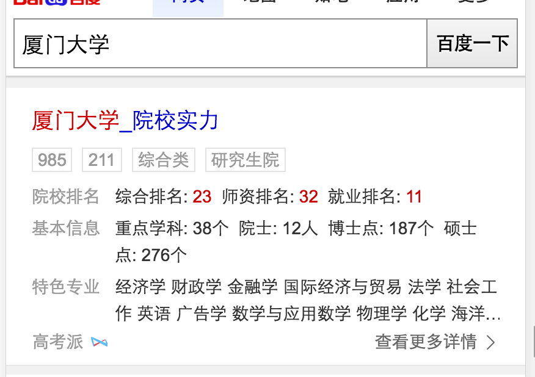
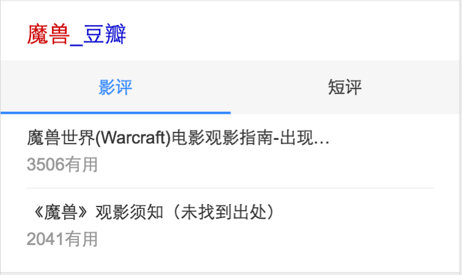

# 孟德丹
> 从2016-07-18到2016-07-22

## 哥伦布-教育-院校实力

### 背景

国内院校产品需求，新增实力信息展示，包括院校基本信息，实力排名，特色专业等。

### 完成情况

* 开发完成。PM对数据可能还需调整，后续先小流量，8.5前全流量上线
* 环境：<a href='https://wwwhttps.baidu.com/s?dev=1&dev_workspace=platform&dev_module=aladdin-wise&dev_tpl=college_strength&dev_path=searchaladdin&dev_tpltype=default&tn=iphone&sid=99999_102157&dev_online=1&wd=%E5%8E%A6%E9%97%A8%E5%A4%A7%E5%AD%A6&word=%E5%8E%A6%E9%97%A8%E5%A4%A7%E5%AD%A6'>厦门大学</a>

### 效果图

## 哥伦布-电影精准词

### 背景

线上精准电影名黑卡为早期sigma 1.0样式，不符合UE&FE规范，且产品样式陈旧，故升级线上样式，以哥伦布形式组织精准电影名相关需求，以期能够更好的满足用户需求，同时提升购票gmv。

### 完成情况

* 联调中
* 预计小流量上线：7.26
* 联调环境：<a href='http://cp01-bihao.epc.baidu.com:8003/s?word=%E6%83%8A%E5%A4%A9%E9%AD%94%E7%9B%97%E5%9B%A22'>惊天魔盗团2</a>

### 效果图

