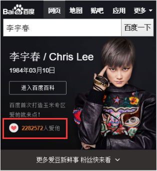
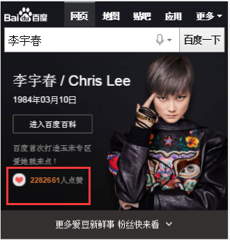
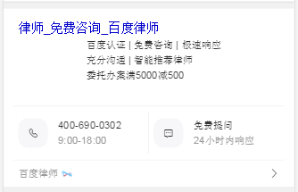
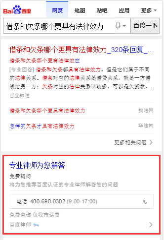

# 饶少艳

> 从2016-07-18号到2016-07-22

## 人物卡片文本描述修改

### 背景

sam_scene_person，person_info两个模板中 “多少人爱他”，“他”为固定的文本，其展示对女明星担心有一定影响，与王璐商定改为 “多少人点赞”。

### 完成情况

07.18上线。

* 方案：修改文本描述。

* 07.18 开发，测试，上线。

### 效果

query : 李宇春

改前：

改后

### PS

person_info修改部分未上线，目前3.0部分已下线，预计上线时同步上线。

## GMV项目：法律-连接人

### 背景

法律相关的搜索Query，展现百度律师咨询结果。

* 强需求：法律咨询、律师咨询、找律师等，默认插入第一条，参与点调

* 弱需求：离婚后孩子怎么判等问答需求，问答卡片位置后一位（哥伦布）。

### 完成情况

07.21 强弱需求都已完成联调，资源方百度律师在并入糯米后被要求关闭，上线进度暂停。

* 方案：强需求新建模板rota_life_counsel单独展现；弱需求用模板rota_life_tel以哥伦布形式展现。

* 07.12 需求提出。

* 07.15 今天已根据MRD完成大致开发，后续需要UE给出定稿继续开发。预计07.19 UE给出定稿。杨鹏达 更改MRD需求 预计7.15晚上给出UE图。

* 07.18 与云升 杨鹏达 核对法律卡需求 分为强需求、弱需求两种卡片，弱需求使用rota_life_tel模板。

* 07.19 强、弱需求schema数据都已确定，杨鹏达配置完成。

* 07.20 云升已配置好环境，等待UE定稿，预计明天7.21联调。

* 07.21 强弱需求完成联调，弱需求方面在讨论最终方案，资源方百度律师在并入糯米后被要求关闭，进度暂停。

### 目前效果

强需求（图片数据未定）：

弱需求（目前最新方案，UE与PM后续会继续讨论）：

## 人物杂志需求开发

### 背景

需求：哥伦布人物info卡片 转到 杂志界面，以哥伦布方式开发。

### 完成情况

07.22 开发中。

* 方案：预计采用SF2.0方式进行杂志界面调转，杂志界面以哥伦布形式展现。

* 07.19 PM刘悦提出需求，由溢麟产生SCHEMA数据，预计8月20前上线。

* 07.20 溢麟完成数据。

* 07.21 UE标注图确定，正在开发。

* 07.22 开发中。

