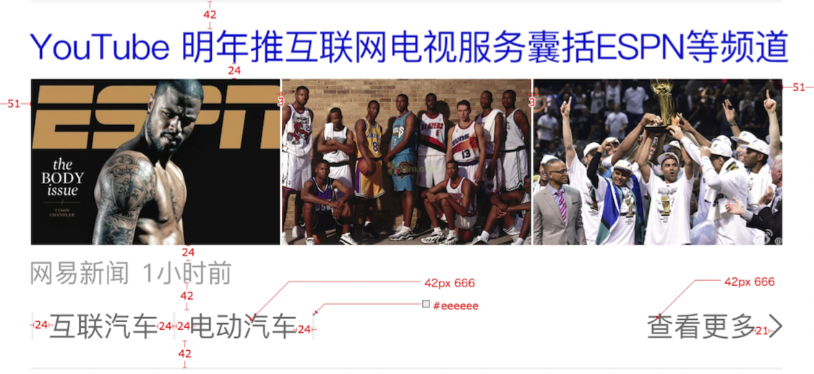
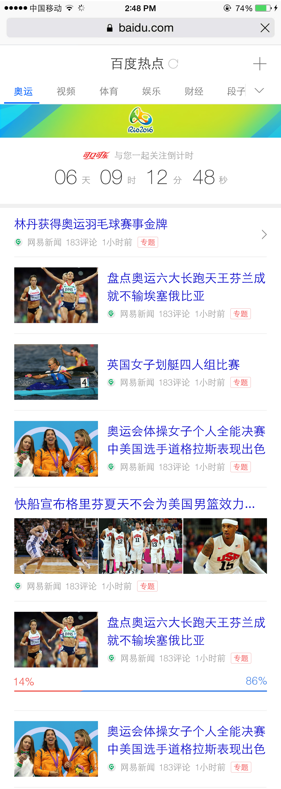
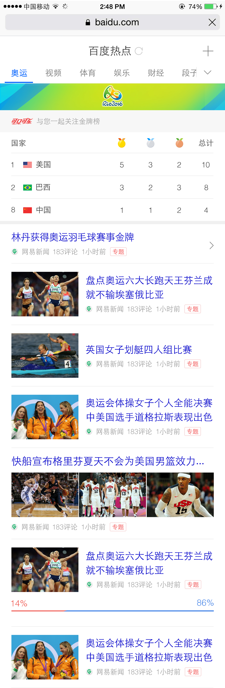

# 王培

> 从2016-07-11到2016-07-15

## 本周跟进

- 资讯
    - UE边距调整
    - 兴趣负反馈升级
    - 增加新闻标签
    - 增加新闻类型
    - 图集优化
    - 奥运频道建设
    - 时效性运营卡片升级
    - 运营卡增加奥运入口
- MIP
    - MIP 文档
    - MIP 组件开发
    - MIP 校验测试
 

## 资讯垂类

### 1. UE边距调整（已完成）

#### 背景与目标

    为提升用户体验，增加收益，Feed流根据新的UE设计进行样式升级，缩小上下边距，以及细节调整

#### 完成情况

- 进度：已经全量上线（07.12）

- 预览地址：http://m.baidu.com/s?word=%E7%99%BE%E5%BA%A6%E7%83%AD%E7%82%B9

### 2. 兴趣负反馈升级（无更新）

#### 背景与目标

    提升用户体验，让用户参与个性化推荐的算法，通过用户反馈发现：
     
     1. 新闻质量问题；
     2. 用户个性偏好

#### 完成情况

- 进度：delay

- 补充：上线依赖后端策略，需要策略开发完成才能联调，具体时间未确定

- 预览地址：暂无

#### 效果图

- 暂无

### 3. 增加新闻标签

#### 背景与目标

    增加新闻标签，便于用户筛选以及运营进行运营，
    
    已经上线的标签有
        - 专题
        - 推荐
 
    需要增加的标签有
        - 置顶
  		- 热点

#### 完成情况

- 进度：已上线

- 补充：小流量上线置顶和热点标签，推荐标签下线

- 预览地址：https://m.baidu.com/s?word=%E7%99%BE%E5%BA%A6%E7%83%AD%E7%82%B9&sid=107815

#### 效果图

- 暂无

### 4. 增加新闻类型

#### 背景与目标

    为配合运营需求，同时丰富首页样式多样性，提高层次感及丰富度，为其他频道导流

#### 完成情况

- 进度：已提测（7.22）

- 预览地址：http://cq01-ala-fe-1.epc.baidu.com:8003/s?word=%E7%99%BE%E5%BA%A6%E7%83%AD%E7%82%B9&sid=107913

#### 效果图

<table algin="center" >
<tr>
<td style="vertical-align:top">
    
</td>
</tr>
</table>

### 5. 图集功能优化

#### 背景与目标

    继续优化升级图集，提升用户体验
    
    升级点：
    - 文字滑动惯性效果
    - 图片缩放功能

#### 完成情况

- 进度：缩放功能开发中，已提测（7.21）

- 预览地址：https://m.baidu.com/from=0/s?word=%E7%99%BE%E5%BA%A6%E7%83%AD%E7%82%B9

#### 效果图

- 暂无

### 6. 奥运频道建设

#### 背景与目标

    资讯垂类下提供详尽的奥运资讯需求满足。
    满足新闻资讯、金牌榜等需求，提升资讯垂类对奥运的控制力。
    开赛前显示倒计时+feed流，开赛后显示金牌榜+feed流

#### 完成情况

- 进度：需求已确定，UE图已确认，开发中。

- 补充：【delay】依赖后端接口和奥运团队的数据，目前方案需要重新确认

- 预览地址：暂无

#### 效果图

<table algin="center" >
<tr>
<td style="vertical-align:top">
    
</td>
<td style="vertical-align:top">
    
</td>
</tr>
</table>

### 7. 时效性运营卡片升级（已完成）

#### 背景与目标

    去横滑

#### 完成情况

- 状态：测试完成，已上线（7.14）

#### 效果图

- 暂无

### 8. 运营卡增加奥运入口

#### 背景与目标

    运营卡增加奥运入口，达到导流作用

#### 完成情况

- 状态：开发完成，明天（7.22）提测

- 预览地址：https://wwwhttps.baidu.com/s?dev=1&dev_workspace=platform&dev_module=aladdin-wise&dev_tpl=wise_sf_news&dev_path=searchaladdin&dev_tpltype=default&tn=iphone&sid=99999&dev_online=1&wd=%E5%BC%A0%E8%89%BA%E5%85%B4%E8%87%B4%E6%95%AC%E5%A5%A5%E8%BF%90&word=%E5%BC%A0%E8%89%BA%E5%85%B4%E8%87%B4%E6%95%AC%E5%A5%A5%E8%BF%90

#### 效果图

<table algin="center" >
<tr>
<td style="vertical-align:top">
    
</td>
</tr>
</table>

## MIP

### 1. MIP 文档

#### 背景与目标
    
    为mip发版准备完善的文档
    
#### 完成情况

- 进度：多次梳理，已完成初版，但仍须多次迭代，今天完成更新（07.14）

#### 效果图

- 暂无

### 2. MIP 组件

#### 背景与目标
    
    mip框架组件开发，为7月发版做准备

#### 完成情况

- 进度：

    - mip-ad 7.22提测
    - mip-appdl 测试中
    - mip-video 组件，测试完bug修复，已转移传梼
    
#### 效果图

- 暂无
    
### 3. MIP 校验测试（无更新）

#### 背景与目标
    
    MIP 前端校验和后端校验测试

#### 完成情况

- 进度： 50错误case + 5 正确case已提供给spider RD和QA同学测试，同时完善前端校验代码
    
#### 效果图

- 暂无
