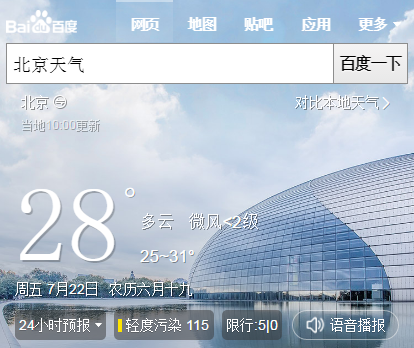
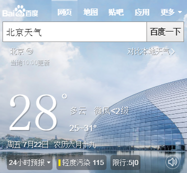

# 赵岐

>2016-07-18到2016-07-22    

## 哥伦布-民生-天气

### 背景
* 增加国内天气卡片的的语音播报按钮
* 国内天气卡片头图优化

### 完成情况
* 头图优化预计7-25联调
* 增加国内天气卡片语音播报按钮，预计7-22上线

### 效果
* 
* 

## 民生-快递
### 背景
* 快递卡片添加验证码
* 快递卡片title跳转和联动优化
### 完成情况
* 验证码功能于7-21上线，全流量，PV分别为：400w（express_delivery）和 70w（express_main_old）
* title跳转和联动优化已评审，7-25联调，预计7-27提测

