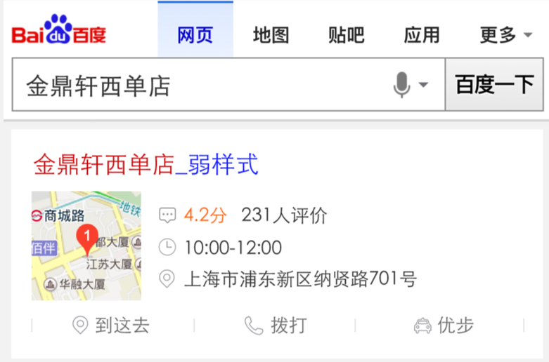
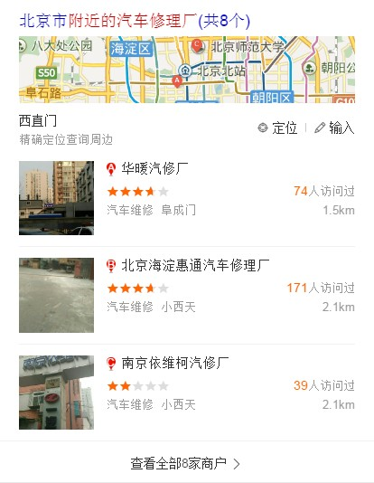
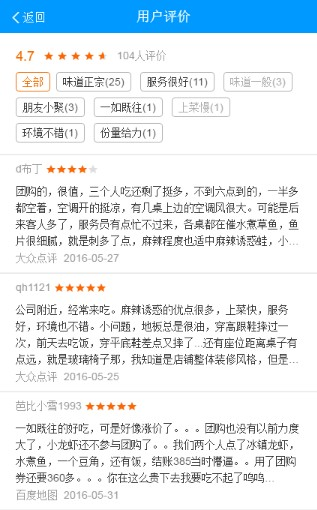
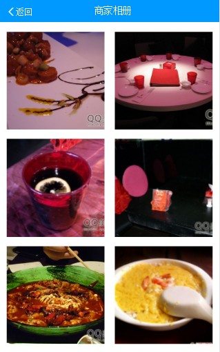

# 包楚权

> 从2016-07-25号到2016-07-29

## POI铺量开发（消费类）

### 背景

需求：地图阿拉丁模板杂乱且风格不统一，信息组织不够合理，基于位置的需求引导未得到很好满足；其中多POI共涉及11个模板，需要按照丰富详情、简单详情做简化和统一样式。

解决问题：
* 按照行业/功能维度统一、简化阿拉丁多poi模板数，消费类目根据用户需求给出更多的摘要信息，简单详情用统一模板呈现卡片，最终希望以更成熟、稳定的信息提升用户满足度；
* 使用superframe技术，提升交互流畅度；
* 整合地图基础信息和糯米消费服务，打造闭环消费体验。

影响面：多POI丰富详情类预估占17.3%的流量，日PV约600W+。

### 完成情况

4个A类卡片页面（单点强样式、单点弱样式、多点强样式、多点弱样式）开发完成，完成了A类2张卡片（多点强、弱样式）和B类页面的联调以及第一轮提测，目前正在修复一些提测反馈的BUG。四个A类卡片的样式如下图所示：

完成了POI评论详情页和POI图片详情页的迁移（迁移至sf2.0方案），预计下周二进行联调。效果图如下所示:

