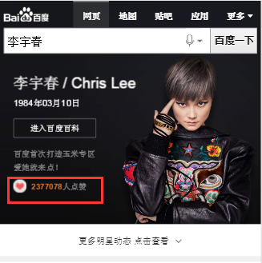

# 饶少艳

> 从2016-07-25号到2016-07-29

## 人物时尚杂志

### 背景

需求：粉丝哥伦布新增杂志合作模式，开设杂志情境页入口，建设杂志合作情景页，在贴吧发起杂志晒单活动，并在情境页中展现活动内容。

### 完成情况

页面开发完成，准备联调中。

* 方案：预计采用SF2.0方式进行杂志界面调转，杂志界面以哥伦布形式展现。

* 07.19 PM刘悦提出需求，由溢麟产生SCHEMA数据，预计08.20前上线。

* 07.20 溢麟完成数据。

* 07.21 UE标注图确定，正在开发。

* 07.22 开发中。

* 07.27 页面开发完成，杂志的数据最晚07.29可以到位。

## 明星榜单大全

### 背景

* 粉丝群体容易调动、愿意参与，对明星偶像的应援具有需求痛点；

* 对影响力的理解和评价来自于感性的认知，行业中缺乏对不同明星统一量化的评价方式。

* 预期影响面：（Query 30个，特型卡片Query 20个，PV 250w）。

### 完成情况

页面开发中。

* 方案：SF2.0情景页形式展示。

* 07.25 讨论评审方案；07.26 给出初步MRD文档，并确定如下排期。
	溢麟：本周内与百科、风云榜对接数据接口的开发需求，确认统一的数据接口格式，
周五（07.29）前初步完成百科、风云榜的数据接入；
	少艳：下周二（08.02）前初步开发完成可调用的数据环境。

* 07.28 所有页面UE稿确定，完成规则页的SCHEMA数据配置与页面开发。

## 娱乐人物阿拉丁卡片摘要前置需求

### 背景

1.百科阿拉丁在“XX个人资料”query下点击率近50%，百科平均位置1.03，是明确的强需求。

2.与竞品对比，当前百科卡片在搜索结果页给用户提供的内容较少。

3.经调研，人物关系、代表作品等，是“XX个人资料”类query的潜在需求。

### 完成情况

* 方案：由溢麟做好odp的数据适配，前端开发直接在现有百科模板上修改。

* 07.27 MRD文档与UE稿确定。

* 07.28 与溢麟讨论，正在确认相关数据技术方案中。

* 07.29 确认技术方案：由溢麟做好odp的数据适配并提供数据控制开关，前端开发直接在现有百科模板上修改。

## 人物卡片文本描述修改

### 背景

上周（07.18）提出的文本描述修改

	> sam_scene_person，person_info两个模板中 “多少人爱他”，“他”为固定的文本，其展示对女明星担心有一定影响，与王璐商定改为 “多少人点赞”。
 
由于上周人物卡片哥伦布3.0版本下线，person_info的修改未上线，本周07.27人物卡片哥伦布3.0版本全量上线，因此person_info的修改需要同步上线

### 完成情况

07.28上线。

* 方案：修改文本描述。

* 已于07.18修改完成。

* 07.28 测试，上线。

### 效果

query : 李宇春

