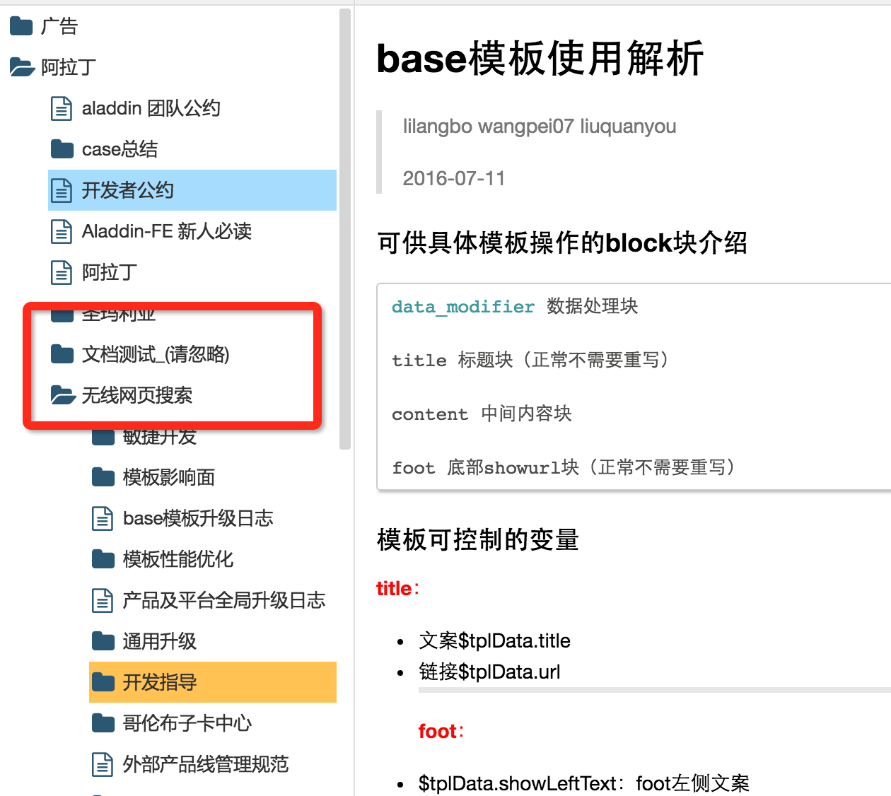
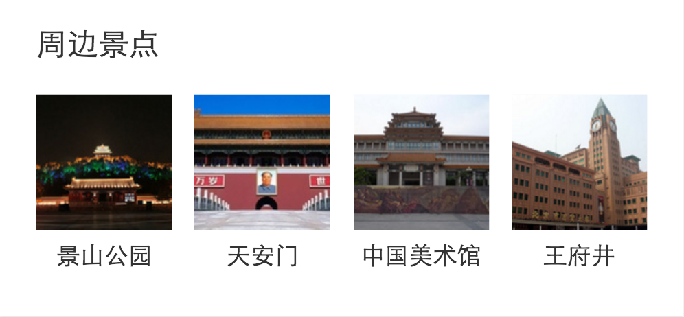

# 司文宇

> 从2016-07-25到2016-07-29

## 文档整理
	
泉有和林哥在脑图中画出了新的文档结构，按照他给的结构整理了一个文件夹，在如图（测试）.

* 文档的重要性不言而喻，现在的文档功能很强大，涵盖了开发中新人老人所需要的几乎所有信息.
* 但是现在的文档结构有少许不清晰：文件名不准确，文件名有重复，词语表达有误，文档内容重复，文档维护不够及时，文档更改告知开发者途径，文档结构归类有待调整，不同部门维护文档方法不同，看了其他部门文档容易引起误会等。

## 行程情景页

### 进展情况

* 开发完成，联调部分完成；
* 情景页吊起连接没有，现在用的是假数据和假连接；
* 下周计划：林哥说可以线上，预计下周一，二上线
	
### 效果图

	

## 周边景点迭代

### 项目背景
1. 添加横滑效果
2. 代码时间太久，很多不符合规范。

### 图片预览

	

	

## 项目中遇到的问题
	
1. around上线过程中，Qa测试出很多问题，比如：ios点击list跳转，返回时会回到顶部；uc浏览器，QQ浏览器点击跳转，返回时会闪回第一分页，再回到第二分页，闪现;询问老人发现，这些问题本来就存在，baiduId缺少。
2. 查看线上的模板时发现，线上的模板也是这样的。想想应该是框架就是这样的，但是当初ue可是认真的说，这个要居中对齐，顶端对齐。
3. 开发平台部分功能不完善，比如card无法添加添加资源id预览。
4. 一定要合理预期自己的工作内容，合理安排排期，周四下午3点半给的口头需求，要周五上线，当时硬着头皮接下来，五点联系QA，周五发现了几个bug，修改了一部分但是还是没来得急周五上线，不太好，第一次在这边上线，我应该好好排期的。结果周报也被忧总批评了，很难过。

