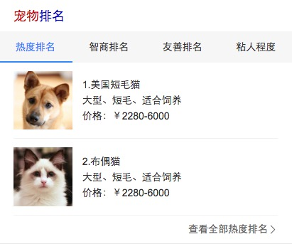

# 常健驰

> 从2016-7-25到2016-7-29

## 哥伦布-Wise宠物泛需求

### 背景与目标

#### 背景与目标：
为满足用户在搜索端搜索宠物相关query的搜索结果需求，以及在提升搜索体验的同时进行隐藏需求的激发验证。

### 收益

    宠物泛需求预期有点提升，媒体时长增加，提升整体泛需求相关query的用户体验

    预估收益pv：12w/day

### 完成情况

人工评估ing…… [宠物大全](http://cp01-ala-fe-5.epc.baidu.com:8003/s?word=%E5%AE%A0%E7%89%A9&ts=3520229&t_kt=0&rsv_iqid=10595074176072590228&sa=ib&rsv_sug4=1900&ss=101&inputT=875) [宠物排名](http://cp01-ala-fe-5.epc.baidu.com:8003/s?word=%E7%8B%97&sid=108012&wiseus=10.195.230.23)

## 效果截图

### 宠物排名效果截图

### 扫描二维码

### 宠物大全效果截图

### 扫描二维码

## 权威专家问答卡片

### 背景与目标

目前关于化验指标类需求的满足主要是医疗站点的问答资源和百科结果，医疗站内的问答对资源规范度不够高，权威度和可信度待审核；百科结果中文字描述冗长，且权威度不高。本项目联合有专业医生团队的医疗站共同建设权威度和可信度高的优质结构化数据库，并且通过给出化验指标异常对应的常见的疾病数据深度满足用户需求。

### 收益

    预估收益pv：30w/day

### 完成情况

模板暂用假数据，7.28下午完成开发，7.29准备跟ue确定样式，后续联调时间需要看后端数据什么时候ready

### 效果截图

### 扫描二维码

## 修改模板

* 用户信息泄露模板已修改 - 7.29上线

## 后续排期

* 暂无
