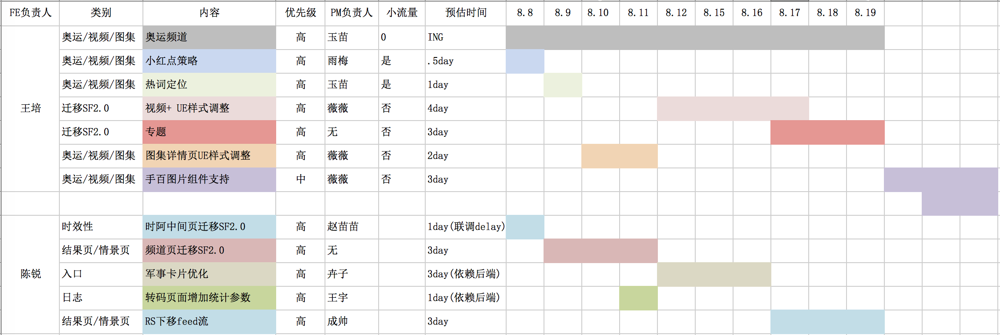
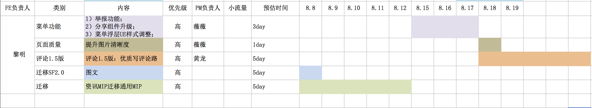

# 资讯垂类

> 从 2016-07-11 到2016-08-05

## 业务背景

```
哥伦布（Columbus）项目，是大搜索在2016年的重点创新大方向。资讯垂类作为哥伦布的一级垂类，针对新闻资讯领域，致力为搜索用户打造沉浸式浏览体验，建设搜索新生态。

```

## 人员

```
- FE: 陈锐，王培，肖广，范黎明
- RD: 唐颋，王明，韩旭，王聪，李国胜，陈海超，柳少锋
- PM: 乔芳，刘成帅，张慧，刘玉苗，戚薇薇，饶俞卉子，王宇，黄龙，李念觉，徐丽娜，张涛，杨康，烟纪阳，田子玉
```

## 需求安排

- 【结果页/情景页】陈锐，王培

<table>
    <tr>
        <td>
            
        </td>
    </tr>
</table>

- 【商业化/详情页】肖广，范黎明

<table>
    <tr>
        <td>
            
        </td>
    </tr>
</table>

## 收益

```
- 在业界首创了搜索资讯浏览的产品形态，极大的提升了用户需求满足度
- 完成了搜索结果从单一query的需求阅读到泛阅读的用户需求满足的重要转型
- 哥伦布产品垂类新产品新体验尝试的先驱
```

##### 核心指标贡献（pv）

- 搜索用户没提时长有所增长(30s->48s)
- 详情页+情景页：0s->300s
- 提升搜索媒体时长(增加1s)

##### 搜索相关指标（天）

- 影响 PV: 6000w
- 分发量: 4200w
- 情景页分发: 1300w

##### 资讯垂类指标（pv）

- feed进入率 0->5%
- feed点击率 0->400%

## 重点进度

### 结果页/情景页

#### 1. 图集功能优化（@王培）

- 进度：全部功能已经增加，测试完，bug修复中，预计（8.8上线）

- 预览地址：http://cq01-ala-fe-1.epc.baidu.com:8003/s?word=%E7%99%BE%E5%BA%A6%E7%83%AD%E7%82%B9

#### 2. 奥运频道建设（@王培）

- 进度：已上线0流量（8.2）

- 补充：

    - 数据分个性化（来自推荐系统）
    - 非个性化（来自在线数据）

- 容错：资源添加开关，出现情况更新资源关闭奥运频道

- 预览地址：https://m.baidu.com/s?word=%E7%99%BE%E5%BA%A6%E7%83%AD%E7%82%B9&sid=108086

#### 3. 视频日志数据修复（@王培）

- 状态：已上线（8.3）

- 预览地址：暂无

#### 4. SF2.0迁移（@王培）

- 状态：图集开发中，视频、专题待开发

- 预览地址：暂无

#### 5. 百度热点改造（@陈锐）

- 状态：因遗留日志问题delay 今天（8.5）上线0流量

- 预览地址：http://cp01-sys-rath4-c32-qa270.cp01.baidu.com:8003/s?dev=1&dev_workspace=platform&dev_module=aladdin-wise&dev_tpl=wise_hot_news&dev_path=searchaladdin&dev_tpltype=default&sid=99999&dev_online=1&wd=%E7%99%BE%E5%BA%A6%E7%83%AD%E7%82%B92&word=%E7%99%BE%E5%BA%A6%E7%83%AD%E7%82%B92&wiseus=10.46.134.231

#### 6. 兼容结果页异步预取（@陈锐） 

- 状态：今天（8.5）开发完成

#### 7. 迁移时啊中间页（@陈锐）

- 状态：依赖后端配置 delay 下周一（8.8）完成开发

### 商业化/详情页

#### 1. 图文详情页迁移 SF2.0（@黎明）

- 状态：前端开发已完成，下周一（8.8）提测

- 预览地址：

#### 2. 收藏功能（@黎明）

- 状态：已上线（8.1）

- 预览地址：https://m.baidu.com/s?word=%E7%99%BE%E5%BA%A6%E7%83%AD%E7%82%B9&ts=1444555

#### 3. 动态tag（@黎明）

- 状态：前端已上线（8.4）

- 预览地址： 暂无

#### 4. 手百右滑手势（@黎明）

- 状态：已上线（8.2）

- 预览地址：https://m.baidu.com/s?word=%E7%99%BE%E5%BA%A6%E7%83%AD%E7%82%B9&ts=1444555

#### 5. 图文详情页 UE 样式调整（@黎明）

- 状态：已上线（8.2）

- 预览地址：https://m.baidu.com/s?word=%E7%99%BE%E5%BA%A6%E7%83%AD%E7%82%B9&ts=1444555

#### 6. 第三方资源迁移新资讯MIP兼容问题修复（@肖广）

- 状态：

- 预览地址：暂无

#### 7. 详情页性能优化（@肖广）

- 状态：今天（8.5）上线

- 预览地址：暂无

#### 8. 性能指标细化（@肖广）

- 状态：开发中，下周三（8.10）完成开发

- 预览地址：暂无

#### 9. feed流预取（@肖广）

- 状态：开发中

- 预览地址：暂无

## 后续计划

- 在突发时效性方面，我们已经覆盖了风云榜热词，下一步是时阿自动出卡代替运营卡，可以扩大影响面

- 在横向上，会和千岛湖合作，在搜索整体范围内做内容激发，这个影响面会非常大

## 问题总结

- 暂无
