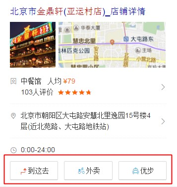
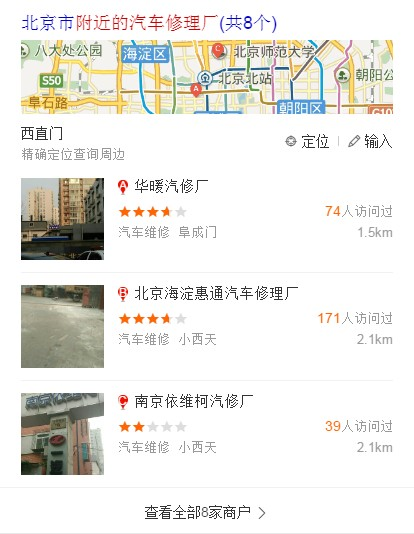
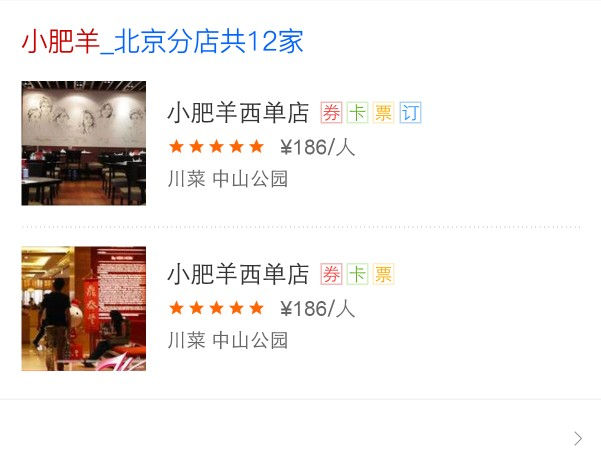
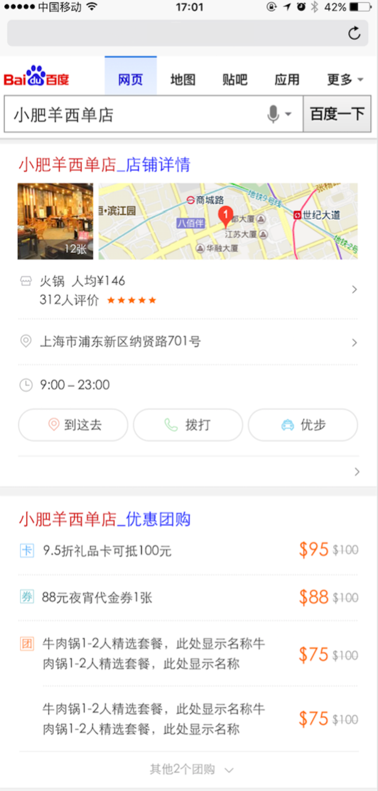
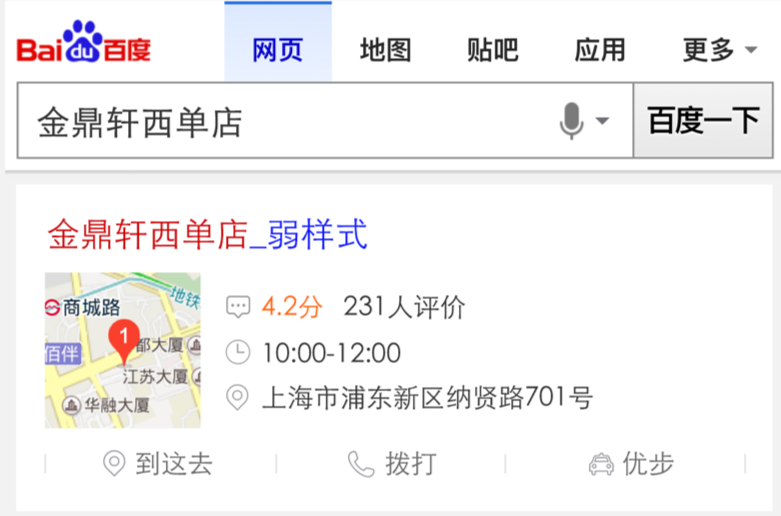
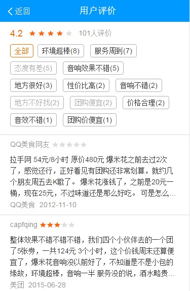
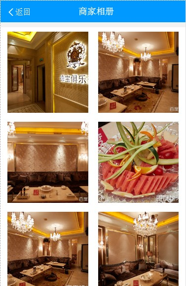
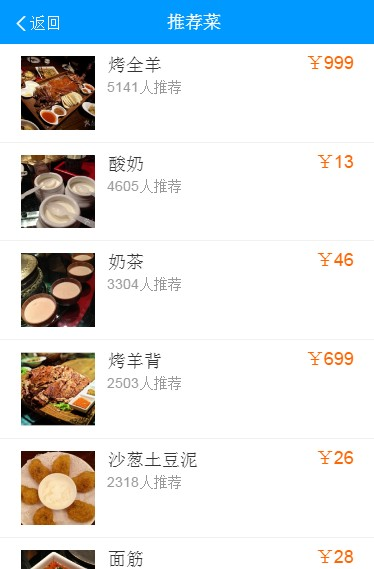

# 包楚权

> 从 2016-08-02到 2016-08-05

## 餐饮卡片代码优化

### 背景与目标

- query："金鼎轩亚运村店"
- 模板：poi_restaruant

### 完成情况

- 修改卡片底部按钮工具的实现逻辑，保持原有优先级原则，修改后减少了约100行代码
- 修改原有代码，使其符合代码规范
- 目前卡片及其相关静态资源已经上线

### 效果截图

## POI铺量开发(消费类)

### 背景与目标
- 按照行业/功能维度统一、简化阿拉丁多poi模板数，消费类目根据用户需求给出更多的摘要信息，简单详情用统一模板呈现卡片，最终希望以更成熟、稳定的信息提升用户满足度；
- 使用superframe技术，提升交互流畅度；
- 整合地图基础信息和糯米消费服务，打造闭环消费体验；

### 完成情况
- 周一完成A类、B类页面的联调以及提测；
- 周二修复QA提出BUG；
- 周三完成A类、B类卡片对sf2.0兼容方案迁移模板(评论详情页、图片详情页)的调起；
- 周四完成推荐菜卡片的迁移以及调起，并修复PM验收发现的bug，以及提测；
- 修复QA反馈的bug

下周PM李正波走三级单，预计周三上线。

### 效果截图
- query
	- 休闲娱乐：附近KTV，钱柜ktv，七九八艺术区，崇礼滑雪场；
	- 运动健身： 附近的羽毛球馆，附近的健身房，附近的瑜伽馆，
	- 医疗：附近的医院，河北省人民医院；
	- 景点：附近的景点，颐和园地址；
	- 丽人：美甲店，艺人美场美甲
	- 汽车服务：附近的汽车修理厂，月福汽车装饰(百旺店)
	- 美食：附近的美食，海底捞西单店；
	- 购物：购物中心，五彩城购物中心；
	- 其他：
		- 附近的酒吧，偶遇酒吧交道口
		- 附近的网吧，翼飞扬网络会所；
		- 附近的李宁专卖店，李宁(北京百望商城店)

- A类多点强样式、多点弱样式、单点强样式、单点弱样式 

- 评论详情页、图片详情页、推荐菜详情页 

### 后续
走完三级单即可上线，预计下周三上线。