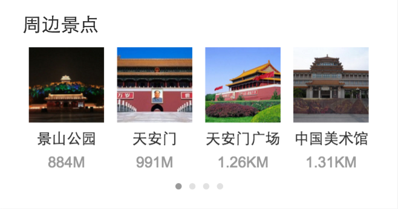
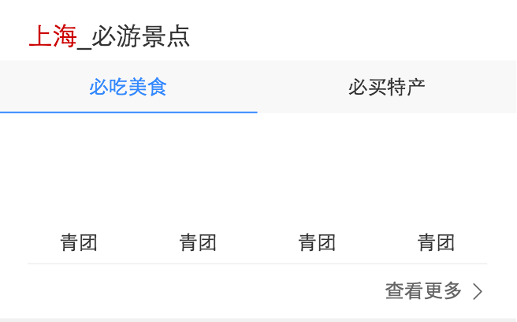

# 司文宇

> 从2016-08-01到2016-08-05

## card ：around 景点周边景点

### 背景

情景页2.0卡片，样式有原来的横排四个item，变成翻页横滑，显示2-16个item。

### 项目进度

添加字段等两次迭代，已分别上线。

### 项目截图

### 后续计划

暂无。

## card ：route 景点行程路线

### 背景

情景页2.0卡片，路线推荐。

### 项目进度

几次修改，相关跳转情景页链接暂无，已提测。

### 后续计划

链接生成，可上线。

## wise 当地特色

### 背景

原来两张卡片必吃美食和必买特产合并为一个tab卡片。

### 项目进度

假数据代码开发完成，但是由于跳转情景页和大搜等原因hold。

### 项目截图

### 后续计划

等pm。

## crCode

### 卡片

wa_xueshu_danpian;vd_list

### 问题列表

* 代码升级：数据结构，转码。
* css栅格不规范
* 资源问题造成的显示bug
* 栅格组合写出想要的样式
* 慎重重置栅格样式
* width:，方法的使用
* 图片懒加载使用：隐藏的texterea标签使用。
* 中cuttype的使用
* https和http
* js插入HTML代码格式
* 注释

### 别人cr

* 图片居中css3取代传统元素一半居中.
* 使用
* 加载组件时间的考虑：用户体验，用户使用概率，组件加载时间，组件响应过程优化。
