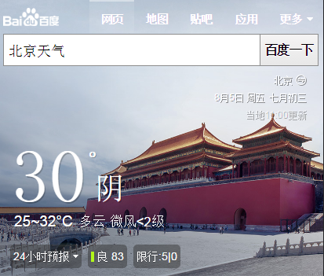
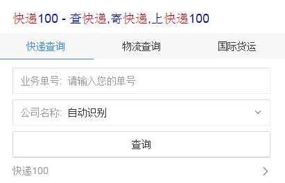
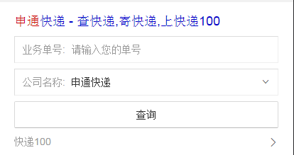

# 赵岐

> 从 2016-08-01到 2016-08-05    

## 哥伦布-民生-天气

### 背景

天气头图样式的优化

### 完成情况

开发完成，8.4上线
### 效果

## 哥伦布-民生-快递

### 背景    
【4155查询卡片】  
优化查询后title和子链跳转       
title跳转到快递100对应落地页，数据来源跳转到快递100首页    
用户选择其他公司时候，title和子链跟随联动      
【4001&4004】    
优化查询后title和子链跳转    
修复query“快递”，查询后下拉框位置显示为空的bug    
用户选择其他公司时候，title和子链跟随联动    
增加历史记录保存功能     
       
开始介入快递单号&寻址类情景页优化需求：    
* 快递小工具    
* 运费时效card，    
* 网点查询card，    
* 在线寄件card，   
* 寄件地址card，   
* 增加“到这去”“拨打”两个button共存的样式   
* 增加输入功能

### 完成情况

开发完成，8.4上线    
快递单号&寻址类情景页优化需求：预计8.16联调，8.19上线

### 效果

