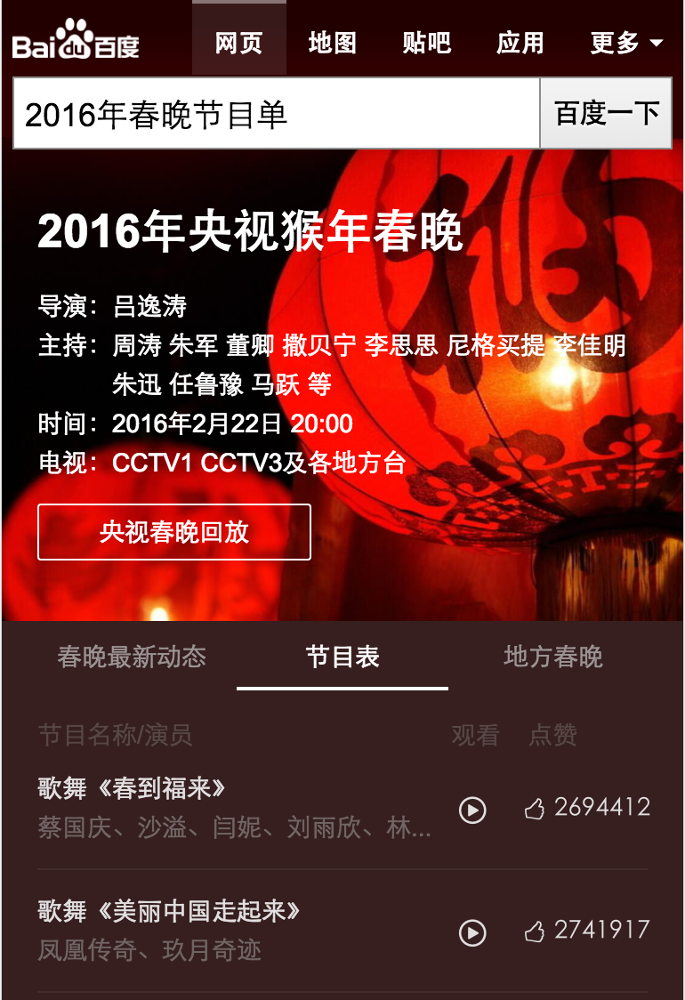
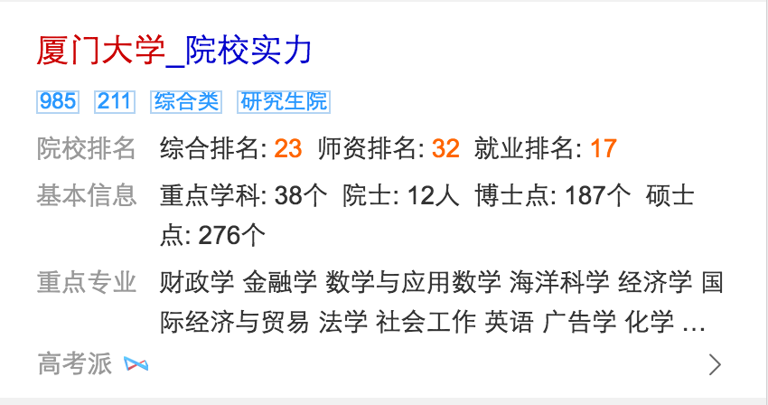

# 孟德丹
> 从2016-08-08 到2016-08-12

## sigma模板迁移

### 背景

 wise_chunwan模板从sigma1.0迁移到最新版

### 完成情况

* 预计8.17完成迁移并提测

### 效果图

## 哥伦布-教育-院校实力

### 背景

通过分析用户历史行为(搜索query及行为分析）发现，用户搜索院校query需求时，对院校排名、是否985/211、院校办学层次(本科or专科)、办学性质(公办or民办)、特色专业等院校信息有较强需求。新增卡片，引入较权威教育网站资源，快速摘要满足用户对院校结构化信息需求，优化基础体验。

### 完成情况

*已经全流量上线
* <a href="https://m.baidu.com/s?word=%E5%8E%A6%E9%97%A8%E5%A4%A7%E5%AD%A6&sid=107821">厦门大学</a>

### 效果图

## 哥伦布-电影精准词

### 背景

线上精准电影名黑卡为早期sigma 1.0样式，不符合UE&FE规范，且产品样式陈旧，故升级线上样式，以哥伦布形式组织精准电影名相关需求，以期能够更好的满足用户需求，同时提升购票gmv。

### 完成情况

* 小流量中：实验抽20%流量 24w左右
* 测试环境：<a href='https://m.baidu.com/s?word=%E7%88%B1%E5%AE%A0%E5%A4%A7%E6%9C%BA%E5%AF%86&sid=108259'>爱宠大机密</a>

### 效果图

