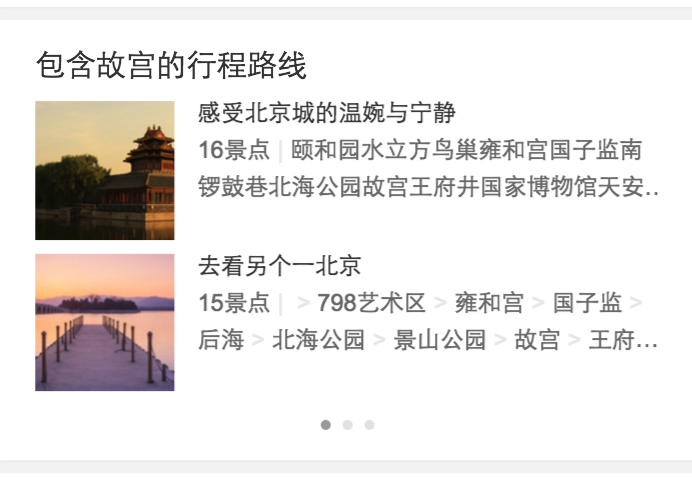
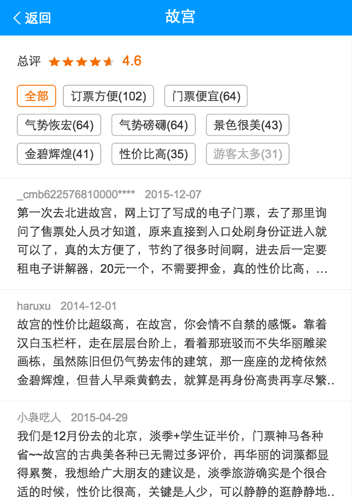
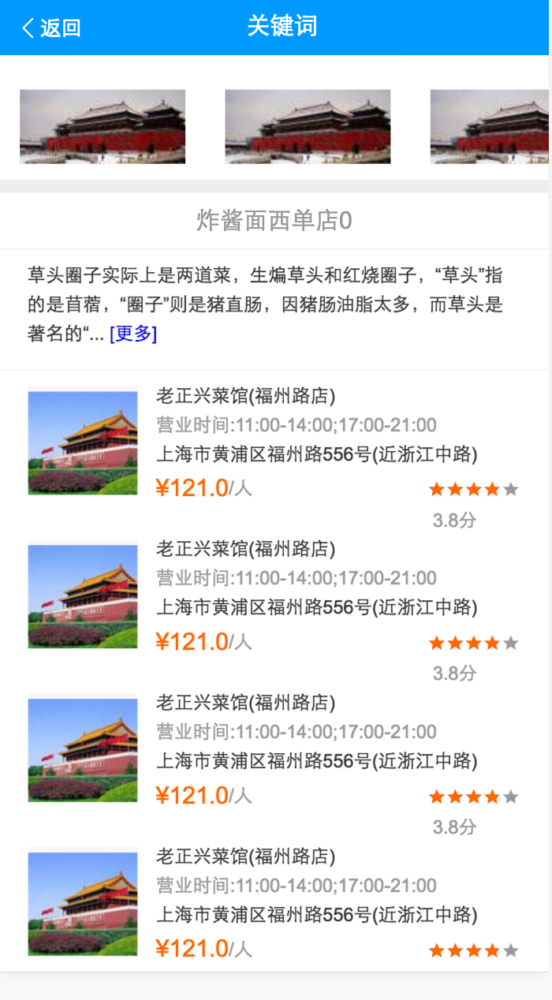

# 司文宇
> 从2016-08-08 到2016-08-12

## card开发：景点行程路线
### 项目背景
上周开发，联调，测试完毕，依赖泉有的链接页面周一上线。
### 项目进度
周二已上线
### 后续
暂无

### 项目截图

## card迭代：评论情景页
### 项目背景
日志添加，原来的SF_LOG_BTN改为WA_LOG_BTN,WA_LOG_OTHER.
### 项目进度
周三已上线
### 后续
暂无
### 项目截图

## 城市改版项目计划
### 项目背景
wiki地址：[http://wiki.baidu.com/pages/viewpage.action?pageId=204667813](http://wiki.baidu.com/pages/viewpage.action?pageId=204667813)
本次城市改版开发量可以分为三部分：结果页卡片，新做card卡，SF1.0的迁移.
### 具体：
* 行程规划卡--开发1天，联调0.5天
* 问答列表情景页--开发1天，联调0.5天（08-11完成）
* 相关问答卡--开发1天，联调0.5天
* 美食情景页--开发1天，联调1天
* 特价路线卡--开发1天，联调0.5天（08-18完成）
* 住宿攻略卡（新数据）--开发1天，联调1天（08-22完成）

### 具体进展：
1 . 行程规划卡：开发完成待联调
#### 项目截图

2 . 问答列表情景页：未开发，1.0迁移，排期尽量往后
3 . 相关问答卡：未开发
4 . 美食情景页：开发中
#### 项目截图

5 . 特价路线卡:开发完成，待联调
#### 项目截图

6 . 住宿攻略卡:开发完成，待联调
#### 项目截图

#### 项目思考

* 情景页命名不规范，之前的ABC情景页规范没有实行，现在取名字很乱。之前的A指结果页，入口进去是情景页B，之后是情景页C；但现在还有一种说法是结果页入口进去的是情景页A，本来可以以ABC这样标识命名卡片，但现在不统一，只怕之后会乱。

## 整理城市景点的卡片样式
* 景点卡片大部分已经下线，平台无法预览，线上无法召回，只有一个mini生效，wiki记录没有标识。
* 城市卡片现已全部实现卡片样式复用。
* 结果页和情景页卡片无法复用。