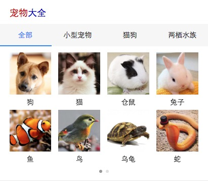

# 常健驰

> 从2016-8-8到2016-8-12

## 哥伦布-Wise宠物泛需求

### 背景与目标

#### 背景与目标：
为满足用户在搜索端搜索宠物相关query的搜索结果需求，以及在提升搜索体验的同时进行隐藏需求的激发验证。

### 收益

    宠物泛需求预期有点提升，媒体时长增加，提升整体泛需求相关query的用户体验

    预估收益pv：12w/day

### 完成情况

`8月12日`模板已上线 [宠物大全](http://cp01-ala-fe-5.epc.baidu.com:8003/s?word=%E5%AE%A0%E7%89%A9&wiseus=10.94.85.51) [宠物排名](http://cp01-ala-fe-5.epc.baidu.com:8003/s?word=%E7%8B%97&sid=108012&wiseus=10.195.230.23)

## 效果截图

### 宠物排名效果截图

### 扫描二维码

### 宠物大全效果截图

### 扫描二维码

## 修改模板

* 宠物选购和宠物百科模板增加底部来源 - 暂无上线

* [整理case总结文档](http://ala-fe.baidu.com/demandspace/case.md)

## 后续排期

* 暂无
