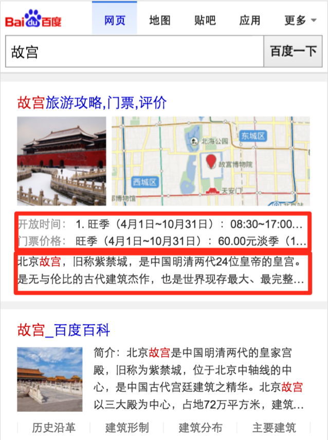
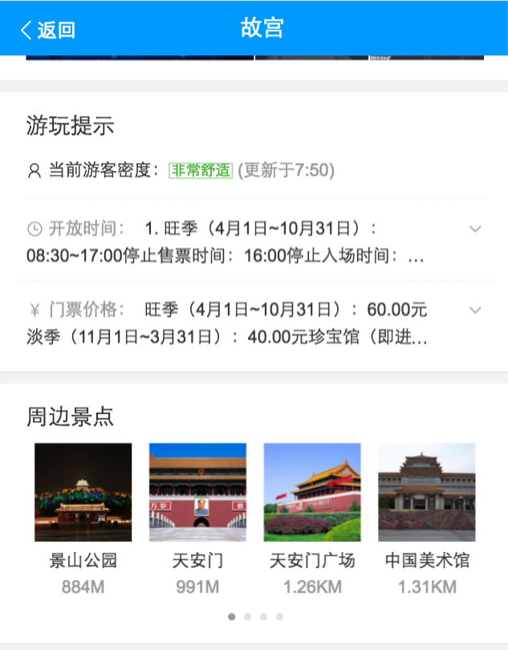

# 张屾

> 从 2016-08-09到 2016-08-12

## 旅游攻略唤起提示情景页根据点击位置自动定位

### 背景与目标

- query：“故宫"
- 模板：jd_mini, prompt

针对旅游攻略的搜索结果（小流量sid=108079）点击门票价格等位置需要自动定位到唤起的情景页相应卡片位置.

### 完成情况

- 完成开发, 自测, 并于本周三（8.10)上线

### 效果截图



### 遗留问题解决方案

> 将两个连接分开, 特定连接进入情景页调用scrollTo后浏览器不会记录滚动位置, 
> 第二次进入则失效. sf2.0 貌似没有提供每次唤起的onshow这样的事件绑定

```
    
         
    {%fe_fn_c_sflink_prefix class="c-blocka c-color" attr= url=$sf_jump_url%}
```

通过以上方式在smarty中给sf传递配置参数
  
## 旅游攻略去掉三个短连接提升点击率

### 背景与目标

- query：“故宫"
- 模板：jd_mini

针对旅游攻略的搜索结果（小流量sid=108079）去掉门票价格区域上面的三个约占60px高度的短连接.

### 完成情况

- 完成开发, 自测, 并于本周二（8.9)上线  