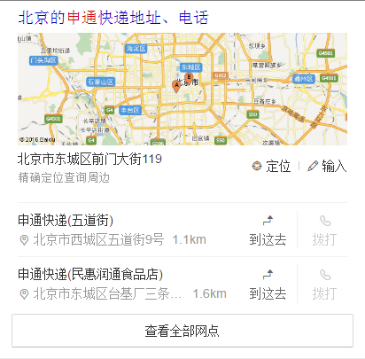

# 赵岐

> 从 2016-08-08到 2016-08-12    

## 哥伦布-民生-快递

### 背景    
对单号查询和寻址需求用户，为用户推出快递小工具功能，构建可控二级情景页。
       

### 完成情况    
* 完成快递小工具卡片开发完成，8.16联调
* 运费时效card，正在开发   
* 网点查询card，正在开发
* 在线寄件card，正在开发
* 寄件地址card，正在开发
* 快递地图卡片
	* 增加“到这去”“拨打”两个button共存的样式，开发完成，8.16联调  
	* 增加输入功能，开发完成，8.16联调

### 效果

