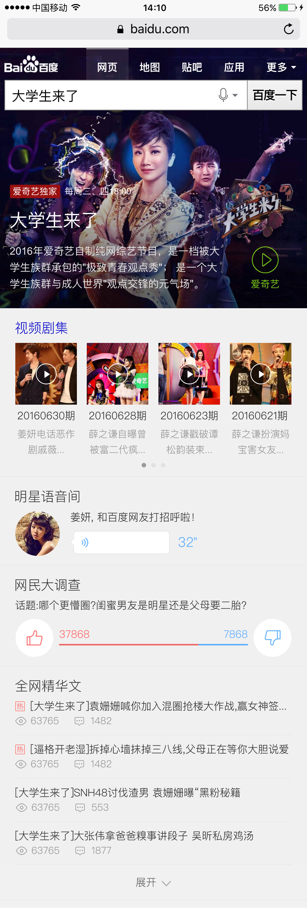

# 产品周报

> 2016年8月15日~2016年8月19日

### 成员

<<<<<<< HEAD
	李晓,赵岐,德丹,晓卉,黄睿,姿艳,健驰,阳阳,鹏远
=======
	李晓,赵岐,德丹,晓卉,黄睿,姿艳,健驰,鹏远,阳阳
>>>>>>> c674b221a2c242b3c2384d0c79ac0008c65b5671

### 需求安排

	* 体育(1)：阳阳
	* 游戏(1)：鹏远
	* 医疗(2)：健驰，德丹
	* 自有产品(1)：姿艳
	* 车系(0.5-1)
	* 房产
	* 飞鸽民生(1-2)：客服、宠物、计算工具、短文本
	* 教育(2)：晓卉，黄睿

### 进度

#### 民生-笑话（晓卉）
* 背景:提升笑话模板数据质量。升级UI样式及模板。提升阅读体验。提升媒体时长
* 完成情况:测试完成待上线,走单中~预计8月19号上线。(开发：8.04-8.08，联调：8.10-8.11。提测：8.16。预计8.12。因数据问题提测delay。)
* 收益：暂无
* 效果图

#### 民生-sigma 1.0模板迁移2.0-颜色模板（晓卉）
* 背景:颜色模板从sigma1.0迁移到最新版
* 完成情况:开发中。开发：8.19。
* 收益：暂无
* 效果图

#### 哥伦布-民生-快递（赵岐）
* 背景:对单号查询和寻址需求用户，为用户推出快递小工具功能，构建可控二级情景页。
* 完成情况:

	* 完成快递小工具卡片开发完成，8.22联调
	* 运费时效card，正在开发   
	* 网点查询card，正在开发
	* 在线寄件card，正在开发
	* 寄件地址card，正在开发
	* 快递地图卡片
		* 增加“到这去”“拨打”两个button共存的样式，开发完成，8.22联调  
		* 增加输入功能，开发完成，8.22联调

* 收益：暂无
* 效果图

#### 哥伦布-民生-快递(赵岐)
* 背景:按照规范，对现有的官网卡片，地图卡片进行foot样式修改
* 完成情况:官网卡片开发完成，联调完成，预计8.19上线
* 收益：暂无
* 效果图

#### 哥伦布-民生-天气（赵岐）
* 背景:小流量头图优化转全量，添加语音播报按钮
* 完成情况:开发完成，联调完成，测试完成，预计8.19上线
* 收益：暂无
* 效果图

#### 哥伦布-民生-天气老卡(李晓)
* 背景:线上500万小城市天气模板为老的sigma1.0机制，为升级开发方式和效率迁移为sigma2.0.
* 完成情况:8.17-8.23模板开发+联调，8.24号pm确认效果+QA介入测试
* 收益：暂无
* 效果图

#### 哥伦布-民生- 天气相关模板情景页迁移sf2.0（李晓）
* 背景:为升级开发方式和效率，天气模板原有情景页到sf2.0
* 完成情况:预计08.25号介入

#### 哥伦布-民生-500W天气优化方案（李晓）
* 背景:为了深度优化用户搜索天气类query需求，对天气主需求，5天预报及今日生活指数进行
* 完成情况:08.19号需求评审

#### 哥伦布-民生-天气泛需求（全国天气和全省天气）（李晓）
* 背景:用户不仅对于某个城市/景点有天气查询需求（当前天气覆盖卡片），用户还有搜索类似q=”全国天气”以及各省天气的需求(PV每天约8W)，而当前搜索结果页未有特型结果覆盖，用户对天气泛需求查询并未得到很好的满足。
* 完成情况:08.16号初步评审，ue已定稿，跟pm确认降低优先级为9月初介入开发
* 收益：暂无
* 效果图

#### 影视-影视宣发卡黑转白、sigma升级（健驰）
* 背景:影视宣发卡黑转白、sigma升级
* 完成情况:预计`8月19日`调完，然后跟`丁朝阳-rd`联调 [宠物大全](http://cp01-ala-fe-5.epc.baidu.com:8003/s?word=%E5%A4%A7%E5%AD%A6%E7%94%9F%E6%9D%A5%E4%BA%86&wiseus=10.36.170.13)
* 收益：暂无
* 效果图

	
#### 影视-电影-精准影院卡（黄睿）
* 背景:线上精准影院卡为早期sigma1.0机制，现优化该卡片样式由黑卡转为白卡，同时增加美食推荐子卡，预期提升用户体验，增加GMV。
* 完成情况:开发排期延迟至24号，延迟原因mini资源无相关schema，故数据接口需靠线上已有模板重新梳理。另外复用已上线资源需迁移php预处理文件额外工作量。
* 收益：暂无
* 效果图

#### 影视-电影精准词(无更新)（德丹）
* 背景:线上精准电影名黑卡为早期sigma 1.0样式，不符合UE&FE规范，且产品样式陈旧，故升级线上样式，以哥伦布形式组织精准电影名相关需求，以期能够更好的满足用户需求，同时提升购票gmv。
* 完成情况:
	* 小流量中：实验抽20%流量 24w左右
	* 测试环境：<a href='https://m.baidu.com/s?word=%E7%88%B1%E5%AE%A0%E5%A4%A7%E6%9C%BA%E5%AF%86&sid=108259'>爱宠大机密</a>
* 收益：暂无
* 效果图

#### 自有产品-图片搜索优化-大图页（姿艳）
* 背景:C类页面的建设，是之前沉浸式实验的延续，希望能够给到用户A-B-C三个页面的完整、刘畅的体验，做一次完整的沉浸式实验。
 大搜C类页面通过SuperFrame2.0实的，对比跳转图搜可以提升页面的加载速度，优化用户的浏览体验。
* 完成情况:
	- 模板样式已基本开发完。
	- 大图页、识图、相似图片接口需要图搜给出。图搜辗转多位RD，周四由杨松接手，周五与PM和大搜RD寇晓辉一起开会拟订数据结构。
* 收益：暂无
* 效果图

大图页设计图

大图页浮层效果图

* 后续：先上抽样，正收益后上全量。

#### 自有产品-外卖阿拉丁（阳阳）
* 背景:预期用户换query降低，页面有点提升，gmv提升~
* 完成情况:模板8月19号（今天）开发完成~8月22号（下周一）~联调~
* 收益：暂无
* 效果图

#### sigma 1.0模板迁移2.0-wise_chunwan春晚模板（德丹）
* 背景:wise_chunwan模板从sigma1.0迁移到最新版
* 完成情况:已上线（8.18）
* 效果图

#### sigma 1.0模板迁移2.0-lovesuicide_mb模板（鹏远）
* 背景:lovesuicide_mb模板从sigma1.0迁移到最新版
* 完成情况:
	* 模板名：【lovesuicide_mb】 query=【自杀】
	* 和PM商讨 白卡删除 在老模版中迁移sigma 现在模板未召回 再找原因 预计下周一（8月22日）上线
* 效果图

