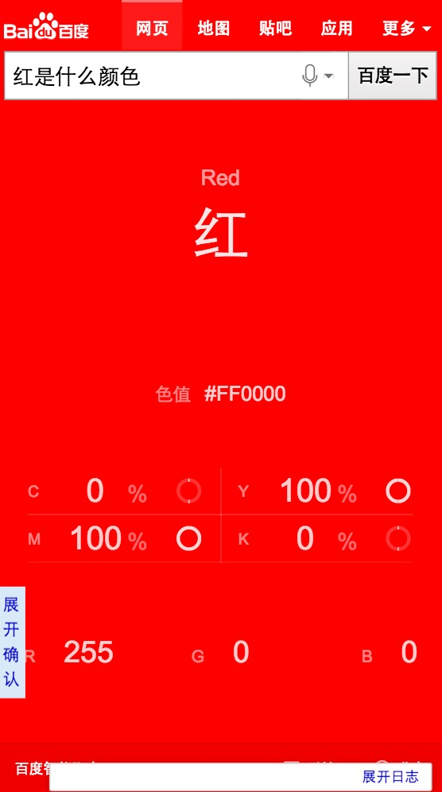

# 胡晓卉

> 从2016-08-15到2016-08-19

## 哥伦布-民生-笑话

### 背景

提升笑话模板数据质量。升级UI样式及模板。提升阅读体验。提升媒体时长

### 完成情况

测试完成待上线。预计8.19。走单中。

开发：8.04-8.08，联调：8.10-8.11。提测：8.16。预计8.12。因数据问题提测delay。

### 效果

## 哥伦布-民生-颜色

### 背景

sigma迁移2.0

### 完成情况

开发中。

开发：8.19。

### 效果

## 哥伦布-教育-院校分数线优化

### 背景

目前线上院校分数线在匹配省份上无数据的时候没有召回卡片，优化为召回卡片提示“暂无数据”。ue规范调整，配合调整样式。

### 完成情况

hold，等待后端交接工作。

功能点修改联调大致完成，还需最后验证一下。

样式已完成修改。

## 哥伦布-icon问题修复

### 背景

目前线上wise的自然结果使用阿拉丁模板时会出现图标，需要对自然结果和阿拉丁进行区分。

### 完成情况

本周无进度。travel2 7.11上线。bk_polysemy 8.4上线。长线方案 AE增加showlamp字段 8.2上线。

短线方案：91和traval2所有资源都加上showlamp字段，模板做foot的特殊处理。

长线方案：kv/mini/ae都添加showlamp字段，前端统一根据这个字段判断。

目前kv、mini、AE都加上了showlamp字段。长线方案需要PM对走AE模板增加showlamp配置，然后对所有模板进行验证，需要时间较长，目前还是需要先对所有非aladin的资源使用的模板进行修复。
