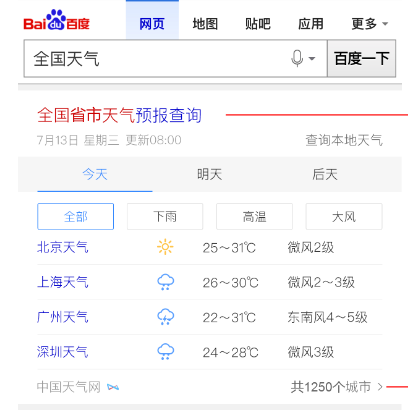

# 李晓

> 从2016-08-15到2016-08-19

## 哥伦布-民生-天气老卡

### 背景

线上500万小城市天气模板为老的sigma1.0机制，为升级开发方式和效率迁移为sigma2.0.

### 完成情况

8.17-8.23模板开发+联调，8.24号pm确认效果+QA介入测试

### 效果

## 哥伦布-民生- 天气相关模板情景页迁移sf2.0

### 背景

为升级开发方式和效率，天气模板原有情景页到sf2.0

### 完成情况

预计08.25号介入

## 哥伦布-民生-500W天气优化方案

### 背景

为了深度优化用户搜索天气类query需求，对天气主需求，5天预报及今日生活指数进行

### 完成情况

08.19号需求评审

## 哥伦布-民生-天气泛需求（全国天气和全省天气）

### 背景

用户不仅对于某个城市/景点有天气查询需求（当前天气覆盖卡片），用户还有搜索类似q=”全国天气”以及各省天气的需求(PV每天约8W)，而当前搜索结果页未有特型结果覆盖，用户对天气泛需求查询并未得到很好的满足。

### 完成情况

08.16号初步评审，ue已定稿，跟pm确认降低优先级为9月初介入开发

### 效果

