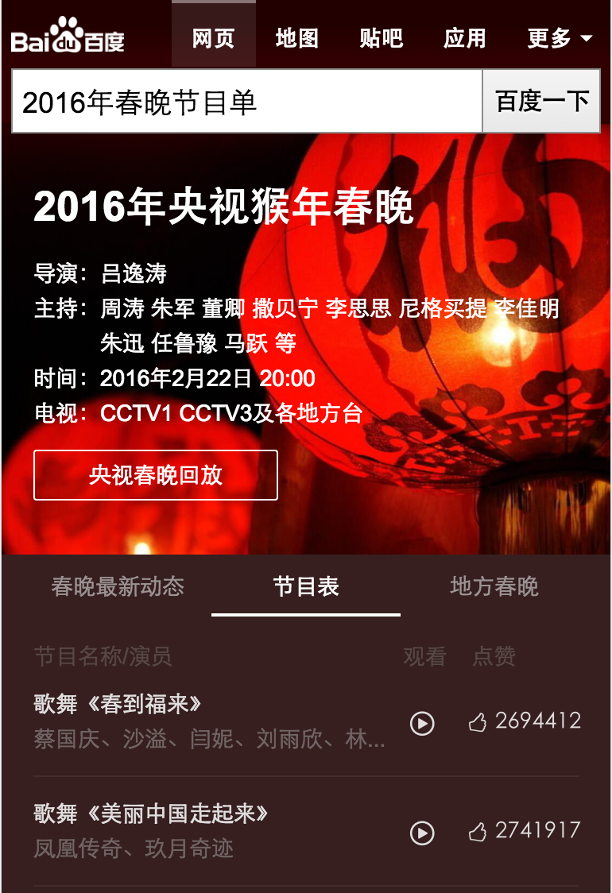
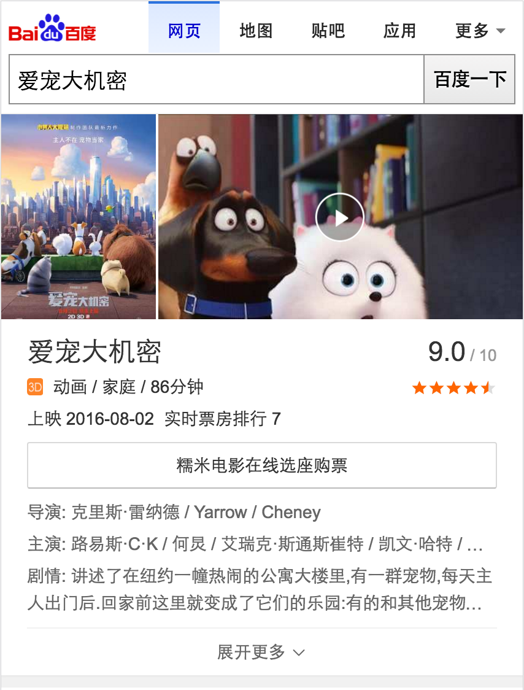
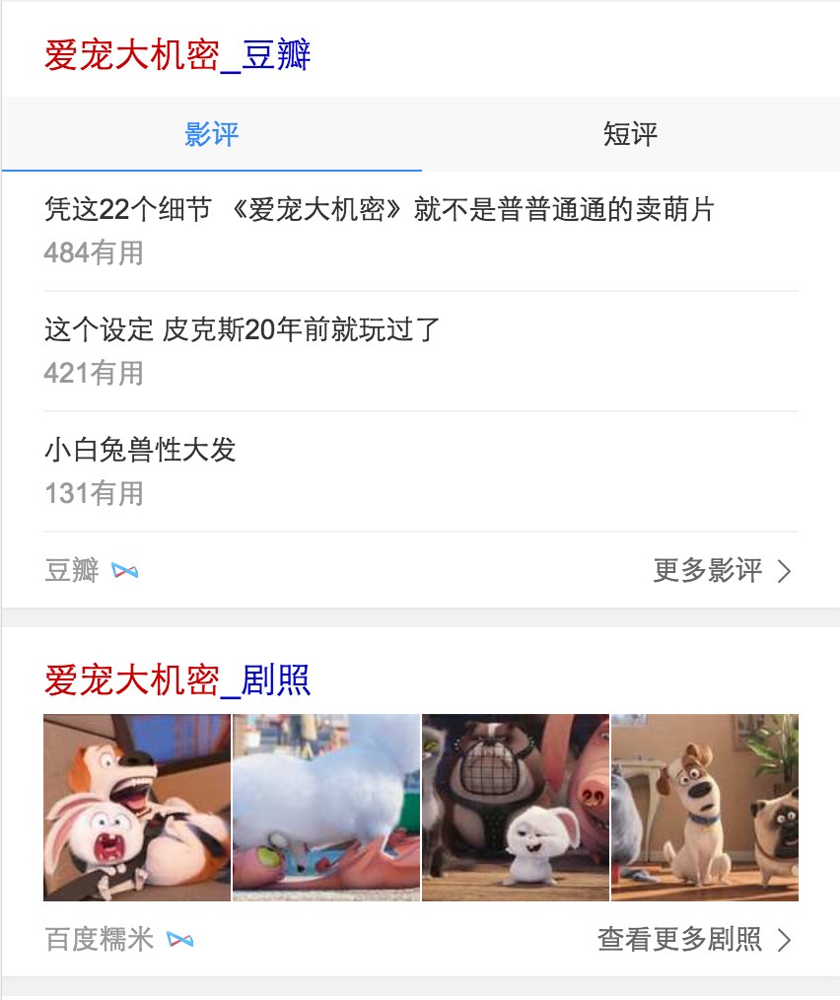
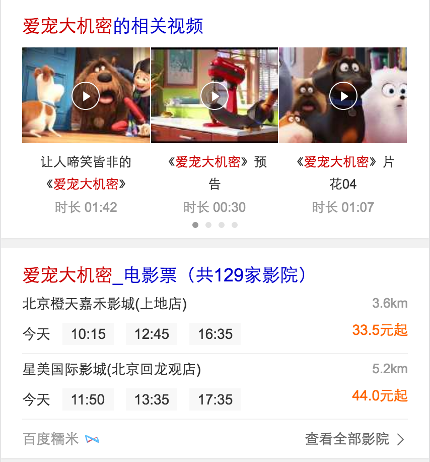

# 孟德丹
> 从2016-08-15 到2016-08-19

## sigma模板迁移

### 背景

 wise_chunwan模板从sigma1.0迁移到最新版

### 完成情况

* 已上线（8.18）

### 效果图

## 哥伦布-电影精准词(无更新)

### 背景

线上精准电影名黑卡为早期sigma 1.0样式，不符合UE&FE规范，且产品样式陈旧，故升级线上样式，以哥伦布形式组织精准电影名相关需求，以期能够更好的满足用户需求，同时提升购票gmv。

### 完成情况

* 小流量中：实验抽20%流量 24w左右
* 测试环境：<a href='https://m.baidu.com/s?word=%E7%88%B1%E5%AE%A0%E5%A4%A7%E6%9C%BA%E5%AF%86&sid=108259'>爱宠大机密</a>

### 效果图

