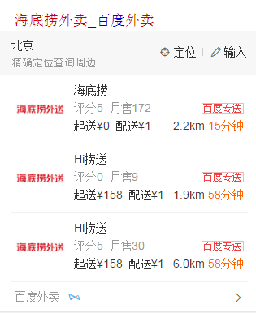

# 李阳阳

> 2016年8月15日~2016年8月19日

## 邮编修改底部左下角来源
	
### 背景

邮政编码数据来源是邮政，因邮政名称变更且合作到期，所以邮政要修百度把邮政的名字先下掉，才会继续和百度谈后续的合作，如果不下，就不跟百度继续合作了。

### 完成情况(完成情况)

8月18号已上线~模板名:post,资源id=6011,query='[北京邮编](https://m.baidu.com/s?word=%E5%8C%97%E4%BA%AC%E9%82%AE%E7%BC%96)'

### 效果

## 外卖阿拉丁

### 背景（预期）

预期用户换query降低，页面有点提升，gmv提升~

### 收益

暂无

### 完成情况

模板8月19号（今天）开发完成~8月22号（下周一）~联调~

### 效果

