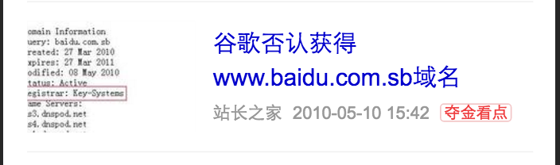

# 王培

> 从2016-08-15到2016-08-19

## 本周跟进

- 资讯
    - 图集优化
    - 奥运频道建设
    - 推荐频道加人工自定义标签
    - 热词定位到奥运频道
    - SF2.0迁移

- MIP
    - MIP 文档
    - MIP 组件开发
    - MIP 校验测试

## 资讯垂类

### 1. 兴趣负反馈升级（无更新）

#### 背景与目标

    提升用户体验，让用户参与个性化推荐的算法，通过用户反馈发现：
     
     1. 新闻质量问题；
     2. 用户个性偏好

#### 完成情况

- 进度：delay

- 补充：上线依赖后端策略，需要策略开发完成才能联调，具体时间未确定

- 预览地址：暂无


#### 效果图

- 暂无

### 2. 图集功能优化

#### 背景与目标

    继续优化升级图集，提升用户体验
    
    升级点：
    - 每张图片加载完成之前为loading状态
    - 文字滑动惯性效果
    - 图片缩放功能（包括双击缩放和双指缩放）

#### 完成情况

- 进度：图片loading状态已上线，图片缩放在 SF2.0 中加上（8.15上线）

- 预览地址：https://m.baidu.com/s?word=%E5%A5%B3%E5%AD%90%E5%8D%81%E7%B1%B3%E5%8F%B0%E6%8F%BD%E9%87%91%E9%93%B6

#### 效果图

- 暂无

### 3. 奥运频道建设

#### 背景与目标

    资讯垂类下提供详尽的奥运资讯需求满足。
    满足新闻资讯、金牌榜等需求，提升资讯垂类对奥运的控制力。
    开赛前显示倒计时+feed流，开赛后显示金牌榜+feed流

#### 完成情况

- 进度：已上线全量（8.5）

- 补充：

    - 本周增加奥运tab点击刷新策略

- 容错：资源添加开关，出现情况更新资源关闭奥运频道

- 预览地址：https://m.baidu.com/s?word=%E7%99%BE%E5%BA%A6%E7%83%AD%E7%82%B9&sid=108086


#### 效果图

<table algin="center" >
<tr>
<td style="vertical-align:top">
    
</td>
<td style="vertical-align:top">
    
</td>
</tr>
</table>


### 5. 推荐频道加人工自定义标签

#### 背景与目标

    迎合奥运热点，主feed（推荐频道）增加人工自定义标签，可由运营同学手动添加

#### 完成情况

- 进度：已上线（8.17）

- 预览地址：暂无


#### 效果图

<table algin="center" >
<tr>
<td style="vertical-align:top">
    
</td>
</tr>
</table>

### 7. 去掉推荐feed时间因子（已下线）

#### 背景与目标

    近期会引入大批的旧闻，我们之前也对时间因子做过调整，但是效果不好，考虑到时间因子对用户判断没太大作用，如果显示旧闻的时间，体验会打折，所以将时间因子去掉做个试验看下效果

#### 完成情况

- 状态：由于收益为负，已下线（8.18）

#### 效果图

- 暂无

### 8. 热词定位到奥运频道

#### 背景与目标

    迎合奥运，将奥运新闻首屏展现

#### 完成情况

- 状态：已上线，流量90%

- 预览地址：https://m.baidu.com/s?word=%E5%A5%B3%E5%AD%90%E5%8D%81%E7%B1%B3%E5%8F%B0%E6%8F%BD%E9%87%91%E9%93%B6&sa=iph_201

#### 效果图

- 暂无

### 9. SF2.0迁移

#### 背景与目标

    配合SF2.0升级，包括：

    - 图集
    - 视频
    - 专题

#### 完成情况

- 状态：

    - 图集：已上线0流量（8.17）
    - 视频：已上线0流量（8.17）
    - 专题：已上线0流量（8.17）

- 预览地址：暂无

#### 效果图

- 暂无


## MIP


### 1. MIP 文档

#### 背景与目标
    
    为mip发版准备完善的文档
    
#### 完成情况

- 进度：

    - 校验list文档更新并徒步官网（8.10）

    ```
    - script 标签升级，允许 mip 所需js，以及type为 application/ld+json 
    ```
    - mip-video 组件文档更新

    - mip-link 组件文档更新
    
    - mip-carousel 图片轮播组件文档更新，增加属性说明

- 预览地址：
    
    - 内网：http://mip.baidu.com/
    - 官网：https://www.mipengine.org/doc.html

#### 效果图

- 暂无

### 2. MIP 组件（无更新）

#### 背景与目标
    
    mip框架组件开发，为7月发版做准备

#### 完成情况

- 进度：无更新
    
#### 效果图

- 暂无
    
### 3. MIP 校验测试

#### 背景与目标
    
    MIP 前端校验和后端校验测试

#### 完成情况

- 进度： 

    - 校验list更新

    ```
    更新前端校验代码，同时同步站长平台后端校验RD
    ```

    - 校验工具完善

    ```
    1. 校验规则（l1 - l3）完成代码并完善测试用例（8.19）
    2. 校验规则（l4 - l6）完成代码并完善测试用例（8.22）
    3. 校验规则（l7 - l9）完成代码并完善测试用例（8.23）
    ```
- 预览地址：校验规则（http://mip.baidu.com/#./docs/2-guides/check-list.md）

#### 效果图

- 暂无
