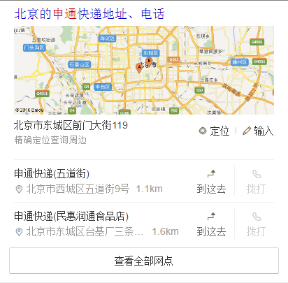
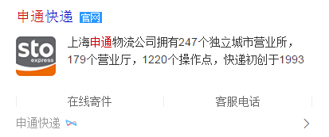
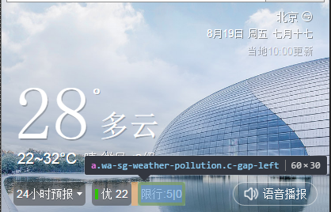

# 赵岐

> 从 2016-08-15到 2016-08-19    

## 哥伦布-民生-快递

### 背景    
对单号查询和寻址需求用户，为用户推出快递小工具功能，构建可控二级情景页。
       

### 完成情况    
* 完成快递小工具卡片开发完成，8.22联调
* 运费时效card，正在开发   
* 网点查询card，正在开发
* 在线寄件card，正在开发
* 寄件地址card，正在开发
* 快递地图卡片
	* 增加“到这去”“拨打”两个button共存的样式，开发完成，8.22联调  
	* 增加输入功能，开发完成，8.22联调

### 效果

## 哥伦布-民生-快递
### 背景
按照规范，对现有的官网卡片，地图卡片进行foot样式修改
### 完成情况
* 官网卡片开发完成，联调完成，预计8.19上线
* 地图卡片开发完成，等待后端联调
### 效果

## 哥伦布-民生-天气
### 背景
小流量头图优化转全量，添加语音播报按钮
### 完成情况
开发完成，联调完成，测试完成，预计8.19上线
### 效果

