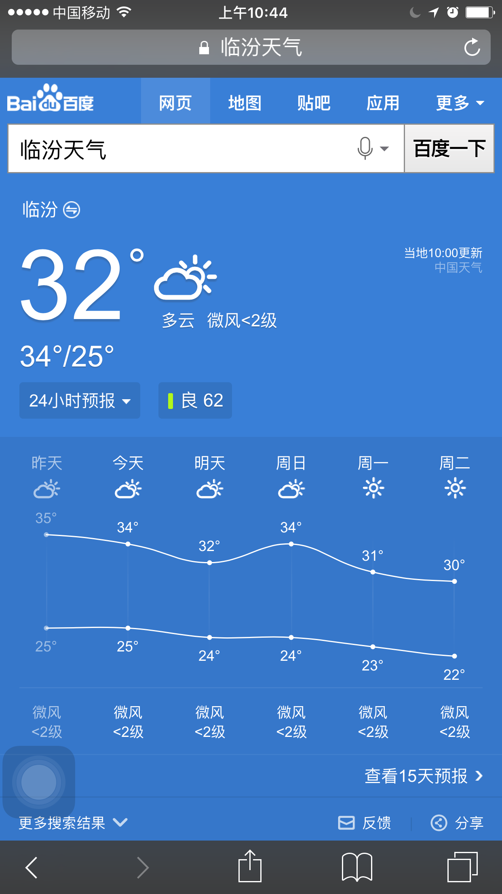
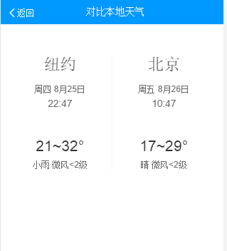
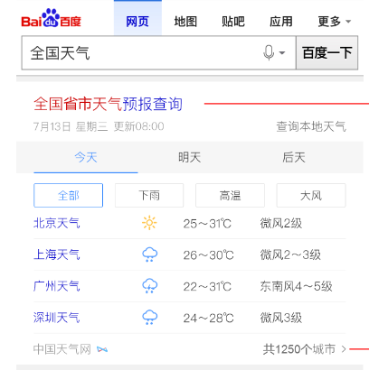
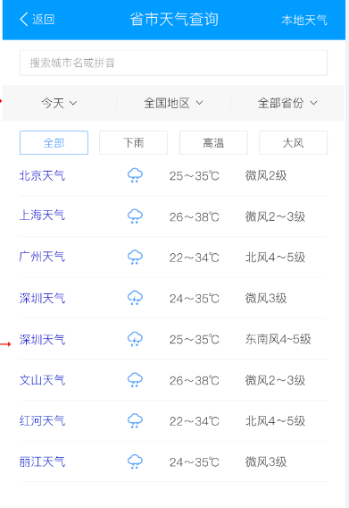

# 李晓

> 从2016-08-22到2016-08-26

### 民生子垂类

    * 天气：pm周里成+杨宇 rd赵元浩 fe李晓
    * 菜谱：pm周里成+杨宇 rd赵元浩 fe李晓
    * 快递：pm徐海漠 rd楚振江
    * 日历：pm林馨怡 rd郑杰
    * 通用推荐：pm徐海漠 rd殷瑞娜

### 进度

## 哥伦布-民生-天气老卡

### 背景

线上500万小城市天气模板为老的sigma1.0机制，为升级开发方式和效率迁移为sigma2.0.

### 完成情况

* 8.17-8.23模板开发+联调，8.24号pm确认效果+QA介入测试
* 复用weather作为白卡退化样式，8.24号已加兼容逻辑上线
* sg卡样式pm确认效果中，待上线

### 效果

## 哥伦布-民生- 天气相关模板情景页迁移sf2.0

### 背景

为升级开发方式和效率，天气模板原有情景页到sf2.0，其中对比本地天气加兼容复用国内对比本地天气card,历史温度新开发情景页

### 完成情况

* 08.25号开始介入，已产出schema, 08.25-08.29开发，08.30号联调，08.31号上线情景页
* 08.29号国外天气模板与国内天气模板合并，同时更改结果页跳转至新的情景页，09.01号上线合并后模板

### 效果

## 哥伦布-民生-500W天气优化方案

### 背景

为了深度优化用户搜索天气类query需求，对天气主需求，5天预报及今日生活指数进行

### 完成情况

* 天气去头图，开发：8.30-8.31 联调：9.1-9.2（半人力） 测试：9.5 上线：9.6 
* 天气优化方案，5天预报详情展开开发：9.2-9.6，推荐样式开发：9.7-9.8，情景页开发：9.9 ，联调：9.12-9.14 ，测试+评估：9.18-9.19 ，上线：9.20模板上线，9.21小流量上线 

## 哥伦布-民生-天气泛需求（全国天气和全省天气）

### 背景

用户不仅对于某个城市/景点有天气查询需求（当前天气覆盖卡片），用户还有搜索类似q=”全国天气”以及各省天气的需求(PV每天约8W)，而当前搜索结果页未有特型结果覆盖，用户对天气泛需求查询并未得到很好的满足。

### 完成情况

08.16号初步评审，ue已定稿，预计09.19号介入

### 效果

