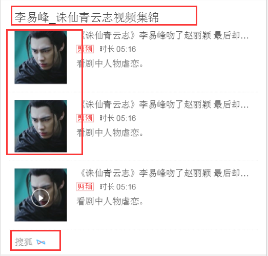
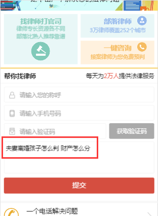

# 饶少艳

> 从2016-08-22号到2016-08-26

## 为短漫复用左图右文模板进行迭代兼容

### 背景

为短漫复用leftimgrighttext模板进行迭代兼容。模板id=8423，模板名：左图右文带翻页/leftimgrighttext）。

1、title：默认可点（红蓝标识），同时增加独立字符，可设置为不可点（全黑）；

2、播放三角icon：默认可播放（有三角icon），同时增加独立字符，可设置为图片（无三角icon）而非视频；

3、showurl：默认爱奇艺，同时增加独立字符，可自定义编辑。

### 完成情况

* 08.22  与pm牟吉宁、lily讨论确认改动点与方案，并完成开发。

* 08.23  自测、pm进行验收测试、QA进行其他query测试，确保对其他query无影响。

* 08.24  完成上线。数据方面未到位，线上环境需要等数据到位之后再补充。

### 效果

sid:102163

query:李易峰

url:https://m.baidu.com/s?word=李易峰&sid=102163
（目前为0流量环境，预计今天08.26环境上线）

改动点示例图：

## 法律弱需求子链添加query参数

### 背景

需求：法律弱需求优化方案，跳转到部落网后，需要将用户的搜索词展现在提问框。

### 完成情况

* 08.19 与云升、部落方确定方案，并完成开发，在子链上添加query参数。

* 08.22 与部落方测试验证效果通过。

* 08.23 pm完成走单并上线。

### 效果

sid:109509

query:夫妻离婚孩子怎么判 财产怎么分

## 人物咨询八卦卡调起feed流图集点击问题修复

### 背景及原因

在之前的开发中未添加相关图集处理的feed静态文件。

### 完成情况

* 08.24 簇title添加feed图集处理静态文件，并进行上线实验，确认问题解决。

* 08.25 阿拉丁八卦卡进行修复上线。

### 效果

query：林允儿

簇title：url：https://m.baidu.com/s?word=林允儿&sid=108404

阿拉丁八卦卡：url：https://m.baidu.com/s?word=林允儿&sid=108405

点击八卦卡进入feed，会有图集相关信息，点击无效问题，通过添加feed静态文件修复。

## 明星榜单大全

### 背景

* 粉丝群体容易调动、愿意参与，对明星偶像的应援具有需求痛点；

* 对影响力的理解和评价来自于感性的认知，行业中缺乏对不同明星统一量化的评价方式。

* 预期影响面：（Query 30个，特型卡片Query 20个，PV 250w）。

### 完成情况

开发完成两个页面。

* 方案：SF2.0情景页形式展示。

* 07.25 讨论评审方案；07.26 给出初步MRD文档，并确定如下排期。
	溢麟：本周内与百科、风云榜对接数据接口的开发需求，确认统一的数据接口格式，
周五（07.29）前初步完成百科、风云榜的数据接入；
	少艳：下周二（08.02）前初步开发完成可调用的数据环境。

* 07.28 所有页面UE稿确定，完成规则页的SCHEMA数据配置与页面开发。

* 08.02 完成三个页面的SCHEMA数据配置以及前两个页面的开发。

* 08.25 调出三个页面的联调环境，等待数据到位，进行联调。

