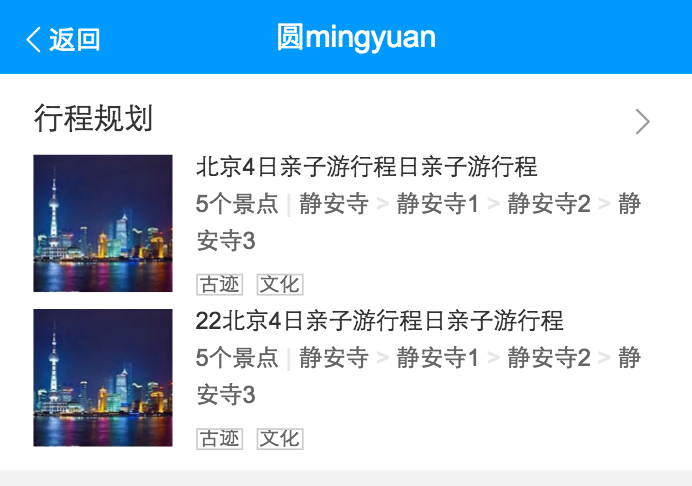
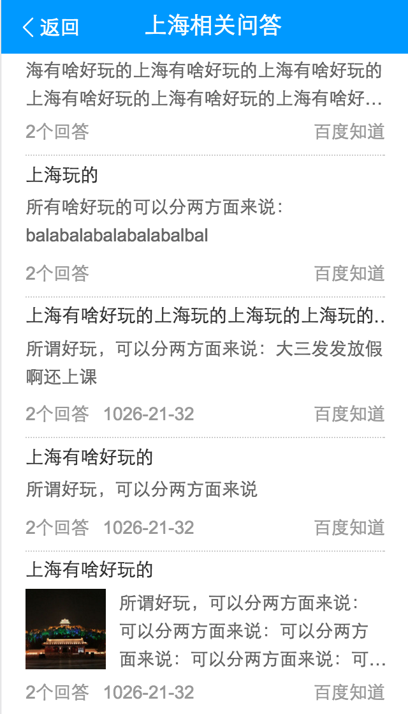
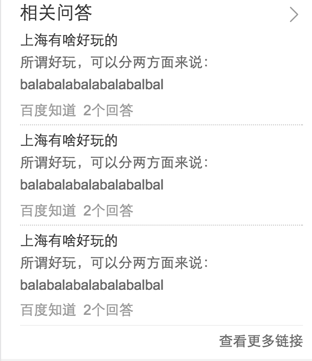
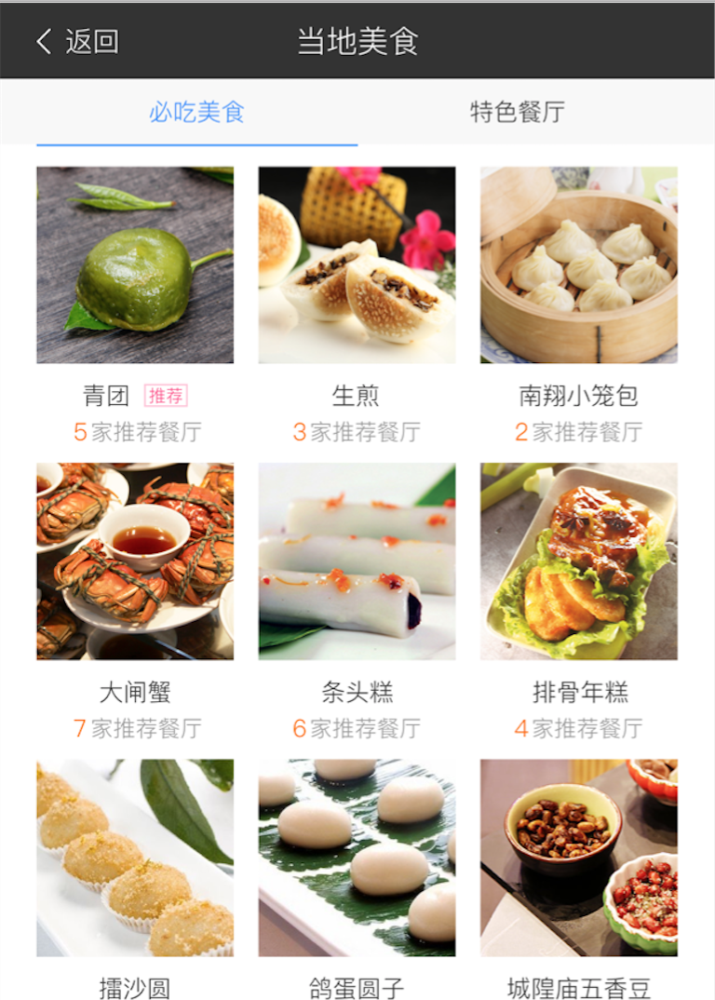
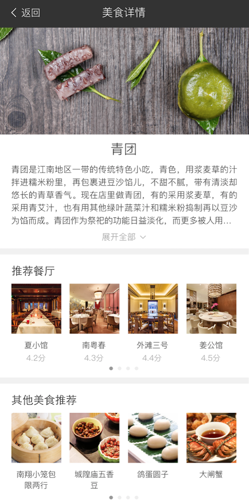
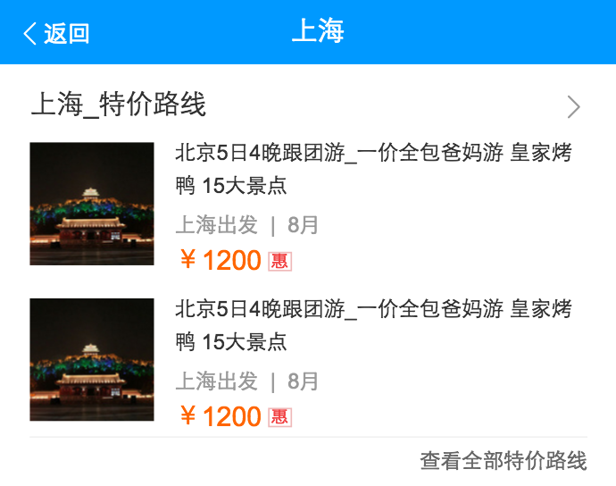
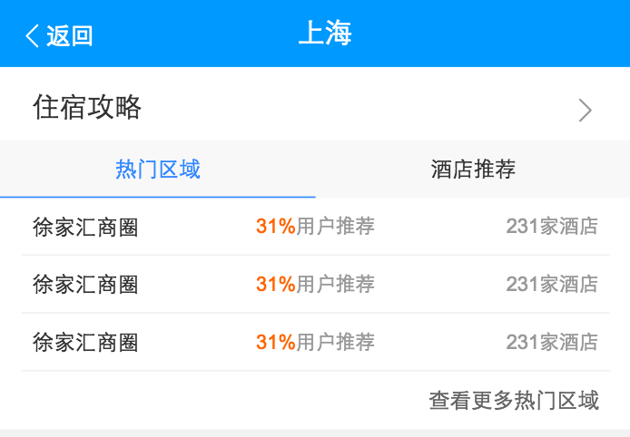
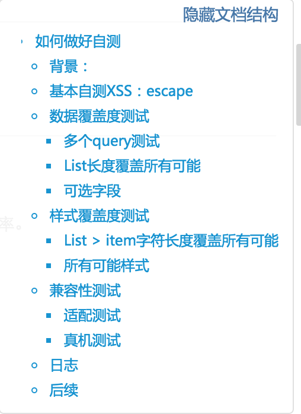

# 司文宇
> 从2016-08-22 到2016-08-26

## 城市改版项目计划
### 项目背景
wiki地址：[http://wiki.baidu.com/pages/viewpage.action?pageId=204667813](http://wiki.baidu.com/pages/viewpage.action?pageId=204667813)
本次城市改版开发量可以分为三部分：结果页卡片，新做card卡，SF1.0的迁移.
### 具体：
* 行程规划卡--开发1天，联调0.5天
* 问答列表情景页--开发1天，联调0.5天（08-11完成）
* 相关问答卡--开发1天，联调0.5天
* 美食情景页--开发1天，联调1天
* 特价路线卡--开发1天，联调0.5天（08-18完成）
* 住宿攻略卡（新数据）--开发1天，联调1天（08-22完成）

### 具体进展：
1 . 行程规划卡：开发完成待联调
#### 项目截图

2 . 问答列表情景页：开发完成，待联调
#### 项目截图

3 . 相关问答卡：开发完成，待联调
#### 项目截图

4(1) . 美食情景页C：

8.25新需求，开发完成

#### 项目截图

4(2) . 美食情景页D：

8.25新需求，开发完成

#### 项目截图

5 . 特价路线卡:开发完成，待联调

#### 项目截图

6 . 住宿攻略卡:开发完成，待联调

携程数据delay；

#### 项目截图

### 项目问题

* 情景页，目前有迁移，有sf2.0，还有混合处理，后端取数据的方式有待统一，目前造成的整体delay就是由于后端给数据延迟造成的，有待统一处理。

* 另一个delay的原因是数据，这个貌似木有办法。。。等！

## 串讲

* 1.主要讲了自己对百度阿拉丁的理解；

* 2.业务流程，业务中遇到的问题，相应问题的解决办法；

* 3.PSUI和BS的对比，提出了自己的疑问和建议，并与朱雷讨论，UI组件的rem规范是UE主控，虽然理论上来说存在不合理性，但是也不是咱们一方面说了就可以推进，所以后续可以提出解决办法。

* 4.提出WAI-ARIA无障碍网页应用，可以研究一下，觉得未来可以加入我们的阿拉丁，很有必要。

* 5.交流沟通方面，是百度以及所有大公司的通病，学会适应这种模式，并有自己独特的理解和运用，达到更高效工作的目的。

* 6.时间管理方面，个人计划制定，很有必要。

* 7.自测，受到大家的一致好评，感谢小武提出这个点，林哥让整理成文档。

## 文档：如何做好自测

* 1.结合自己串讲的内容，又添加了其他内容。已在sfe平台展现。

* 2.[传送门](http://sfe.baidu.com/#/阿拉丁/无线网页搜索/开发指导/如何做好自测)

* 3.截图如下：

## 模板平台foot走查

* 目前小武在做模板平台foot优化，看了所有模板关于foot的写法，整体来说比较混乱

* 1,位置，可以规范block模块位置，有助于代码维护

* 2,写法，每个人都有自己的风格，写的时候随心所欲，比如置空重写(有可能是业务需要)，代码量大小参差不齐。

* 3,感觉需要ue配合，规范foot样式，以及和foot相关的样式。

