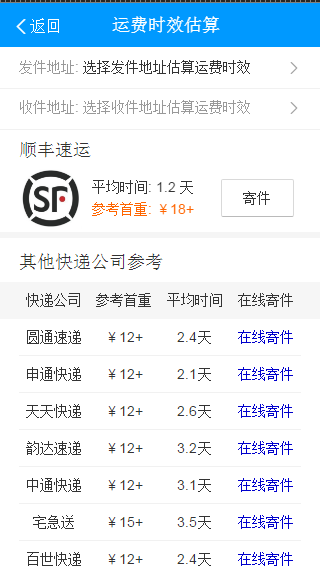
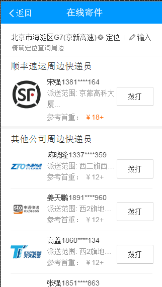
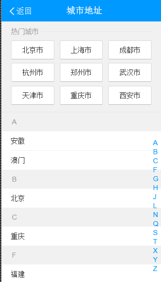
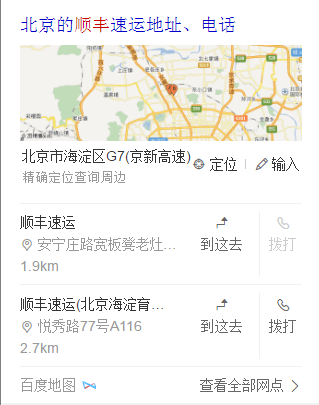

# 赵岐

> 从 2016-08-22到 2016-08-26    

## 哥伦布-民生-快递

### 背景    
对单号查询和寻址需求用户，为用户推出快递小工具功能，构建可控二级情景页    
快递官网卡片去掉底部按钮，调整title和内容区域的间距    
快递地图卡片去掉底部“查询全部”按钮，修改底链样式，修改内容区域样式，调整title和内容区域的间距    
新增官网和地图模板的实验组    
快递查询模板修复缺少的交互日志
       

### 完成情况    
* 快递小工具卡片
* 运费时效card
* 网点查询card
* 在线寄件card
* 寄件地址card
* 快递官网卡片去掉底部按钮
* 快递地图卡片
	* 增加“到这去”“拨打”两个button共存的样式  
	* 增加输入功能
	* 去掉底部按钮，修改底部样式
* 以上卡片和模板修改都已开发结束，联调测试完成，工具卡片样式要变，三级单尚未通过，无法上线

### 效果

    
    
    
    
    
    

