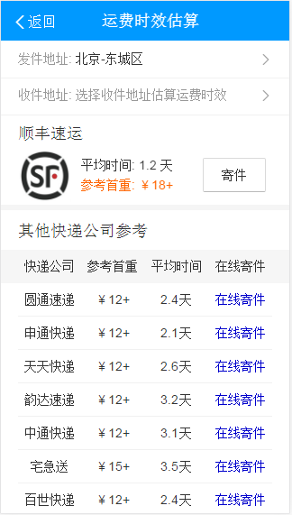
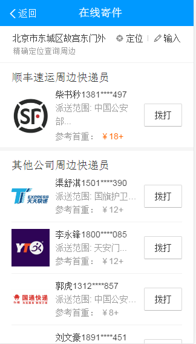

# 李阳阳

> 2016年8月29日~2016年9月2日

## 外卖阿拉丁

* 背景:预期用户换query降低，页面有点提升，gmv提升~
* 完成情况:模板已提测完成~模板正在ubs评估和走单子~还有三个小问题~午后修一下~预计9月6号可以上线~
* 收益：暂无
* 效果图

## 图片搜索优化-大图页

* 背景与目标：
	* C类页面的建设，是之前沉浸式实验的延续，希望能够给到用户A-B-C三个页面的完整、刘畅的体验，做一次完整的沉浸式实验。
	* 大搜C类页面通过SuperFrame2.0实的，对比跳转图搜可以提升页面的加载速度，优化用户的浏览体验。
* 完成情况
	*模板的结果页和情景页的B类页面~已从kv资源迁移至ae资源~迁移完成~
	*模板样式已基本开发完。
	*接口rd那边ae的同步数据已完成~异步接口数据还在开发~大概8月29号完成~预计29号介入~开发周期大概7天~
* 效果图(由于没数据~一下是平台预览的静态页面图~)

结果页的页面

情景页B的页面

竖屏下的c1界面：

横下的c1界面：

## 哥伦布-民生-快递（之前赵岐跟进~这周修复了些许样式问题~）

* 对单号查询和寻址需求用户，为用户推出快递小工具功能，构建可控二级情景页。
* 完成情况:模板正在0流量中~
	
本周修复问题

		* 某些浏览器下样式错乱~
	
已修复~9月2号（下午）上线~

	
环境地址：[顺丰快递](http://cp01-sys-rath4-c32-qa074.cp01.baidu.com:8003/s?word=%E9%A1%BA%E4%B8%B0%E5%BF%AB%E9%80%92&sid=102155)

* 收益：暂无
* 效果图

