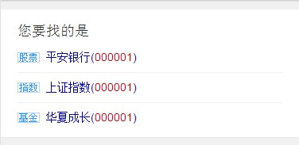
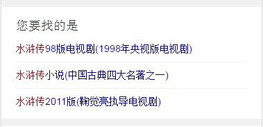

# 祁鹏远

> 2016年8月29日~2016年9月2日

## 自有产品阿拉丁样式修改需求(无进展，PM说目前样式上有些弱，先不建议上线，等PM再和ue沟通下得)

### 需要修改的模板
* 模板名：【gonglveyouxi】 query：保卫萝卜2攻略
* 模板名：【tiebaxml】     query：李毅吧
* 模板名：【wenkuala】     query：柳树醒了教案

### 完成情况
* 7月18日已上线上线 模板名：gonglveyouxi
* 7月18日已上线上线 模板名：wenkuala
* 模板名：tiebaxml已修改完，PM说目前样式上有些弱，先不建议上线，等PM再和ue沟通下得

### 效果

## 模版复用 stock_lead

### 背景

* 有些query存在比较重大的歧义，我们希望能够通过引导的方式，让用户更快找到自己需要的那个义项

### 进度

* 8月31日（本周三）模板已上线，数据还未上线

### 效果

## 游戏主播kv卡，新模板

### 背景

* 以直播和视频为载体的多媒体平台快速发展，导致一批主播和网络红人成为用户关注的热点。而这些游戏主播本身有很强的粉丝效应，故希望在原有的搜索结果下，整合主播的内容，以更好的满足用户。 主播的相关需求较为简单，卡片提供直播间、图集、视频等入口，通过与资源方配合建立主播落地页，聚合卡片内各个入口资源。

### 进度

* 模板以开发完毕，等待数据联调
* 预计9月5日联调，9月6日上线

## 精准影院卡优化

### 进度

* 开发中
* 预计下周二上线（9月6日）

## 后续排期

### 迁移sf2.0

