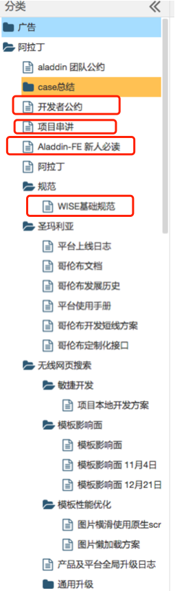
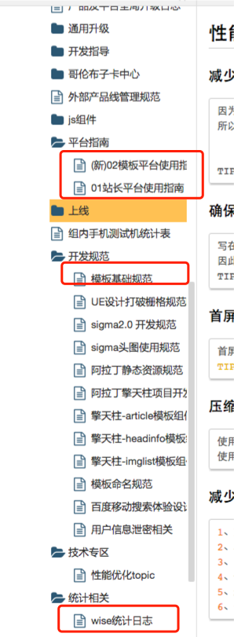

# 司文宇
> 从2016-09-05到2016-09-09

## 城市改版项目
### 项目背景

wiki地址：[http://wiki.baidu.com/pages/viewpage.action?pageId=204667813](http://wiki.baidu.com/pages/viewpage.action?pageId=204667813)

### 具体计划：
* 行程规划卡–开发1天，联调0.5天  (DONE)
* 问答列表情景页--开发1天，联调0.5天（DONE）
* 相关问答卡–开发1天，联调0.5天  (DONE)
* 美食情景页–开发1天，联调1天 (DONE)
* 特价路线卡–开发1天，联调0.5天 (DONE)
* 住宿攻略卡（新数据）–开发1天，联调1天（DONE）
* 当地特色卡片（card）(DONE)
* 当地特色卡片（结果页）待联调。
* 当地特色数据。(DONE)

新增：
* 结果页，当地特色-(DONE)
* 情景页，当地特色-(DONE)

### 具体进展：终于达到提测状态了！！！

### 阿拉丁&百度签证合作

签证同学做自己的阿拉丁，协助他们熟悉开发环境和开发文档，并列举sfe文档平台的重要文档：

### 必游景点迭代

#### 背景
旅游城市query，显示收敛卡和必游景点。必游景点由原来的无可度横滑变成翻页横滑

#### 项目截图

#### 项目问题
如上图所示，
当list中有一个长度为三行时，整个都是三行。暂时没有太好的解决办法，可以控制只显示两行。

