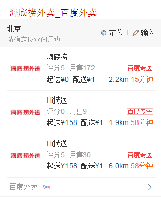
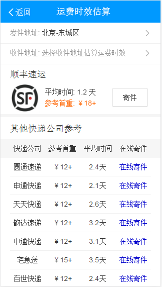
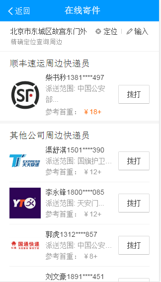
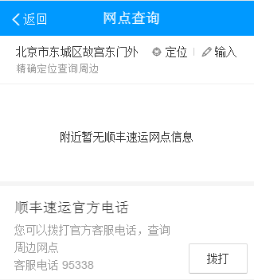
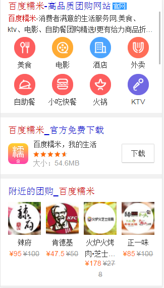
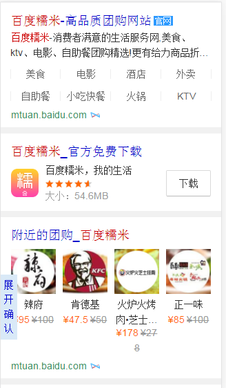
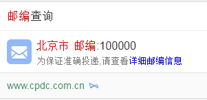
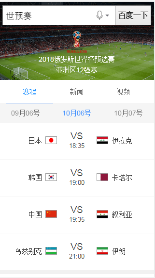
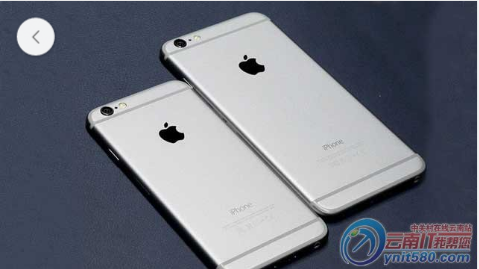

# 李阳阳

> 2016年9月5日~2016年9月9日

## 外卖泛需求阿拉丁

* 背景:预期用户换query降低，页面有点提升，gmv提升~
* 完成情况:已于9.7晚小流量上线~
	* 【实验情况】
	* 实验组：sid=109793，资源id=4824，模板名=takeoutfood
	* 对照组：sid=109794，资源id=3156，模板名=wz_waimai
	各抽取50%流量。
* 收益：50%抽样~影响面约2.5w~
* 效果图

q=[外卖](https://m.baidu.com/s?word=%E5%A4%96%E5%8D%96&sid=109793)

## 哥伦布-民生-快递

* 对单号查询和寻址需求用户，为用户推出快递小工具功能，构建可控二级情景页。
* 完成情况:模板正在0流量中~
	
本周修复问题

		* 小工具模板样式修改实验~
		* 地图模板底部的url跳转错误~改为与title跳转逻辑一样~
		* 小工具模版的在线工具和网点查询的情景页里定位位置~改为在定位失败并且没有缓存的时候~自动触发下定位按钮~
	
修改完成~9月7号已上线~

	
环境地址:

	
[顺丰快递](http://cp01-sys-rath4-c32-qa074.cp01.baidu.com:8003/s?word=%E9%A1%BA%E4%B8%B0%E5%BF%AB%E9%80%92&sid=102155)

	
[顺丰快递](http://cp01-sys-rath4-c32-qa074.cp01.baidu.com:8003/s?word=%E9%A1%BA%E4%B8%B0%E5%BF%AB%E9%80%92&sid=102156)

* 收益：暂无
* 效果图

## 百度糯米模板修改样式~

* 背景:百度糯米的模板修改样式~响应模板添加showurl~涉及的模板有三个~nm_menu、nm_love、nm_app
* 完成情况:已修改~pm正在验证效果~预计9月9号（或者9月12号）上线~
* 效果图

q=[百度糯米](https://wwwhttps.baidu.com/s?dev=1&dev_workspace=platform&dev_module=aladdin-wise&dev_tpl=nm_menu&dev_path=searchaladdin&dev_tpltype=default&sid=99999_107619&dev_online=1&wd=%E7%99%BE%E5%BA%A6%E7%B3%AF%E7%B1%B3&word=%E7%99%BE%E5%BA%A6%E7%B3%AF%E7%B1%B3)

* 线上原图：

* 改后图：

## 邮编post模板去掉底部foot~

* 背景:邮编post模板去掉底部foot~
* 完成情况:已修改~pm已确认~9月9号上线~
* 效果图

q=[北京邮编](https://wwwhttps.baidu.com/s?dev=1&dev_workspace=platform&dev_module=aladdin-wise&dev_tpl=post&dev_path=searchaladdin&dev_tpltype=default&sid=99999&dev_online=1&wd=%E5%8C%97%E4%BA%AC%E9%82%AE%E7%BC%96&word=%E5%8C%97%E4%BA%AC%E9%82%AE%E7%BC%96)

* 线上原图：

* 改后图：

## 体育模版的复用和样式修改~

* 背景:
	* 【本周修改点】
		- 模板复用~与rd联调模板~，模板新增tab定位字段~
		- tab组件升级~线上tab样式错乱~
* 完成情况:已于9.6上线~
* 收益：世预赛约15w
* 效果图

q=[世预赛](https://m.baidu.com/s?word=%E4%B8%96%E9%A2%84%E8%B5%9B)

## 图片搜索优化-大图页（无进展）

* 背景与目标：
	* C类页面的建设，是之前沉浸式实验的延续，希望能够给到用户A-B-C三个页面的完整、刘畅的体验，做一次完整的沉浸式实验。
	* 大搜C类页面通过SuperFrame2.0实的，对比跳转图搜可以提升页面的加载速度，优化用户的浏览体验。
* 完成情况
	*模板的结果页和情景页的B类页面~已从kv资源迁移至ae资源~迁移完成~
	*模板样式已基本开发完。
	*接口rd那边ae的同步数据已完成~异步接口数据还在开发~大概8月29号完成~预计29号介入~开发周期大概7天~
* 效果图(由于没数据~一下是平台预览的静态页面图~)

结果页的页面

情景页B的页面

竖屏下的c1界面：

横下的c1界面：

