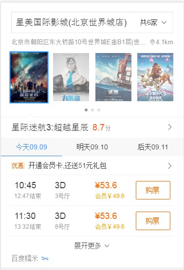

# 祁鹏远

> 2016年9月5日~2016年9月9日

## 游戏主播kv卡，新模板

### 背景

* 以直播和视频为载体的多媒体平台快速发展，导致一批主播和网络红人成为用户关注的热点。而这些游戏主播本身有很强的粉丝效应，故希望在原有的搜索结果下，整合主播的内容，以更好的满足用户。 主播的相关需求较为简单，卡片提供直播间、图集、视频等入口，通过与资源方配合建立主播落地页，聚合卡片内各个入口资源。

### 进度

* 现在已联调
* 预计9月12日（下周一）上线

### 效果

## 精准影院卡优化

### 进度

* 提测完成
* 再走三级单，本打算今天上线，ue提出新的点，最后等ue定好需要修改的东东，在进行修改。。。。。哎

### 效果

## 迁移sf2.0 

### 进度

* 迁移的模板：sigma_celebrity_rela
* 开发中
* 预计下周三完成开发，都是新资源，提测要两天，上线一天

### 效果

## 后续排期

### 民生菜谱两个模板

### 文库对比试验模板

