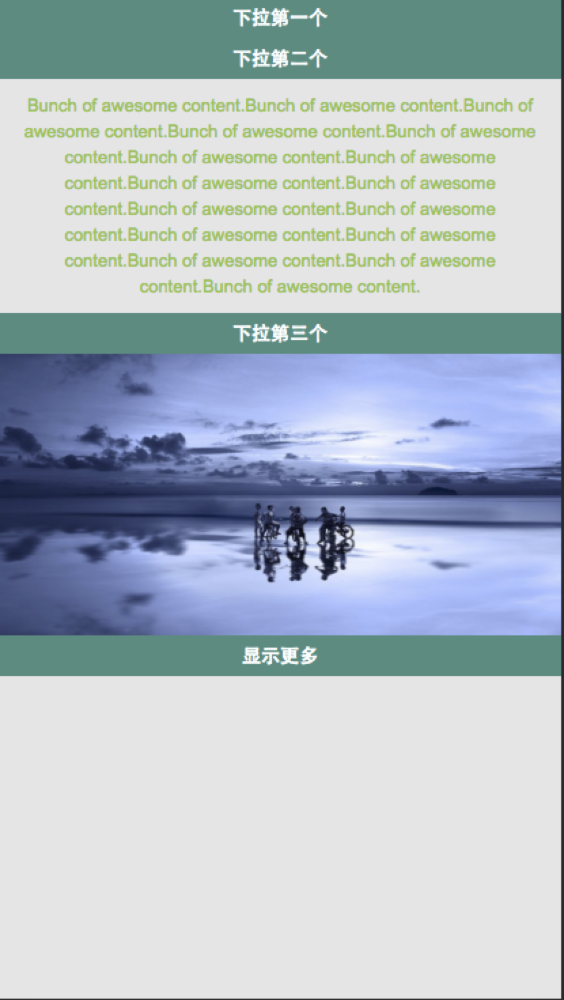
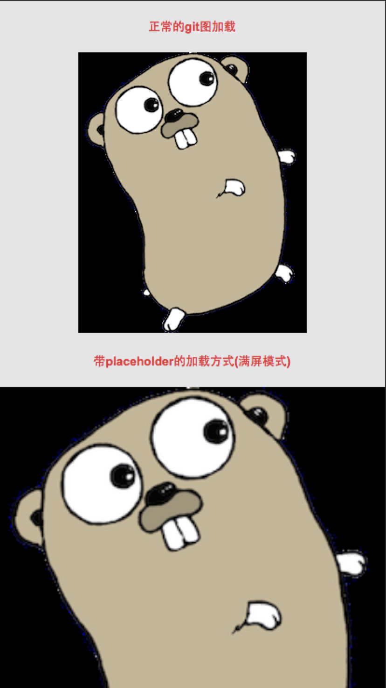

# 王培

> 从2016-09-05 到 2016-09-09

## 本周跟进

- MIP 校验规则

- MIP 组件开发

## 1. 校验规则

### 背景与目标

    mip-validator 是一个支持 npm 安装，同时支持网页校验的 MIP 校验工具， 校验规则就是为校验工具提供一套符合 MIP 规范的规则。

### 完成情况

- 进度：

    - 校验规则升级

    ```
    1. 不允许 html 标签中含有 style 属性

    2. 不允许 html 标签中含有 on开头的属性（如onclick），但是允许适用 on
    ```

## 2. mip-img 组件动画效果bug修复

### 背景与目标
    
    mip-img 组件pop效果在图片回退时会闪现两张图片，效果修复

### 完成情况

- 进度：已上线（9.7）

### 效果图

<table>
    <tr>
        <td></td>
        <td></td>
    </tr>
</table>


## 3. 视频组件升级

### 背景与目标
    
    1）视频组件功能升级, 当提供了 iframe 地址时，组件优先支持 iframe 播放。
    2）视频组件引入外部代码（手百视频播放，play.js通用组件），比重比较大，使组件本身比较臃肿，需要对组件进行代码抽离。

### 完成情况

- 进度：

    1）支持 iframe 播放已提测（9.7，和齐健下掉zepto依赖一起）
    2）视频组件轻量化暂未开始，待1）测试上线后开始开发

### 效果图

- 暂无

## 4. 广告 layout 升级

### 背景与目标
    
    1）IE，Safari等浏览器当数组中的元素是一个时，forEach函数报错。
    2）layout 注册方法修改

### 完成情况

- 进度：已上线（9.6）

### 效果图

- 暂无

## 5. mip-sidebar

### 背景与目标
    
    通用侧边栏组件，支持左边侧边栏和右边侧边栏

### 完成情况

- 进度：已提测（9.7）
- 预览地址：http://fedev.baidu.com/~wangpei07/mip/sidebar/mip-sidebar.html

### 效果图

<table>
    <tr>
        <td></td>
    </tr>
</table>
    
## 6. mip-accordion（接@传梼）

### 背景与目标
    
    下拉列表组件

### 完成情况

- 进度：已上线

### 效果图

<table>
    <tr>
        <td></td>
    </tr>
</table>

## 7. mip-anim（接@传梼）

### 背景与目标
    
    动图组件，监听动图加载情况，提升用户体验

### 完成情况

- 进度：已上线

### 效果图

<table>
    <tr>
        <td></td>
    </tr>
</table>


## 8. mip-fit-text（接@传梼）

### 背景与目标
    
    自适应字体组件，根据屏幕窗口的变化能够自适应字体

### 完成情况

- 进度：已提测（9.7）
- 预览地址：http://fedev.baidu.com/~wangpei07/mip/fit-text/fit-text-mip.html

#### 效果图

- 暂无

## 9. MIP 文档

### 背景与目标
    
    为mip发版准备完善的文档
    
### 完成情况

- 进度：

    - 增加 mip-anim 文档说明
    - 增加 mip-accordion 文档售卖
    - mipmain.js 版本升级同步文档

- 预览地址：
    
    - 内网：http://mip.baidu.com/
    - 官网：https://www.mipengine.org/doc.html

### 效果图

- 暂无
