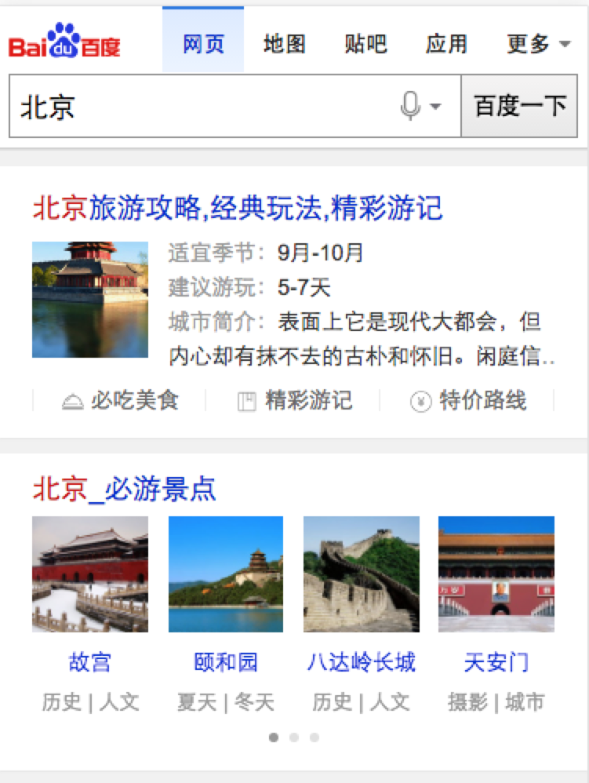
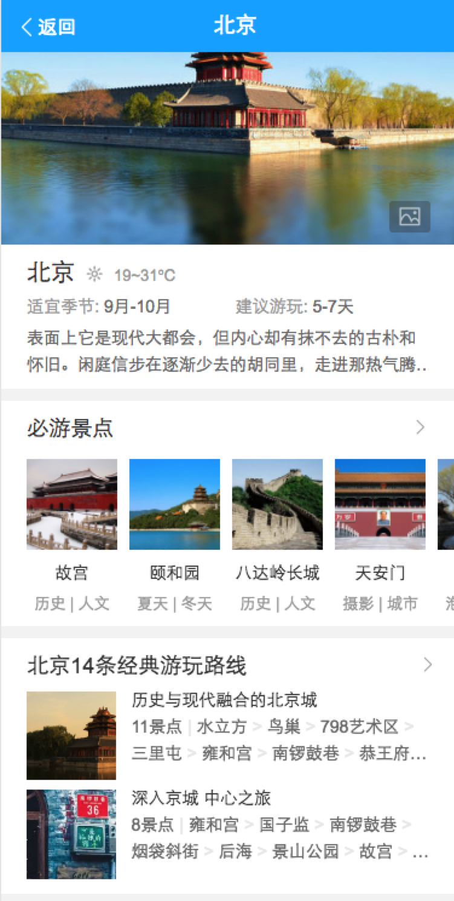
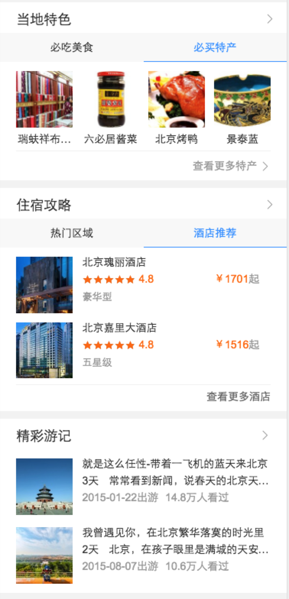
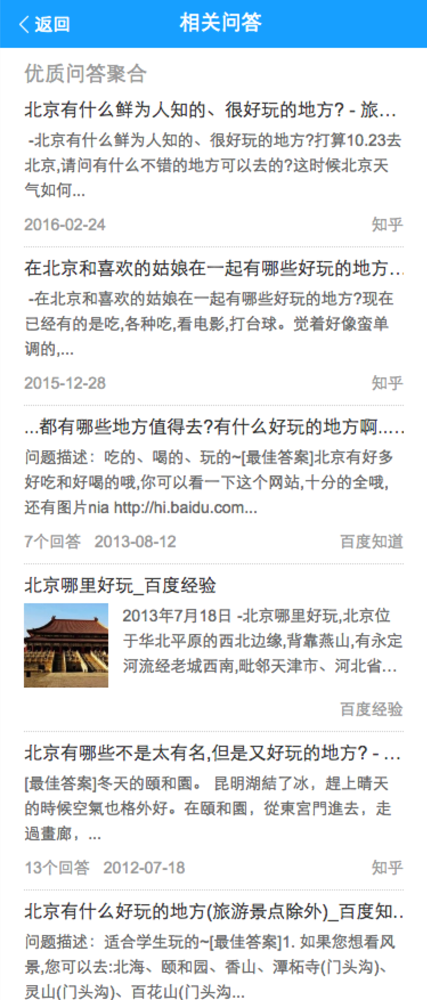
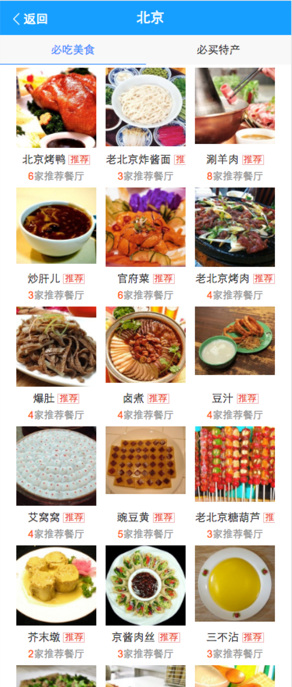
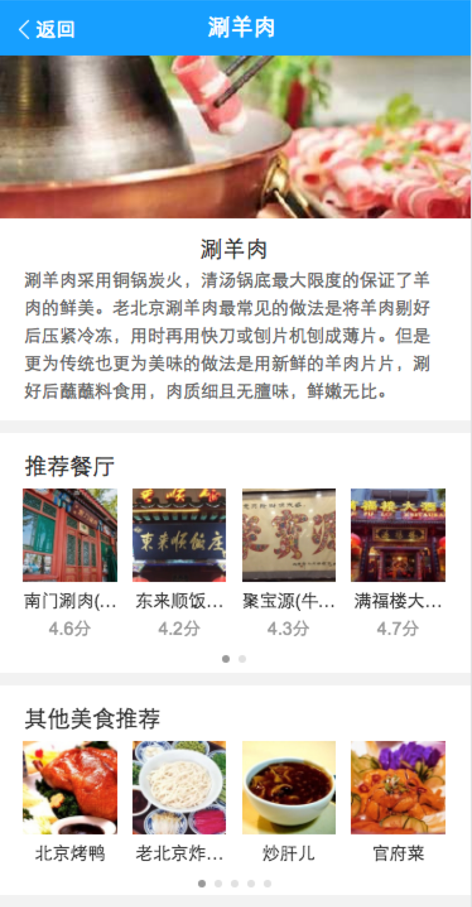
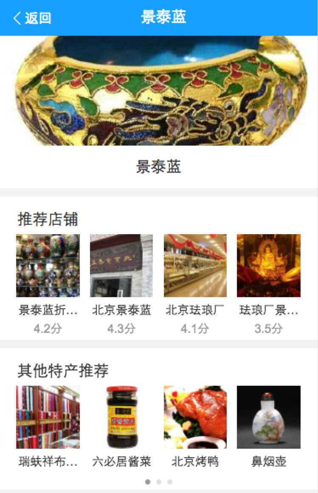

# 司文宇

> 2016年9月12日~2016年9月14日

## 城市改版项目
### 项目背景

wiki地址：[http://wiki.baidu.com/pages/viewpage.action?pageId=204667813](http://wiki.baidu.com/pages/viewpage.action?pageId=204667813)

### 具体计划：
* 行程规划卡–开发1天，联调0.5天  (DONE)
* 问答列表情景页--开发1天，联调0.5天（DONE）
* 相关问答卡–开发1天，联调0.5天  (DONE)
* 美食情景页–开发1天，联调1天 (DONE)
* 特价路线卡–开发1天，联调0.5天 (DONE)
* 住宿攻略卡（新数据）–开发1天，联调1天（DONE）
* 当地特色卡片（card）(DONE)
* 当地特色卡片（结果页）待联调。
* 当地特色数据。(DONE)

新增：
* 结果页，当地特色-(DONE)
* 情景页，当地特色-(DONE)

### 具体进展：提测bug修改中

#### bug修改问题

1. 收敛卡https报警

1. 我跟泉有做的卡片在样式上有少许出入

1. 特产美食图片部分不符合需求，已给携程提出

1. 特产美食数据部分不符合需求，已给携程提出

1. ios9 谷歌浏览器情景页2.0跳转，1秒后顶部的蓝色条会下滑，情景页中一半复现，bug issue：[传送门](http://gitlab.baidu.com/psfe/superframe/issues/32)

1. ue视觉稿，mrd，口头描述等不统一，ue走查发现大量视觉问题，修复中~~~

### tab情景页切换组件

#### 调研

1. 横滑tab组件功能完善。

1. 视图不稳定，待odp配置。

1. 点击创新不稳定，待配置。

1. item1 -> item2tab切换，$().eq(index).trigger(click);

#### 进度

现在环境稳定，待给出schema和配置，至下周。

#### 问题

psui没有API文档，只有初始化参数配置。

