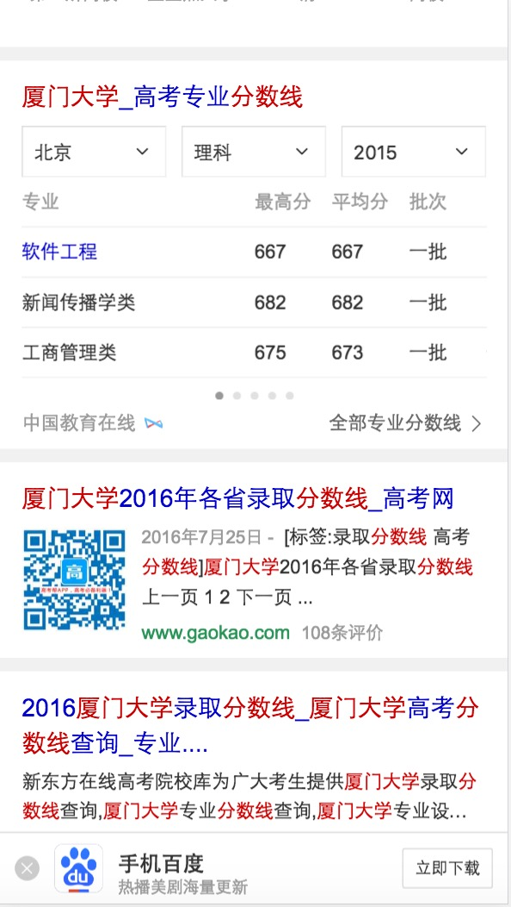
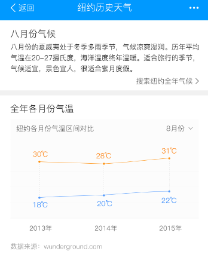

# 产品月报

> 从 2016-08-29 到2016-09-23


## 人员

```
- FE: 李晓,晓卉,健驰,阳阳,鹏远

```

### 需求安排

	* 体育(1)：阳阳
	* 游戏(1)：鹏远
	* 医疗(1)：健驰
	* 自有产品
	* 车系
	* 房产
	* 飞鸽民生(1-2)：李晓
	* 教育(1)：晓卉

### 进度

#### 游戏主播kv卡（鹏远）
* 背景:以直播和视频为载体的多媒体平台快速发展，导致一批主播和网络红人成为用户关注的热点。而这些游戏主播本身有很强的粉丝效应，故希望在原有的搜索结果下，整合主播的内容，以更好的满足用户。 
* 完成情况:已完成，走三级单中，下周一（9月26日）上线
* 收益：小流量PV约3w，全流量扩词以后，会有50-70w左右
* 效果图
<p></p>

#### 哥伦布-教育-海外院校申请条件相关卡片 （晓卉）
* 背景:满足用户对海外院校相关信息的搜索，从搜索结果页直接展现海外院校需求下的热门内容，降低用户换query比（约6%~8%），提高用户搜索满意度。
* 完成情况:9.09上线小流量，转全待排期。
* 线上地址：[预览](https://m.baidu.com/s?word=%E6%9D%9C%E5%85%8B%E5%A4%A7%E5%AD%A6&sid=102160)
* 效果图
<p></p>

####  节日卡片（健驰）
* 背景：为了在节日期间提升整体用户体验，并承接logo导流，给予用户更具温度的query结果页。特准备上线带有节日色彩的阿拉丁模板。该模板用于大部分节日，从满足用户需求角度出发，同时带动百度体系兄弟部门各项收益指标（如新闻、糯米、度秘等等），大搜作为中心，联合各个产品线共同发力，在节日期间创造更多价值。
* 完成情况：9月13日模板已上线 中秋节 有时效性 现在已经不召回。
* 收益：预估收益pv：200w/day
* 效果图
<p></p>

#### 二手车(阳阳)
* 背景:
	* 针对二手车，用户有买车和卖车两方面的需求。而各商家的车源分散，中小型城市的车源不足，且市场上暂无巨头出现，目前呈现三足鼎立之势（优信、人人、瓜子）
	* 百度可通过聚合车源、搭建入口、提供额外优惠等方式，进一步满足用户需求，稳住二手车的流量入口。
* 完成情况:
	* 排期如下：
		- 9-19 rd产出数据schema @晓辉
		- 9-27-10.10  FE样式和功能开发 @阳阳
		- 9.21 资源方产出测试数据 @雅雯 @夏夏
	    - 9.21-9.26 产出联调环境 @晓辉
		- 9.26-9.30 wd开发 @学峰
		- 10.8-10.10  WD/RD联调 @晓辉 @学峰
		- 10.10-10.14 联调+测试 @阳阳 @雅雯 @曹密
* 收益：暂无
* 效果图
<p>以下图是泛需求的静态图（由于rd的数据环境没搞好~只做了静态页面和部分的交互功能，大部分的功能等待9月27环境好了在继续~）</p>
<p>

</p>
<p>

</p>
<p>

</p>
<p>

</p>
<p>

</p>
<p>

</p>
<p>

</p>

#### 食材菜谱MRD-V2.0(鹏远)
* 背景:
* <span>食材菜谱V1.0于8月5日全流量上线，采用精准菜谱优化方案（新增菜谱聚合卡片，美食问答由于点调位置靠下，全流量退场）。</span>
* <span>单独分析食才菜谱相关query的实验数据发现（7月底小流量实验结论：持平（0728-0801））：</span>
* <span>1、整体指标上看：点调生效时间短，实验数据有波动。8月1日有点、换query略有好转，8月23日退化样式全流量上线后，全流量回归下，预计整体指标上会有一定收益。</span>
* <span>2、菜谱阿拉丁对比：实验组展现位置、点击和有点指标均好于对照组，但仍有提升空间。</span>
    * <span>1）title点击可提高</span>
    * <span>2）食材菜谱用户有筛选&查看更多菜谱的需求</span>
* 排期 ：
    * <span>9月20号开始介入</span>
    * <span>食材百科卡，9月20日~9月22日，开发3天</span>
    * <span>菜谱筛选卡，9月23日~9月28日，开发4天</span>
    * <span>菜谱sf，9月29日~10月9日，开发4天</span>
    * <span>联调3天，10月10日~10月12日</span>
    * <span>提测2天，10月13日~10月14日</span>
    * <span>人工评估2天，10月17日~10月18日</span>
    * <span>10月19日上线</span>
* 收益：
    * <span>1）食材名类query：总pv7600。</span>
    * <span>2）食材做法类query：总pv1.5W。</span>
* 效果图
<p></p>
<p></p>

#### 宝宝发育指标 - 母婴（健驰）
* 背景：关于宝宝发育指标的相关需求，目前线上阿拉丁仅提供宝宝体格和动作指标结构化信息，且线上结果仍为未经栅格化的历史遗留卡片。本次对该卡片做优化，满足用户更多维度的宝宝发育指标需求（如，语言发育和情感社会认知发育），提供体格发育指标个性化检测功能，重新设计后的卡片更友好更加具有趣味性。
* 收益：预估收益pv：9w/day
* 完成情况：已提测 ,预计9月26（下周一）上线
* 预览地址：[6个月宝宝](http://cp01-ala-fe-6.epc.baidu.com:8003/s?word=6%E4%B8%AA%E6%9C%88%E5%AE%9D%E5%AE%9D&ts=8186996&t_kt=0&rsv_iqid=693706945042933627&sa=ihr_2&rsv_sug4=1237&ss=001)
* 效果图
<p></p>
<p></p>

#### 哥伦布-民生-天气老卡（李晓）
* 背景:线上500万小城市天气模板为老的sigma1.0机制，为升级开发方式和效率迁移为sigma2.0.
* 完成情况:8.17-8.23模板开发+联调，8.24号pm确认效果+QA介入测试，复用weather作为白卡退化样式，8.24号已加兼容逻辑上线
* 收益：暂无
* 效果图
<p></p>

#### 哥伦布-民生-500W天气优化方案（李晓）
* 背景:为了深度优化用户搜索天气类query需求，对天气主需求，5天预报及今日生活指数进行
* 完成情况:推荐样式，2天 （9.18-9.19）；联调，3天（9.21-9.23）；提测和人工评估，3天（9.26-9.28）；模板上线（9.29）
* 收益：暂无
* 效果图
<p></p>
<p></p>

#### 哥伦布-民生-1000W城市天气去头图 （李晓）
* 背景: 为了深度优化用户搜索天气类query需求，对天气主需求进行优化，与pc端天气视觉效果统一，去掉城市背景头图，背景改为与天气情况相映射
* 完成情况:
    * <span style="color:gray">天气去头图，09.06号开始联调，09.09号测试，09.12号模板上线，目前线上0流量，预计09.18号全量</span>
    * （对比本地天气&24小时预报曲线）+去头图优化9月18日晚上19:40完成全流量上线。本次全流量上线覆盖国内155个城市以及国外76个城市天气
* 收益：影响面约为1000万/天
* 预览地址：query=[北京天气](https://m.baidu.com/s?word=%E5%8C%97%E4%BA%AC%E5%A4%A9%E6%B0%94&sid=102156)
* 效果图
<p></p>

#### 哥伦布-教育-专业分数线（晓卉）
* 背景:专业分数线需要转全。
    * 转全前有两个问题：
    * 1. 目前可上线的query为 院校+分数线精准query（略正），院校泛需求下略负向。需要前后端配合更新一下异步数据请求query
    * 2. 线上case：专业分数线 异步数据请求都失败了，目前已下掉小流量
* 完成情况:9.2已上线。
* 线上地址：[预览](https://www.baidu.com/s?word=%E5%8E%A6%E9%97%A8%E5%A4%A7%E5%AD%A6%E5%88%86%E6%95%B0%E7%BA%BF)
* 效果图
<p></p>


####  百家号大搜展现（阳阳）
* 背景:为了更好地维护内容生态，需要引入自媒体人入驻，创作内容，充实并提高内容池质量。而引入自媒体人，并且激励自媒体人活跃，都需要提供更多权益，更多曝光机会，吸引自媒体人。百度搜索结果页的展现本身就是流量和知名度的象征，并且对于明确搜索自媒体人或相关内容的query来说，百家号展现满足了部分需求。
* 完成情况:模版上线
* 收益：pv量：<5w
* 效果图
<p>q=[码农杂谈](https://m.baidu.com/s?word=%E7%A0%81%E5%86%9C%E6%9D%82%E8%B0%88&sid=102164)</p>
<p></p>
<p></p>

#### 外卖泛需求阿拉丁（阳阳）
* 背景:预期用户换query降低，页面有点提升，gmv提升~
* 完成情况:已于9.7晚小流量上线~
	* 【实验情况】
	* 实验组：sid=109793，资源id=4824，模板名=takeoutfood
	* 对照组：sid=109794，资源id=3156，模板名=wz_waimai
	各抽取50%流量。
* 收益：50%抽样~影响面约2.5w~
* 效果图
<p>q=[外卖](https://m.baidu.com/s?word=%E5%A4%96%E5%8D%96&sid=109793)</p>
<p></p>

#### 哥伦布-民生-快递（阳阳）
* 对单号查询和寻址需求用户，为用户推出快递小工具功能，构建可控二级情景页。
* 完成情况:模板正在0流量中~
	<p>本周修复问题</p>
		* 小工具模板样式修改实验~
		* 地图模板底部的url跳转错误~改为与title跳转逻辑一样~
		* 小工具模版的在线工具和网点查询的情景页里定位位置~改为在定位失败并且没有缓存的时候~自动触发下定位按钮~
	<p>修改完成~9月7号已上线~</p>
	<p>今日（9月23日）转全上线~</p>
	<p>环境地址:</p>
	<P>[顺丰快递](http://cp01-sys-rath4-c32-qa074.cp01.baidu.com:8003/s?word=%E9%A1%BA%E4%B8%B0%E5%BF%AB%E9%80%92&sid=102155)</p>
	<p>[顺丰快递](http://cp01-sys-rath4-c32-qa074.cp01.baidu.com:8003/s?word=%E9%A1%BA%E4%B8%B0%E5%BF%AB%E9%80%92&sid=102156)</p>
* 收益：暂无
* 效果图
<p>

</p>
<p>

</p>
<p>

</p>
<p>

</p>

#### 客服模板优化（健驰）
* 背景：现在线上客服相关的模板太多，为了以后方便管理，样式统一，需要吧线上的模板整合成一个主模板和一个退化模板。
* 收益：预估收益pv：430w/day
* 完成情况：模板已完成，今日9月26日上线
* 预览地址：[汉斯格雅客服热线](https://wwwhttps.baidu.com/s?dev=1&dev_workspace=platform&dev_module=aladdin-wise&dev_tpl=nkefu&dev_path=searchaladdin&dev_tpltype=default&sid=99999&dev_online=1&wd=%E6%B1%89%E6%96%AF%E6%A0%BC%E9%9B%85%E5%AE%A2%E6%9C%8D%E7%83%AD%E7%BA%BF&word=%E6%B1%89%E6%96%AF%E6%A0%BC%E9%9B%85%E5%AE%A2%E6%9C%8D%E7%83%AD%E7%BA%BF)

#### 哥伦布-民生- 天气相关模板情景页迁移sf2.0（李晓）
* 背景: 为升级开发方式和效率，天气模板原有情景页到sf2.0，其中对比本地天气加兼容复用国内对比本地天气card,历史温度新开发情景页
* 完成情况: 08.25号开始介入，已产出schema, 08.25-08.29开发，08.30号联调，08.31号上线情景页；08.29号国外天气模板与国内天气模板合并，同时更改结果页跳转至新的情景页，09.01号上线合并后模板；09.05号已上线，query=[纽约天气](https://m.baidu.com/s?word=%E7%BA%BD%E7%BA%A6%E5%A4%A9%E6%B0%94)
* 收益：暂无
* 效果图
<p></p>
<p></p>

#### 迁移模板sigma_celebrity_rela sf2.0 （鹏远）
* 背景:升级模板sf1.0
* 完成情况:8月19日sf已上线，因本周rd休假，下周一配置（9月26日）上线
* 收益：PV约200w
* 效果图
<p></p>