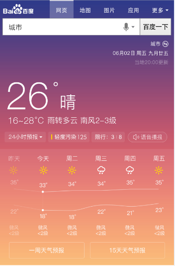
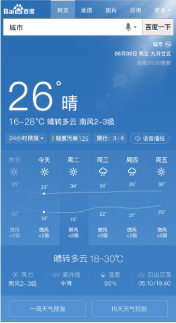

# 李晓

> 从2016-09-12到2016-09-14

### 民生子垂类

    * 天气：pm周里成+杨宇 rd赵元浩 fe李晓
    * 菜谱：pm周里成+杨宇 rd赵元浩 fe李晓
    * 快递：pm徐海漠 rd楚振江
    * 日历：pm林馨怡 rd郑杰
    * 通用推荐：pm徐海漠 rd殷瑞娜

### 进度

## 哥伦布-民生-天气老卡

### 背景

线上500万小城市天气模板为老的sigma1.0机制，为升级开发方式和效率迁移为sigma2.0.

### 完成情况

* 8.17-8.23模板开发+联调，8.24号pm确认效果+QA介入测试
* 复用weather作为白卡退化样式，8.24号已加兼容逻辑上线
* 上线0流量后发现sg2.0屏蔽了预处理文件，需要讲预处理文件相关逻辑迁移至模板。
* 09.28号使用sg_weather模板实验

### 效果

## 哥伦布-民生-1000W城市天气去头图

### 背景

为了深度优化用户搜索天气类query需求，对天气主需求进行优化，与pc端天气视觉效果统一，去掉城市背景头图，背景改为与天气情况相映射

### 完成情况

* 天气去头图，09.06号开始联调，09.09号测试，09.12号模板上线，目前线上0流量，预计09.18号全量
* （对比本地天气&24小时预报曲线）+去头图优化9月18日晚上19:40完成全流量上线。本次全流量上线覆盖国内155个城市以及国外76个城市天气，影响面约为1000万/天,query=[北京天气](https://m.baidu.com/s?word=%E5%8C%97%E4%BA%AC%E5%A4%A9%E6%B0%94&sid=102156)

### 效果

## 哥伦布-民生-500W天气优化方案

### 背景

为了深度优化用户搜索天气类query需求，对天气主需求，5天预报及今日生活指数进行

### 完成情况

* 5天预报详情展开，3天（9.12-9.14）已完成
* 推荐样式，2天 （9.18-9.19）已完成
* 联调，3天（9.21-9.23），模板和后端数据联调，1天（9.21），模板和UE联调样式，1天（9.22），模板和PM联调产品逻辑和细节，1天（9.23）提前一天已完成
* 提测和人工评估，3天（9.23-9.27）
* 模板上线（9.27）

### 效果

## 哥伦布-民生-天气泛需求（全国天气和全省天气）

### 背景

用户不仅对于某个城市/景点有天气查询需求（当前天气覆盖卡片），用户还有搜索类似q=”全国天气”以及各省天气的需求(PV每天约8W)，而当前搜索结果页未有特型结果覆盖，用户对天气泛需求查询并未得到很好的满足。

### 完成情况

待开展

### 效果

## 民生项目其他需求

* 【日历】日历日期查询迭代，联调完、09.12号测试、09.13号上线，09.18号已上线，健驰跟进。
* 【推荐】通用推荐情景页迁移2.0 + 两个细节改动，09.06~09.13开发联调，09.14提测，09.19号模板已上线鹏远跟进。
* 【菜谱】菜谱样式优化，已评审，09.02号定稿，09.20号介入开发，开发中，10.19号前模板上线，鹏远跟进。
* 【天气】哥伦布天气现存问题用户体验优化方案 + 场景化天气优化方案，09.26日需求评审，李晓跟进。

## 民生未安排需求

* 【日历】节日节气垂类优化，已评审，09.12号初稿，09.13号终稿，人力待定。
* 【快递】快递泛查询和资源方平衡方案，09.28日评审。
* 【菜谱】泛需求优化方案，09.28日评审。

