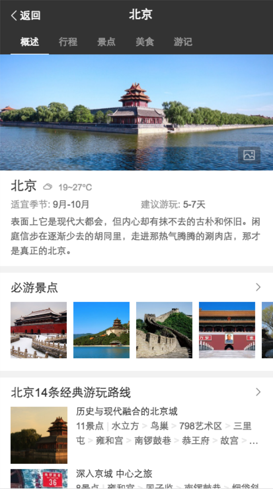

# 司文宇

> 2016年9月18日~2016年9月23日

## 城市改版项目
### 项目背景

wiki地址：[http://wiki.baidu.com/pages/viewpage.action?pageId=204667813](http://wiki.baidu.com/pages/viewpage.action?pageId=204667813)

### 具体计划：
* 行程规划卡–开发1天，联调0.5天  (DONE)
* 问答列表情景页--开发1天，联调0.5天（DONE）
* 相关问答卡–开发1天，联调0.5天  (DONE)
* 美食情景页–开发1天，联调1天 (DONE)
* 特价路线卡–开发1天，联调0.5天 (DONE)
* 住宿攻略卡（新数据）–开发1天，联调1天（DONE）
* 当地特色卡片（card）(DONE)
* 当地特色卡片（结果页）待联调。
* 当地特色数据。(DONE)

新增：
* 情景页，当地特色-(DONE)

### 具体进展：已0流量上线，0流量id：109912

#### bug问题

	case1：@highlinght在情景页中的bug，是odp3.0中的bug；
	case2：结果页模板必有景点两周前上线，使用的是46108资源，取两层result，情景页上线时候也有一个资源31517使用这个资源，直接去result，造成展现空模板

### tab情景页切换组件

#### 调研

1. 横滑tab组件功能完善。

1. odp配置。

1. item1 -> item2tab切换，$().eq(index).trigger(click);

#### 进度

组件使用文档连接：<a href="http://sfe.baidu.com/#/阿拉丁/无线网页搜索/js组件/情景页顶部通栏技术方案">传送门</a>

现在环境稳定，联调结束，待正式数据和odp配置上线
<a href="http://cp01-ala-fe-col-2.epc.baidu.com:8003/sf?openapi=1&dspName=iphone&from_sf=1&pd=city&resource_id=4324&word=%E5%8C%97%E4%BA%AC&hide=1&apitn=tangram&top=%7B%22sfhs%22%3A2%7D&ext=%7B%22type%22%3A%22food%22%2C%22tab_name%22%3A%22%E6%A6%82%E8%BF%B0%22%7D">环境连接</a>

#### demo截图

#### 问题

1. psui没有API文档，只有初始化参数配置。

1. tab标签少于5个时候样式不能满足，需手动解决。

