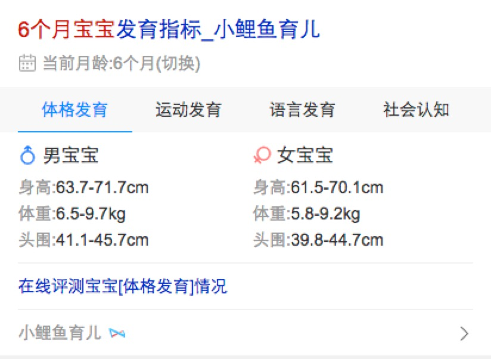
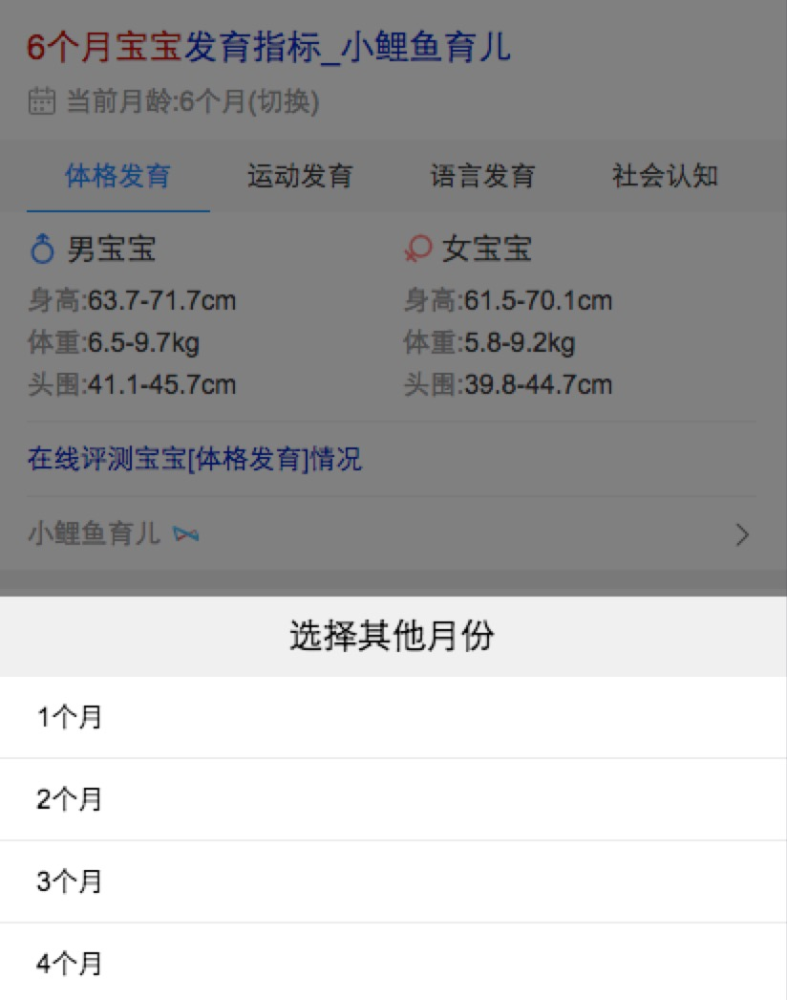
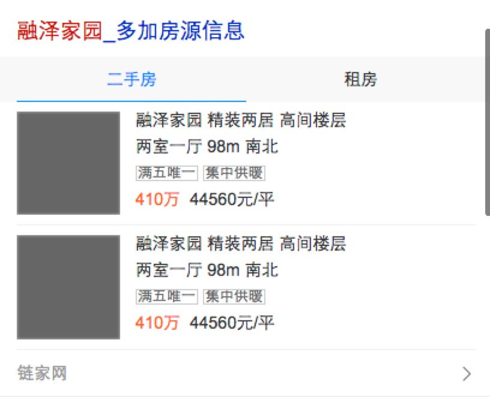

# 常健驰

> 从2016-9-19到2016-9-23

## 农历、日历模板修改

### 收益

    预估收益pv：30w/day

### 完成情况

`9月18日`模板已上线 [日历](https://m.baidu.com/#|src_%E6%97%A5%E5%8E%86|sa_ib)

### 效果截图

## 节日哥伦布卡片

### 背景

为了在节日期间提升整体用户体验，并承接logo导流，给予用户更具温度的query结果页。特准备上线带有节日色彩的阿拉丁模板。该模板用于大部分节日，从满足用户需求角度出发，同时带动百度体系兄弟部门各项收益指标（如新闻、糯米、度秘等等），大搜作为中心，联合各个产品线共同发力，在节日期间创造更多价值。

### 收益

    预估收益pv：200w/day

### 完成情况

`9月13日` 模板已上线 [中秋节](https://m.baidu.com/#|src_%E4%B8%AD%E7%A7%8B%E8%8A%82|sa_tb) 有时效性 现在已经不召回。

### 效果截图

## 宝宝发育指标 - 母婴

### 背景

关于宝宝发育指标的相关需求，目前线上阿拉丁仅提供宝宝体格和动作指标结构化信息，且线上结果仍为未经栅格化的历史遗留卡片。本次对该卡片做优化，满足用户更多维度的宝宝发育指标需求（如，语言发育和情感社会认知发育），提供体格发育指标个性化检测功能，重新设计后的卡片更友好更加具有趣味性。

### 收益

    预估收益pv：9w/day

### 完成情况

已提测 [6个月宝宝](http://cp01-ala-fe-6.epc.baidu.com:8003/s?word=6%E4%B8%AA%E6%9C%88%E5%AE%9D%E5%AE%9D&ts=8186996&t_kt=0&rsv_iqid=693706945042933627&sa=ihr_2&rsv_sug4=1237&ss=001)

### 效果截图

## 客服模板优化

### 背景

现在线上客服相关的模板太多，为了以后方便管理，样式统一，需要吧线上的模板整合成一个主模板和一个退化模板。

### 收益

    预估收益pv：430w/day

### 完成情况

模板已完成，在测试数据 [汉斯格雅客服热线](https://wwwhttps.baidu.com/s?dev=1&dev_workspace=platform&dev_module=aladdin-wise&dev_tpl=nkefu&dev_path=searchaladdin&dev_tpltype=default&sid=99999&dev_online=1&wd=%E6%B1%89%E6%96%AF%E6%A0%BC%E9%9B%85%E5%AE%A2%E6%9C%8D%E7%83%AD%E7%BA%BF&word=%E6%B1%89%E6%96%AF%E6%A0%BC%E9%9B%85%E5%AE%A2%E6%9C%8D%E7%83%AD%E7%BA%BF)

### 效果截图

## 房产

### 完成情况

`9月22日`下午开始介入开发 [融泽家园](https://wwwhttps.baidu.com/s?dev=1&dev_workspace=platform&dev_module=aladdin-wise&dev_tpl=housing&dev_path=searchaladdin&dev_tpltype=default&sid=99999&dev_online=0&dev_file=default.xml&dev_fileformat=xml&dev_pos=asResult&wd=%E8%9E%8D%E6%B3%BD%E5%AE%B6%E5%9B%AD&word=%E8%9E%8D%E6%B3%BD%E5%AE%B6%E5%9B%AD)

### 效果截图

## 后续排期

* 日历项目
