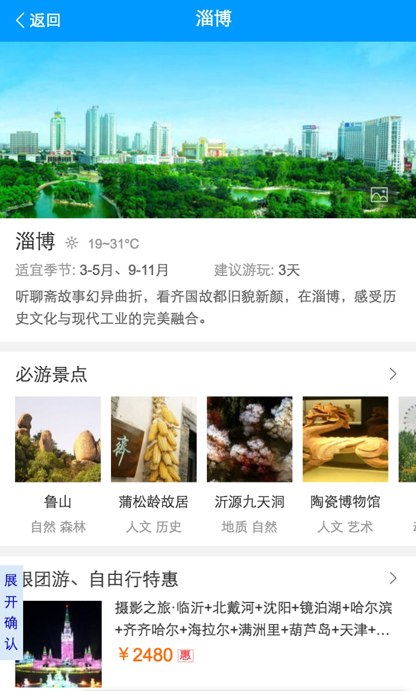

# 刘泉有

> 2016-09-26 ~ 2016-09-30

## 移动生活-旅游城市

### 背景

当前的旅游类搜索结果页包含卡片较多，尤其是同质内容卡片使得页面结构凌乱。以景区和典型旅游城市作为试水Query，依托于场景化卡片优化搜索结果页整体效果，优化内容包括：增加特价线路子卡、百度图片子卡、相关地点推荐子卡、相关咨询子卡，同时尝试兼容广告的浅色大卡样式和自然结果融合的样式。

### 收益

108城市全流量,PV80W.
另730城市小流量,PV20W.

### 完成情况

- 2016-04-28上线

Query: 三亚,乌镇,丽江,桂林,上海,北京...

[三亚](https://m.baidu.com/s?word=%E4%B8%89%E4%BA%9A&sid=105601)

### 本周

无更新

### 效果

[淄博](https://wwwhttps.baidu.com/sf?pd=city&openapi=1&dspName=iphone&from_sf=1&resource_id=4324&word=%E6%B7%84%E5%8D%9A&city_name=None&title=%E6%B7%84%E5%8D%9A&lid=15597221358174187051&ms=1&frsrcid=31714&frorder=2)

### 后续计划

* [项目总结](http://wiki.baidu.com/pages/viewpage.action?pageId=204667813).
* 小流量后根据数据优化,直至全量,时间点暂未定。

## 移动生活-旅游景点

### 背景

针对旅游类目下的景点搜索需求，从页面整体效果上优化体验，建立更有组织的搜索结果页面.

### 收益

页面停留时长增加，长点击增加，门票gmv转化率上升,预计日PV 300W（旺季可能会翻倍）.
先小流量上线,PV约120W.

### 完成情况

- 景点收敛卡722城市已全量.

### 本周

景点收敛卡兼容优惠购票样式（09-28）上线.

景点情景页头卡添加跳转图片情景页逻辑（09-28）上线.

景点情景页购票卡重构（09-28）上线.

### 效果

[北京](https://m.baidu.com/ssid=fb07416b373367756361733f09/s?word=%E6%95%85%E5%AE%AB&sid=106555)

### 后续计划

* 度假线路开发,暂无排期,数据还在更新中.

### aladdin文档建设&文档平台

- 文档平台已于(09-24)上周六全量,mip与superframe文档也迁移至该文档平台.
- 已与大仙勾兑下一步平台优化计划。
- 迁移PC文档计划收假后一周内给出。
