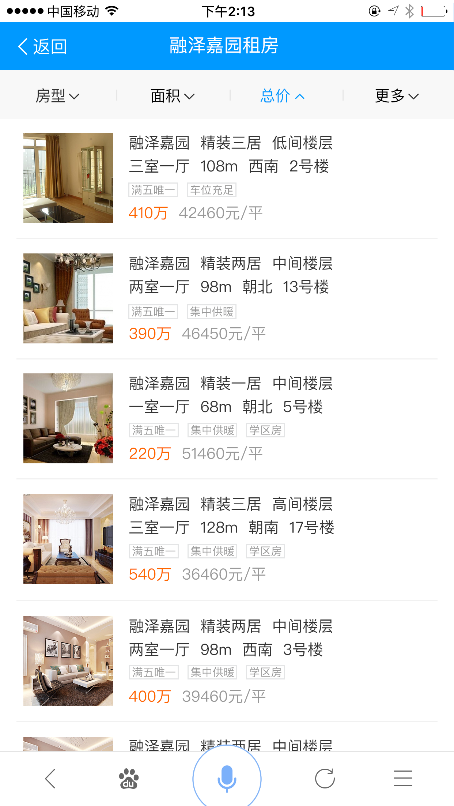
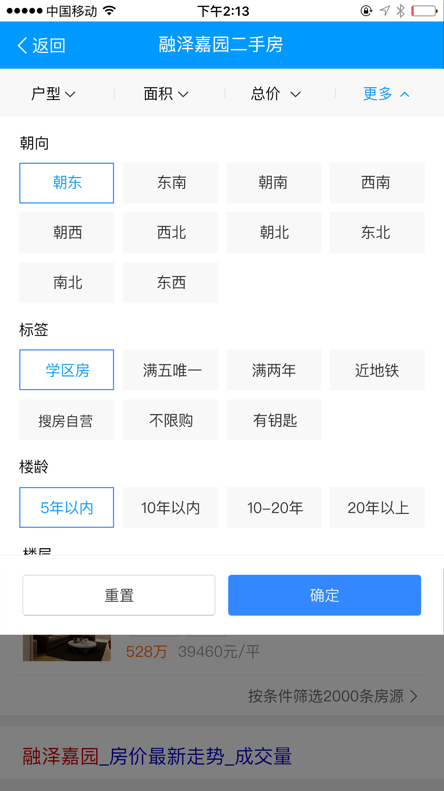
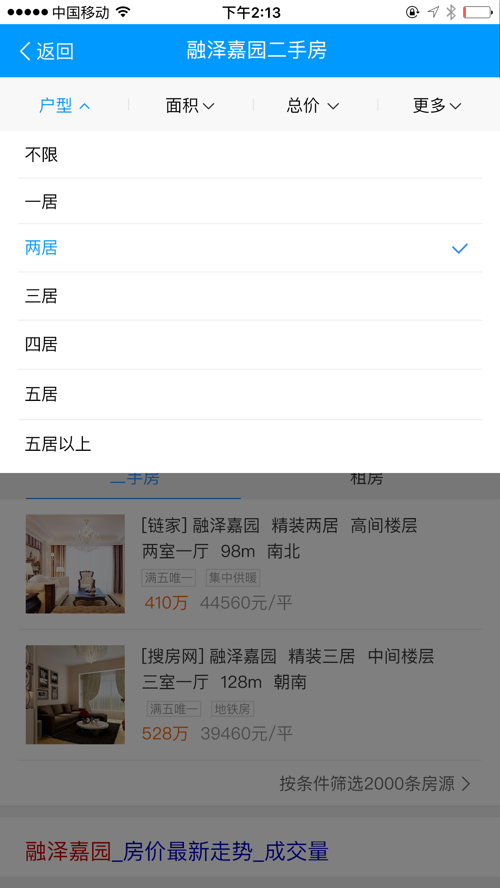
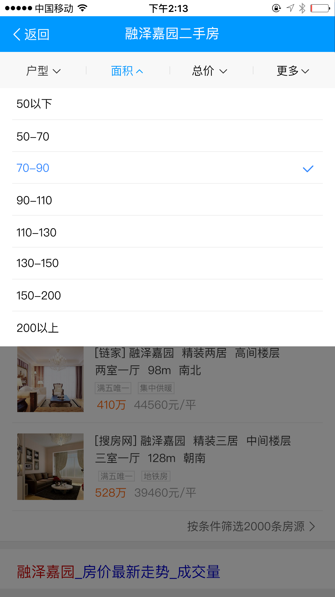
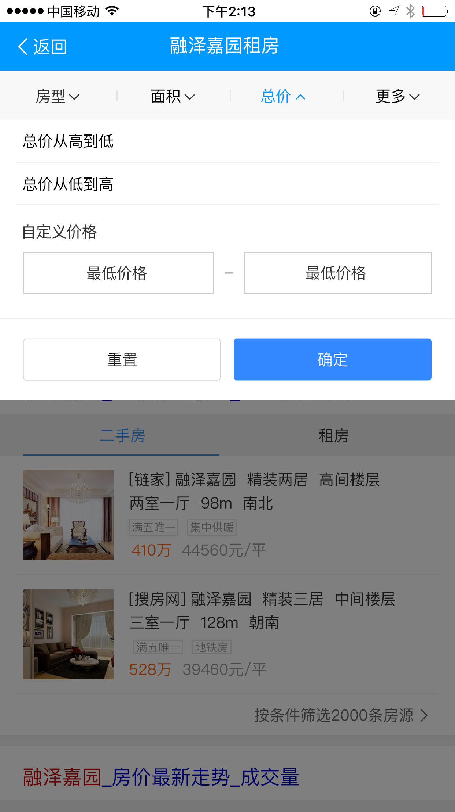

# 常健驰

> 从2016-9-26到2016-9-30

## 客服模板优化

### 背景

现在线上客服相关的模板太多，为了以后方便管理，样式统一，需要吧线上的模板整合成一个主模板和一个退化模板。

### 收益

    预估收益pv：430w/day

### 完成情况

主需求模板修改，正在确认效果中，节前不上了 [岳立天成客服](http://cp01-ala-fe-6.epc.baidu.com:8003/s?word=%E5%B2%B3%E7%AB%8B%E5%A4%A9%E6%88%90%E5%AE%A2%E6%9C%8D&sa=thr_5&ts=3407005&t_kt=0&ie=utf-8&rsv_t=9938%252FQfMChvbubDjzrtFicVcpuDlo%252FVpmsvja2cN7rBEmX3TSf49&rsv_pq=4895795527288079052&ss=101&rqlang=zh&rsv_sug4=23355&inputT=21840&oq=%E7%99%BE%E5%BA%A6%E5%AE%A2%E6%9C%8D%E7%94%B5%E8%AF%9D)

### 效果截图

## 房产

### 完成情况

模板已用假数据开发完成，后端环境预计是在`9月26日`搭好，实际`9月29日`搭好，数据结构还存在一些问题正在修改数据结构 [融泽家园](https://wwwhttps.baidu.com/s?dev=1&dev_workspace=platform&dev_module=aladdin-wise&dev_tpl=housing&dev_path=searchaladdin&dev_tpltype=default&sid=99999&dev_online=0&dev_file=default.xml&dev_fileformat=xml&dev_pos=asResult&wd=%E8%9E%8D%E6%B3%BD%E5%AE%B6%E5%9B%AD&word=%E8%9E%8D%E6%B3%BD%E5%AE%B6%E5%9B%AD)

### 效果截图

## 后续排期

* 暂无
