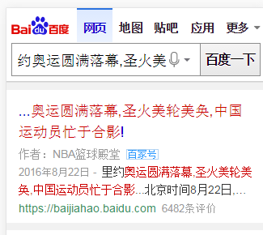
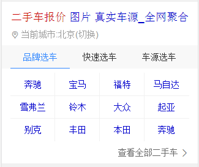
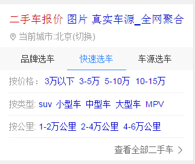
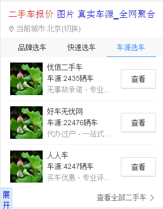
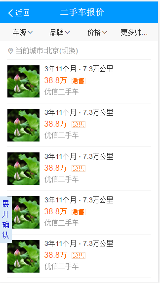
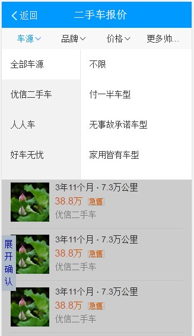
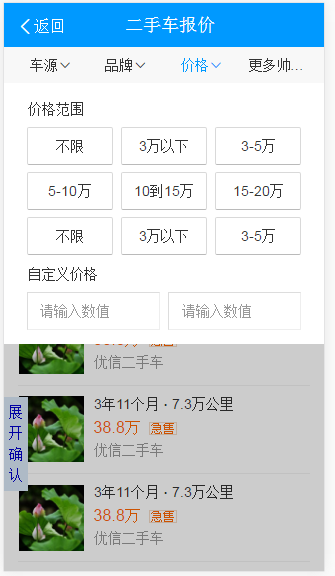
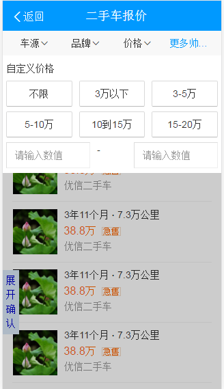
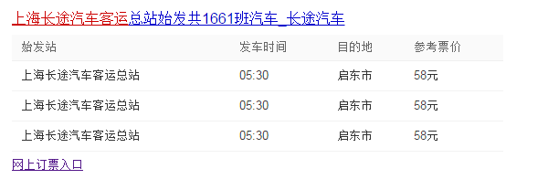

# 李阳阳

> 2016年9月12日~2016年9月14日

## 百家号大搜文章展现（复用www_normal）(无更新)

* 背景:为了更好地维护内容生态，需要引入自媒体人入驻，创作内容，充实并提高内容池质量。而引入自媒体人，并且激励自媒体人活跃，都需要提供更多权益，更多曝光机会，吸引自媒体人。百度搜索结果页的展现本身就是流量和知名度的象征，并且对于明确搜索自媒体人或相关内容的query来说，百家号展现满足了部分需求。
* 目标:利用百度大搜的流量提升优质作者文章的展现和阅读量，整体提升作者的流量和金钱收益，形成良性口碑传播，吸引更多作者入驻。
* 完成情况: 9月22日已上线~抽样50%~pv量：<20w~
* 收益：pv量：<20w~确切的收益等待小流量的结论~
* 效果图

q=[约奥运圆满落幕，圣火美轮美奂，中国运动员忙于合影](https://m.baidu.com/s?word=%E7%BA%A6%E5%A5%A5%E8%BF%90%E5%9C%86%E6%BB%A1%E8%90%BD%E5%B9%95%EF%BC%8C%E5%9C%A3%E7%81%AB%E7%BE%8E%E8%BD%AE%E7%BE%8E%E5%A5%82%EF%BC%8C%E4%B8%AD%E5%9B%BD%E8%BF%90%E5%8A%A8%E5%91%98%E5%BF%99%E4%BA%8E%E5%90%88%E5%BD%B1&sid=110031)

## 二手车

* 背景:
	* 针对二手车，用户有买车和卖车两方面的需求。而各商家的车源分散，中小型城市的车源不足，且市场上暂无巨头出现，目前呈现三足鼎立之势（优信、人人、瓜子）
	* 百度可通过聚合车源、搭建入口、提供额外优惠等方式，进一步满足用户需求，稳住二手车的流量入口。
* 完成情况:
	* 排期如下：
		- 9-19 rd产出数据schema @晓辉
		- 9-27-10.10  FE样式和功能开发 @阳阳
		- 9.21 资源方产出测试数据 @雅雯 @夏夏
	    - 9.21-9.26 产出联调环境 @晓辉
		- 9.26-9.30 wd开发 @学峰
		- 10.8-10.10  WD/RD联调 @晓辉 @学峰
		- 10.10-10.14 联调+测试 @阳阳 @雅雯 @曹密
	* 进度：
	    - 结果页的泛需求和精确需求基本完成~ 情景页节后开始开发~
* 收益：暂无
* 效果图

## 摘要表格资源迁移（pc端）(无更新)

* 背景:将线上已有的很多table表格的资源整成一个数据格式，pc同步wise一套数据结构~
* 完成情况:正在进行~
* 收益：暂无
* 效果图

