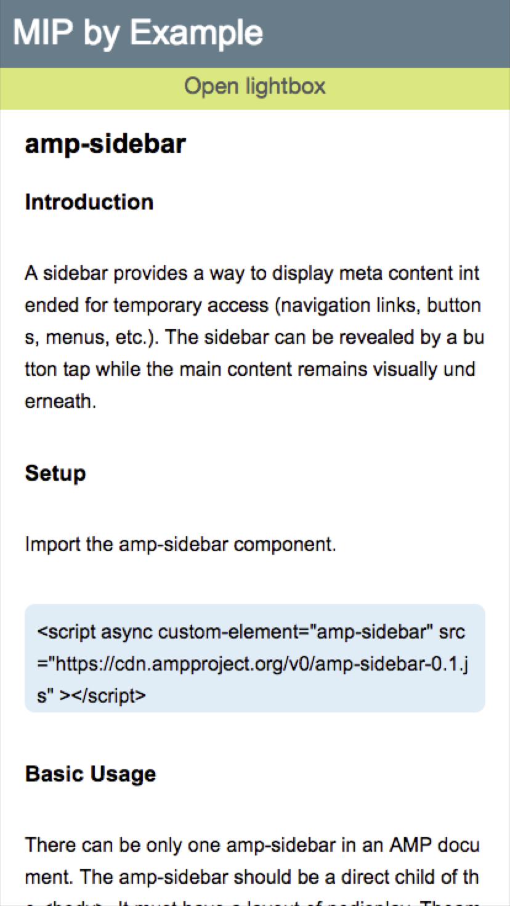
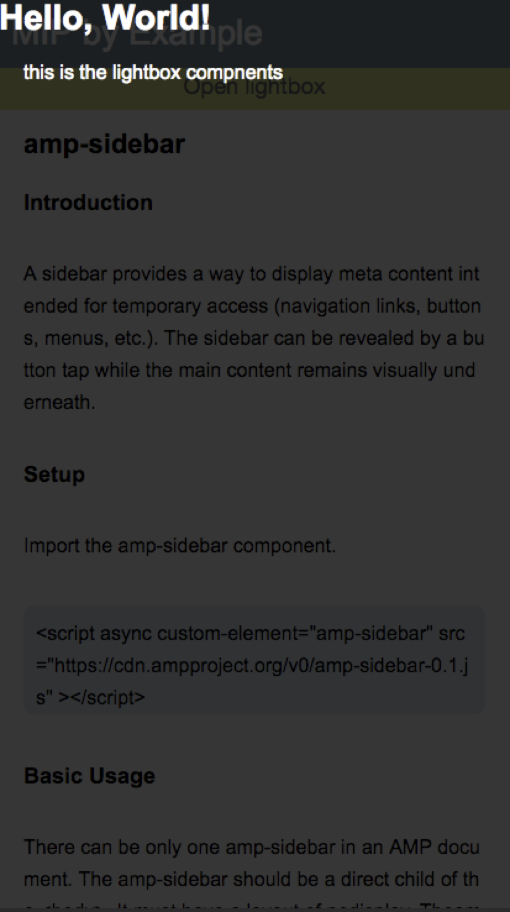
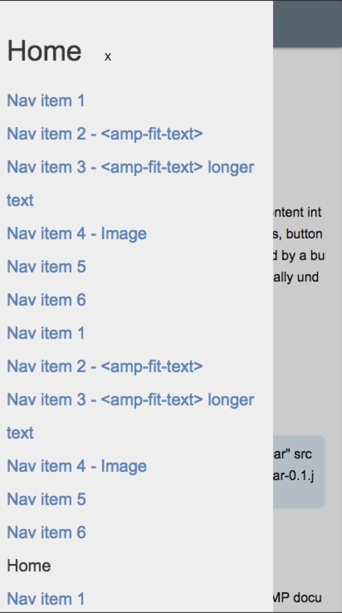

# 王培

> 从2016-09-18 到 2016-09-23

## 本周跟进

- MIP 组件开发

- MIP 文档更新

## 1. 校验规则（无更新）

### 背景与目标

    mip-validator 是一个支持 npm 安装，同时支持网页校验的 MIP 校验工具， 校验规则就是为校验工具提供一套符合 MIP 规范的规则。

### 完成情况

- 进度：

    - 校验规则升级

    ```
    1. 不允许 html 标签中含有 style 属性

    2. 不允许 html 标签中含有 on开头的属性（如onclick），但是允许适用 on
    ```
## 2. mip-link

### 背景与目标
    
    超链接 组件加 pageType 参数，区分是否 no_cache

### 完成情况

- 进度：已上线（9.26）
- 预览地址：http://fedev.baidu.com/~wangpei07/mip/link/link-mip.html

### 效果图

- 暂无

## 3. mip-form

### 背景与目标
    
    input 增加 关闭按钮，一键清除文案功能

### 完成情况

- 进度：开发中
- 预览地址：暂无

### 效果图

- 暂无

## 4. mip-lightbox

### 背景与目标
    
    点击按钮展开浮层

### 完成情况

- 进度：测试 BUG 修复中
- 预览地址：http://fedev.baidu.com/~wangpei07/mip/lightbox/lightbox-mip.html

### 效果图

<table>
    <tr>
        <td></td>
        <td></td>
    </tr>
</table>

## 5. mip-sidebar

### 背景与目标
    
    通用侧边栏组件，支持左边侧边栏和右边侧边栏

### 完成情况

- 进度：测试 BUG 修复中（9.21）
- 预览地址：http://fedev.baidu.com/~wangpei07/mip/sidebar/mip-sidebar.html

### 效果图

<table>
    <tr>
        <td></td>
    </tr>
</table>

## 6. mip-fit-text（接@传梼）

### 背景与目标
    
    自适应字体组件，根据屏幕窗口的变化能够自适应字体

### 完成情况

- 进度：测试BUG修复中（9.7）
- 预览地址：http://fedev.baidu.com/~wangpei07/mip/fit-text/fit-text-mip.html

#### 效果图

- 暂无

 
## 7. 第三方开发组件上线

### 背景与目标
    
    第三方开发的组件，测试完毕，上线

### 完成情况

- mip-fh-ad 飞华广告组件
- mip-39ad  39广告组件
- mip-vd*   视频团队相关组件

### 效果图

- 暂无

## 8. MIP 文档

### 背景与目标
    
    完善文档，随时更新
    
### 完成情况

- 进度：

    - 增加 style 使用说明文档
    - 更新 对应组件版本

- 预览地址：
    
    - 内网：http://mip.baidu.com/
    - 官网：https://www.mipengine.org/doc.html

### 效果图

- 暂无
