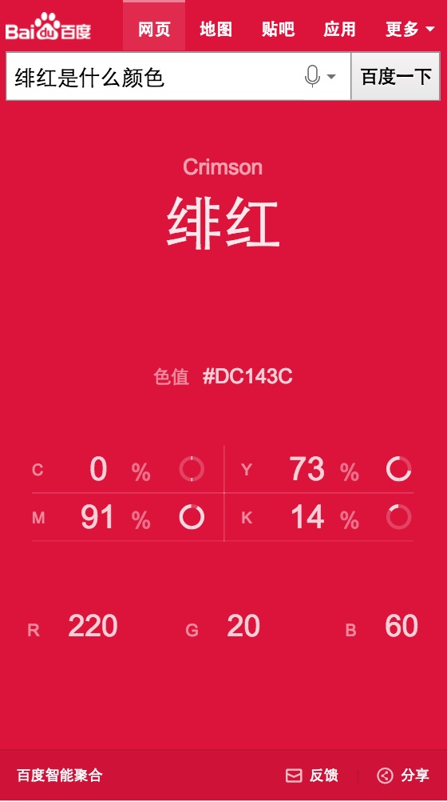

# 胡晓卉

> 从2016-10-08到2016-10-14

## 哥伦布-颜色sigma（选模板badcase）

### 背景

十一前发现sigma模板无背景颜色，进行了资源屏蔽。十一后进行问题追查，发现召回的是iphone.only.tpl。通过和平台同学沟通，发现是由于配置原因，线上有很多sigma模板召回了1.0版本。

解决方案为将1.0的配置下掉，并对所有迁移过的模板进行回归。

### 完成情况

10.08已解决。

## 哥伦布-教育-考研基本信息

### 背景

满足用户查询报考基本信息、考试科目安排、成绩等基础信息获取需求。

### 完成情况

10.13已上线。

开发：9.29-9.30，10.09-10.10。

### 效果

[预览](https://m.baidu.com/s?word=考研)

## 哥伦布-团购pc

### 背景

配合后端更换接口,前端样式调整，线上bug修复。

### 完成情况

10.09已上线。

开发9.23。联调9.26。

### 效果

[预览](https://www.baidu.com/s?ie=UTF-8&wd=%E5%8C%97%E4%BA%AC%E7%81%AB%E9%94%85)

## 哥伦布-笑话

### 背景

sf2.0迁移。（待迁移。由于资讯的sf2.0页面正在小流量，机制没有打平，暂时不能迁移。）

资讯垂类中的图集(/feed?tag=gallery)、视频接口（/video/list），在未来不久将会下线，需要各业务方进行接口迁移。

### 完成情况

10.13已上线。

开发：10.12。

### 效果

[预览](https://m.baidu.com/s?word=%E7%AC%91%E8%AF%9D&sid=109557)

## 哥伦布-颜色sigma（样式调整）

### 背景

配合sigma2.0机制下卡片左右间距调整进行样式调整。

### 完成情况

10.14上线。

9.28开发。

### 效果

[预览](https://www.baidu.com/s?word=%E7%BB%AF%E7%BA%A2%E6%98%AF%E4%BB%80%E4%B9%88%E9%A2%9C%E8%89%B2)

## 哥伦布-教育-院校问答讨论卡片及情景页

### 背景

问答卡片迭代，部分样式修改，增加sf调起入口。

### 完成情况

开发中。

开发：10.13-10.14。

## 哥伦布-教育-海外院校申请条件相关卡片

### 背景

卡片迭代。

### 完成情况

待跟进。

开发10.17。