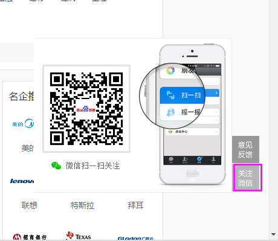

# 刘玲玲

> 从2016-10-08到 2016-10-14

### 本周进展如下： 

###  阿拉丁卡片部分
* 1、修改招聘pc端，title跳转连接参数名称
*    模板名：job3
*    query = 司机招聘 （周日 10.09 上线）
* 2、优质文章新需求 （测试完成，待走单上线） 
*    测试地址： http://nj03-psdy-aladdin038.nj03.baidu.com:8003/s?word=%E5%A4%A9%E6%96%87%E6%9C%9B%E8%BF%9C%E9%95%9C
*    效果图： 
*    
* 3、招聘公司名大卡，（开发中）
*    模板名： zhp_firm_name
*    测试地址：http://cp01-aladdin-product-06.epc.baidu.com:8003/s?word=%E6%AD%A6%E6%B1%89%E7%9B%88%E7%A7%91%E4%B8%96%E7%BA%AA%E5%95%86%E8%B4%B8%E6%9C%89%E9%99%90%E5%85%AC%E5%8F%B8
*    效果图：
*     

### 招聘中间页部分 （冯斐帆完成）

* 1、招聘中间页wise端页面优化
*  背景：自9月1号招聘中间页上线以来，分别对校招类和公司类中间页点展统计进行了总结。本次优化主要的内容是：
* （1）条件筛选交互优化；
* （2）热招职位 职位展现优化等。
*  收益：随着校招高峰期的到来，目前校招pv和公司pv稳定增长。日均分别是10w和17w（直接访问百度百聘）
*  完成情况：10.09上线完成。
*  线上地址：http://zhaopin.baidu.com/m/campus
* 2、招聘中间页pc端页面优化和功能迭代
*  背景：主要优化点是，添加了微信分享；摘要信息等。
*  完成情况：10.14 上线完成。
*  线上地址：http://zhaopin.baidu.com/campus
*  收益：新增了一个微信公众号入口。带来百度百聘微信公众号的新用户。
*  效果图： 

* 3、公司部分问答讨论（开发中）
* 当前进度：模板开发完成，待和后端数据联调状态。
* 测试地址： http://cp01-zll-test02.epc.baidu.com:8989/m/company?query=8e0cefe141c407282e662aa73876cc64&page=discusspage
* 4、和领英初步对接人脉和职场动态接口
* 背景：本周和领英的接口人初步进行了讨论，主要是针对公司部分人脉和职场动态接口的对接。
* 当前进度：具体细节还没有讨论，预计下周进行。
