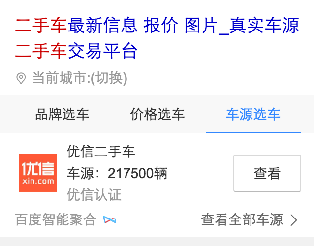
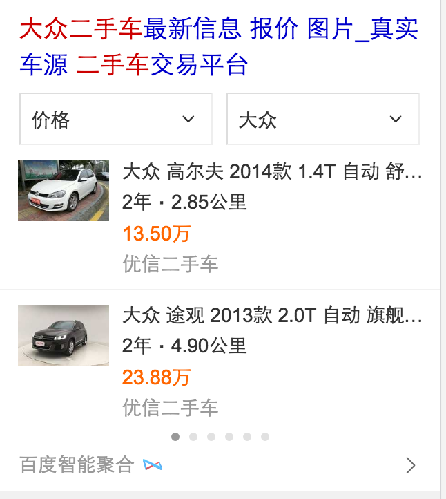
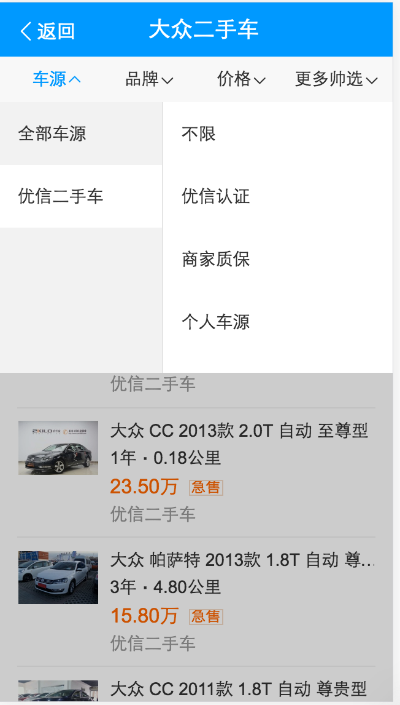
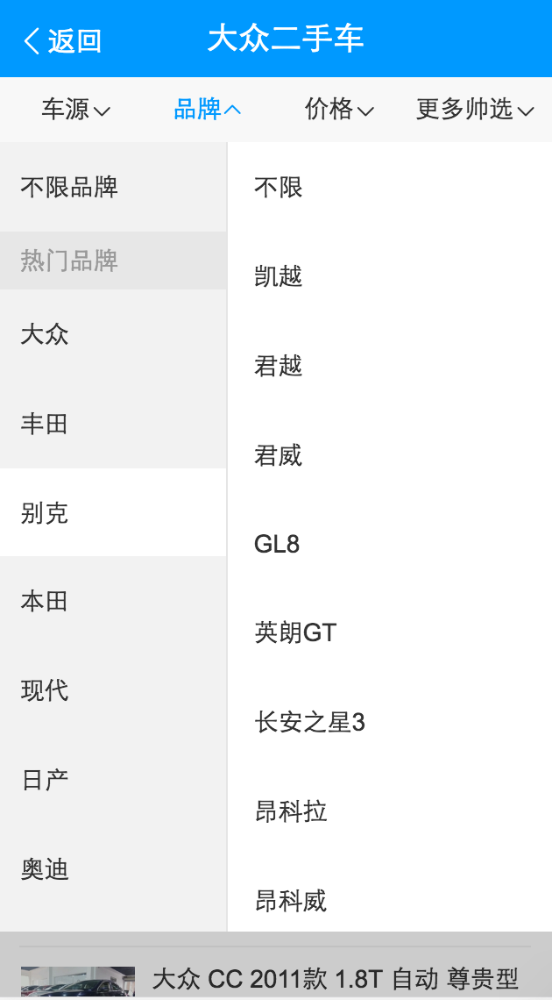
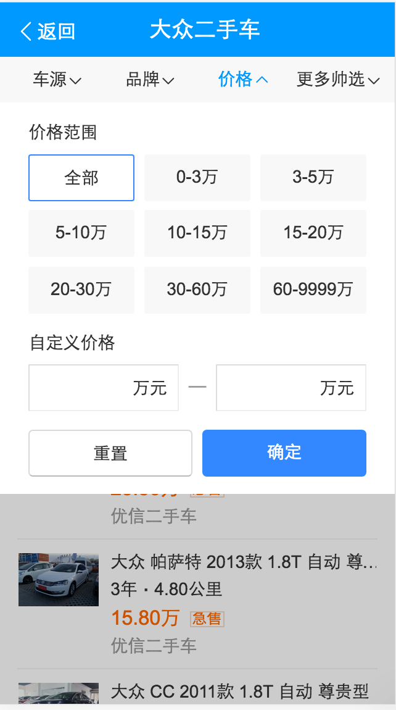
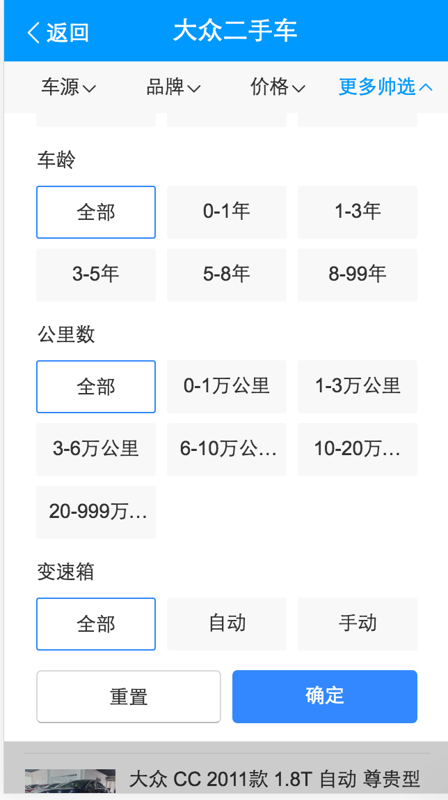
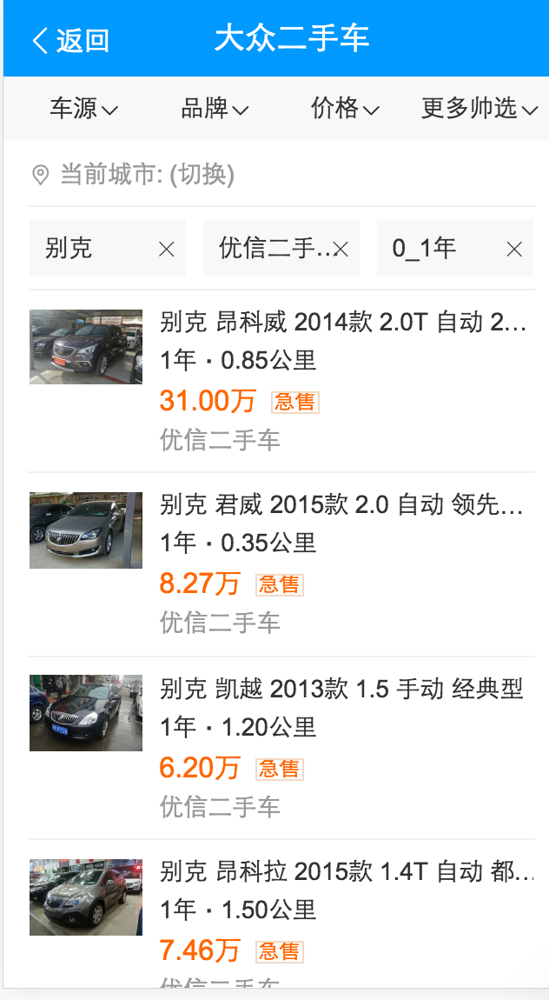
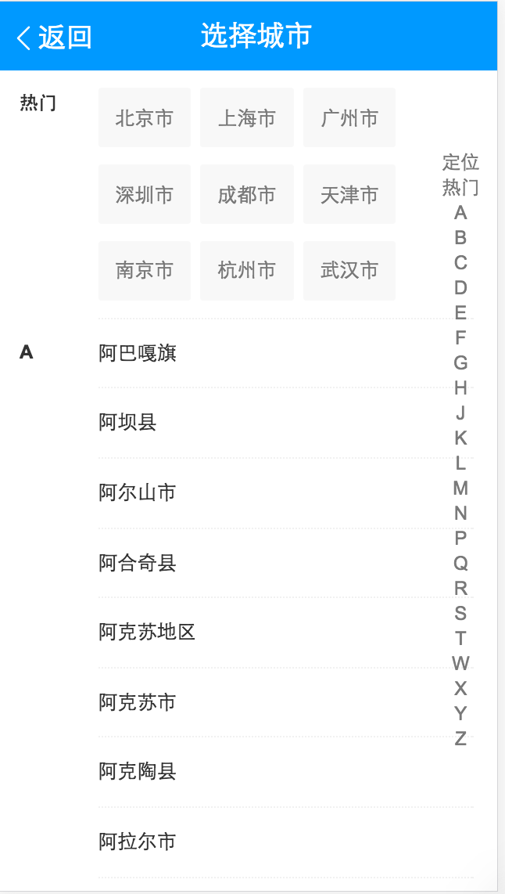

# 李阳阳

> 2016-10-08~2016-10-14

## 二手车

* 背景:
	* 针对二手车，用户有买车和卖车两方面的需求。而各商家的车源分散，中小型城市的车源不足，且市场上暂无巨头出现，目前呈现三足鼎立之势（优信、人人、瓜子）
	* 百度可通过聚合车源、搭建入口、提供额外优惠等方式，进一步满足用户需求，稳住二手车的流量入口。
* 完成情况:
	* 排期如下：
		- 9-19 rd产出数据schema @晓辉
		- 9-27-10.10  FE样式和功能开发 @阳阳
		- 9.21 资源方产出测试数据 @雅雯 @夏夏
	    - 9.21-9.26 产出联调环境 @晓辉
		- 9.26-9.30 wd开发 @学峰
		- 10.8-10.10  WD/RD联调 @晓辉 @学峰
		- 10.10-10.14 联调+测试 @阳阳 @雅雯 @曹密
	* 进度：
	    - 整体基本完成~情景页和结果页的链接还没完成~预计10月17号提测~10月19号上线~
* 收益：暂无
* 效果图

泛需求的效果图：

精确需求的效果图：

情景页的效果图：

## 摘要表格资源迁移（pc端）(无更新)

* 背景:将线上已有的很多table表格的资源整成一个数据格式，pc同步wise一套数据结构~
* 完成情况:正在进行~
* 收益：暂无
* 效果图

