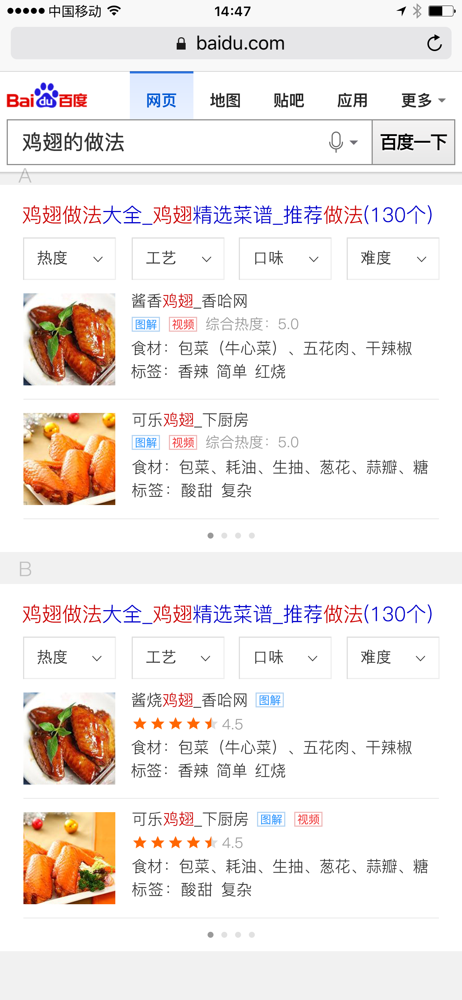
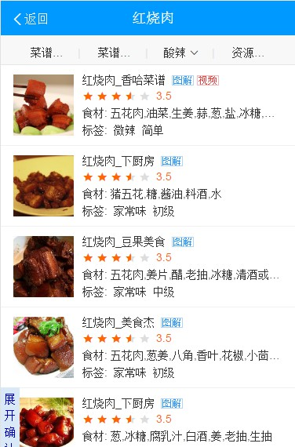

# 祁鹏远

> 2016年10月8日~2016年10月14日

## 游戏主播kv卡，新模板

### 背景

* 以直播和视频为载体的多媒体平台快速发展，导致一批主播和网络红人成为用户关注的热点。而这些游戏主播本身有很强的粉丝效应，故希望在原有的搜索结果下，整合主播的内容，以更好的满足用户。 主播的相关需求较为简单，卡片提供直播间、图集、视频等入口，通过与资源方配合建立主播落地页，聚合卡片内各个入口资源。

### 进度

* 9月28日已上线，0流量，现在小流量。

### 效果

## 精准影院卡优化

### 进度

* 因为模版太老的关系，有个广告位还需要在修改一下，需要和pm商讨一下
* 下周二（10月17号）上线

### 效果

## 迁移sf2.0 

### 进度

* 迁移的模板：sigma_celebrity_rela
* 10月8日已上线

### 效果

## 食材菜谱MRD-V2.0

### 背景

* 食材菜谱V1.0于8月5日全流量上线，采用精准菜谱优化方案（新增菜谱聚合卡片，美食问答由于点调位置靠下，全流量退场）。
* 单独分析食才菜谱相关query的实验数据发现（7月底小流量实验结论：持平（0728-0801））：
* 1、整体指标上看：点调生效时间短，实验数据有波动。8月1日有点、换query略有好转，8月23日退化样式全流量上线后，全流量回归下，预计整体指标上会有一定收益。
* 2、菜谱阿拉丁对比：实验组展现位置、点击和有点指标均好于对照组，但仍有提升空间。
* 1）title点击可提高
* 2）食材菜谱用户有筛选&查看更多菜谱的需求
* 3、深度分析换query数据
* 1）食材名类query：总pv7600。都有后续换query行为，其中35%为”食材功效、选购&储存、热量、食物宜搭相克、价格”；
* 2）食材做法类query：总pv1.5W，后续换query比例为60%，其中大部分为该食材其他精准菜谱做法，说明用户有进一步菜谱做法需求。

### 排期 

* 今天开始提测
* 提测2天，10月13日~10月14日
* 人工评估2天，10月17日~10月18日
* 10月19日上线

### 效果图

## sigma升级引起的边距问题

### 模板

* sg_footballvs，10月14号已上线
* lovesuicide_mb，10月14号已上线
* wise_chunwan，10月14号已上线

## 帮糯米那边修改边距问题

### 进度

* 下周一开始

