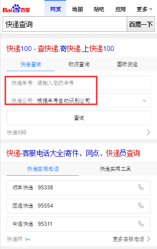
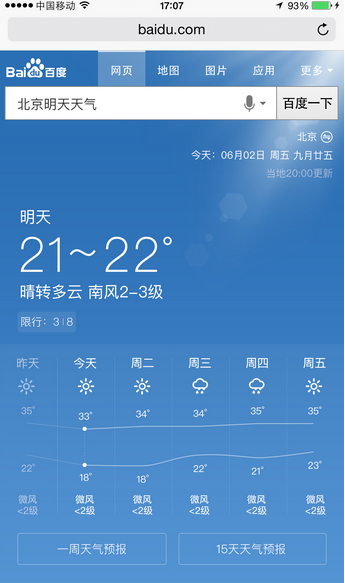
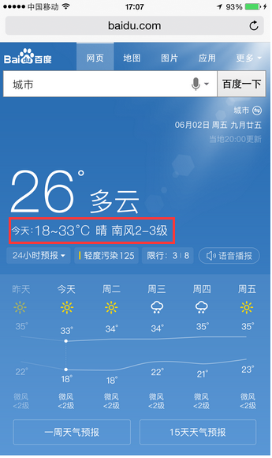

# 李晓

> 从2016-09-12到2016-09-14

### 民生子垂类

    * 天气：pm周里成+杨宇 rd赵元浩 fe李晓
    * 菜谱：pm周里成+杨宇 rd赵元浩 fe李晓
    * 快递：pm徐海漠 rd楚振江
    * 日历：pm林馨怡 rd郑杰
    * 通用推荐：pm徐海漠 rd殷瑞娜

### 进度

## 哥伦布-天气-生活指数侧滑

### 背景

哥伦布天气现存问题用户体验优化-生活指数侧滑，加展开查看更多。

### 完成情况

* 09.30号开发已完成，10.12，10.17联调，期间rd休假，10.18测试，10.19模板上线

* 10.19号模板已上线

### 效果

## 哥伦布-民生-快递泛需求文案优化

### 背景

快递泛需求换query比例较高，分析为用户不太理解文案对应功能，进行文案优化，已减少换query比例

### 完成情况

* 10.12开发已完成，10.13测试，10.14上线

* 10.17号小流量上线，实验组抽取30%流量，预估全量影响面70w，query：[快递查询](https://m.baidu.com/s?word=%E5%BF%AB%E9%80%92%E6%9F%A5%E8%AF%A2&sid=110411)

### 效果

## 哥伦布-民生-哥伦布天气现存问题用户体验优化方案、场景化天气优化方案

### 背景

针对query明天天气、明天天气怎么样、后天天气、周*天气，以及实时预报天气等进行优化

### 完成情况

* 开发联调 10.19~10.21
* 测试 10.24号
* 评估 10.25号
* 上线 10.16号模板上线、10.27号数据上开流量

### 效果

## 哥伦布-民生-天气泛需求（全国天气和全省天气）

### 背景

用户不仅对于某个城市/景点有天气查询需求（当前天气覆盖卡片），用户还有搜索类似q=”全国天气”以及各省天气的需求(PV每天约8W)，而当前搜索结果页未有特型结果覆盖，用户对天气泛需求查询并未得到很好的满足。

### 完成情况

优先级较低，待开展

## 民生项目其他需求

* 【菜谱】菜谱样式优化，已评审，开发中，模板开发完待走单，@祁鹏远；
* 【推荐】星河推荐情景页小说&人物类迭代需求，已评审，10.24联调，@肖学林；
* 【日历】日历卡片高度调整方案，@仙姐fe跟进；
* 【菜谱】泛需求优化方案，10.13号已评审，待ue初稿；

