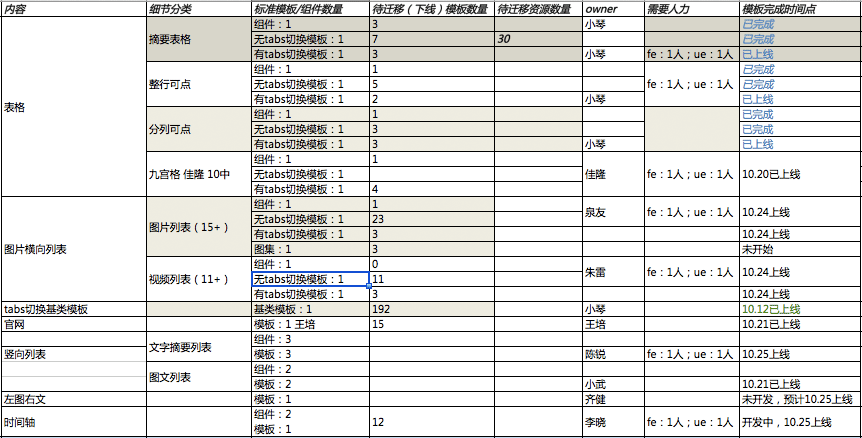

# 舒小琴

> 2016.10.15 - 2016.10.21

## 产品周报
* 民生
    * 客服统一模板优化：主需求模板迭代升级，效果评估中，10.21已上线 @健驰
    * 食材菜谱：测试中，预计10.17-18评估，模板10.19已上线，数据预计10.25上线 @鹏远
* 影视
    * 精准影院卡sigma 2.0迁移：效果评估中，ue提出新的修改点，10.18已上线 @黄睿，德丹，鹏远
* 自有产品
    * 图片抽样模板优化-大图页：预计9.7完成开发（无更新） @姿艳，阳阳
    * *自有产品阿拉丁样式升级：已上线2个模板，还差tiebaxml（无更新）@鹏远*
* 教育
    * 国内院校-问答评论卡：迭代开发中，10.17已上线 @晓卉
    * 国内院校-院校分数线优化：10.18已上线 @晓卉
    * 海外院校申请条件：9.9已小流量上线，迭代需求10.17跟进，10.18已上线 @晓卉
* 体育
    * nba的新闻和视频情景页调起：模板开发完成，等待联调（无更新）@阳阳
* 车系
    * 二手车：模板基本开发完成，已送测，预计10.25上线 @阳阳 
* 房产
    * 二手房：联调中，预计10.14提测（无更新） @健驰 
* 糯米
    * 官网样式优化：10.19已上线 @阳阳
* 栅格化相关
    * ip模板：开发中，预计10.24联调 @晓卉 
    * weiyidanan_general、shenfenzheng、sport_avsb_wise，已完成2个 @阳阳
    * jinzhi、wise_table05、kefu3、answer4，预计10.28上线 @鹏远
* 问题
    * sigma开发有可能涉及sigma卡，白卡和退化卡，成本略高，现对线上sigma样式进行梳理：[详情](http://ala-fe.baidu.com/demandspace/v_qipengyuan.md)(无更新) 

## 模板统一
### 整体目标
* 建立统一的标准化模板库（需求、UI设计、schema、模板实现）和标准化流程，Q4标准模板数达到50%。
* 完成模板数据结构（KV/MINI/AE/AC等）机制统一

### 整体收益
1.  效率上，统一化后，产品整体迭代效率更高，统一调整速度更快；提高了模板复用率，垂类产品迭代更快；同时单模板开发成本也会降低。
2.  稳定性上，实现kv、mini、ae数据结构打平，模板对数据兼容逻辑和依赖变少；同时统一标准，模板质量提高，降低case率，能提高整体稳定性。
3.  可控性上，对整体的可控性更强。
4.  体验和交互上更加统一，提高用户体验。

### 内容及整体计划
#### 模板标准化，统一化
* 人员：FE：小琴、小武；PM：雪涛；UE：丽玮
* 内容
    * 建立分类标准
    * 对已有模板分类
    * 下线、合并模板
* 计划
    * 7.15前给出初步可行性结论（表格试点）
    * 7.22完成垂类模板的归类并给出模板合并或下线列表
    * 7月底完成分类标准建立
    * 8月份完成表格等10个左右标准模板和schema的产出，以及资源迁
        * 字段标准素材库规范发布：随着模板标准化的推进，逐步丰富素材库，需要通过gitlab提交和审核 8.26之前制定字段命名规范，并给出表格类展现标准字段
        * widget通路打通——8.22-8.26
    * 9月份新增模板标准化的流程和规范
    * 9-12月对所有模板进行分批标准化，Q4 标准模板的pv预期覆盖面达50% 
    * 对于线上无展现的模板，将会每两周例行下线

#### 模板统一管理和预览库
* 人员：FE：小琴
* 计划
    * 目前已完成线上有展现模板的预览库建设
    * 7.15完成优化预览库展现方式
    * 7.22 完成线下预览库的构建

#### Galaxy，建立标准化通用实现库
* 人员：FE：朱雷
* 计划
    * 7.20   galaxy平台方案评审
    * 8.15   平台开发完成
    * 8.31   table的showcase完成
    * 预期模板数量覆盖面：Q3 10%，Q4 50%

#### schema统一，资源引入
* 人员：FE：小琴；RD：楠姐、雷爷；PM：雪涛
* 方案：资源方按新schema迁移，或数据端适配
* 计划：与模板标准化，统一化同步进行

#### AE/KV/MINI/AC等数据流机制统一
* 人员：FE：小琴；odp：白松、雷爷；aladdin RD：楠姐、雷爷
* 内容
    * mcpack，机制已上线，kv模板待迁移
    * utf8转码统一
    * 数据结构层级统一
    * 通用字段统一，alaData，tplData，aladddinTemplateName，aladdinResourceID，showlamp
* 问题
    * 梳理还有哪些数据没有迁移mcpack @巍巍（*目前只剩下翻译*）
    * 转码-us拿到的数据有3个服务不是gbk的 @相澧(delay至下周(9.23-9.30)给出排期
    * 转码-sigma统一选模板逻辑重构 @相澧（9.29已全量）
    * 转码-odp拆卡的模板进行转码 @轶婵 （*8.26已转全*）
    * 模板通用字段alaData，tplData（*7.19已上线*），showlamp已统一，其他待收集 @小琴，轶婵
    * 多条结果的mini资源模板，kv无法复用，这个需要重新发起一次讨论（待发起）
   
* 计划
    * 7月份完成utf8转码机制的全量上线(*7.20已全量上线*)
    * 8月份完成数据结构层级和通用字段统一(*tplData已统一*）
    * 9-12月对所有老模板mcpack和编码及数据结构统一分批迁移，进度可以和模板标准化同步进行

#### 数据适配
* 人员：FE：小琴；aladdin RD：楠姐、雷爷
* 问题
    * pc、wise落地页不一致，要复用同一个资源的话，需要不同端复用不同的链接
    * 需要odp和openApi同时支持
    * 
* 计划
    * 同步机制已上线，配置上线机制待确定
    * 异步机制Q3完成（*已支持*）

### 进度情况

* 标准模板流程和规范已完成梳理，待发布，[参考链接](http://gitlab.baidu.com/psfe/schema)
* 模板样式合并
    * 已梳理通用模板资源及模板迁移情况：159个模板，241个资源，97个pm 
    * 通用标准模板（18个）、基类模板（1个）和组件（13个），预计10.25整体完成上线，详情如下表：
    
    * 整行可点和多列表格标准模板已上线，资源待迁移(24个资源反馈了迁移时间及状态，6个资源未反馈）
    * *摘要表格模板的30个资源，已迁移完成*
* 模板下线
    * 第二期模板下线进展：65个模板可删除，37个模板保留，202个模板未反馈状态 
* 平台提供标准模板、标准组件管理模块
    * 已开发完成，预计10.24上线 
* 数据统一
    * 转码-us拿到的数据有3个服务不是gbk的，目前有1个服务正在迁移，其他2个服务（1个近期下线，1个11月底下线）
    * kv mcpack迁移重新讨论了两方案
        * 方案一：升级老模板    
        GSS支持对kv新资源进行mcpack编码，已开发完成，测试中，预计11.1上线
        老模板的升级分三类：1 标准化模板 2 可分到垂类的模板 3 不属于1和2的   @小琴  10月底给出模板分类 随标准化进度完成，垂类和标准化可并行
        * 方案二：升级架构  
        由于模板使用了多种编码转换的方式，架构考虑是否可将这些函数重载，并且统一模板编码为utf-8 @轶婵 节后给结论是否可行

## 其他-本周工作

实习生面试

> 2016.10.11 - 2016.10.14

## 产品周报
* 民生
    * 通用推荐sf2.0迁移：模板已上线，10.8已上线配置 @鹏远
    * 客服统一模板优化：主需求模板迭代升级，效果评估中（无更新） @健驰
    * 食材菜谱：测试中，预计10.17-18评估，10.19上线@鹏远
    * 晓卉落地页迁移sf2.0：10.13已上线@晓卉
* 影视
    * 精准影院卡sigma 2.0迁移：效果评估中，ue提出新的修改点，预计10.17上线 @黄睿，德丹，鹏远
* 自有产品
    * 图片抽样模板优化-大图页：预计9.7完成开发（无更新） @姿艳，阳阳
    * *自有产品阿拉丁样式升级：已上线2个模板，还差tiebaxml（无更新）@鹏远*
* 教育
    * 国内院校-问答评论卡：迭代开发中，预计10.17上线 @晓卉
    * 国内院校-院校分数线优化：未开始 @晓卉
    * 海外院校申请条件：9.9已小流量上线，迭代需求10.17跟进 @晓卉
    * 考研：10.13已上线@晓卉
* 体育
    * nba的新闻和视频情景页调起：模板开发完成，等待联调（无更新）@阳阳
* 车系
    * 二手车：模板基本开发完成，预计10.17送测 @阳阳 
* 房产
    * 二手房：联调中，预计10.14上线@健驰 
* 糯米
    * PC团购迁移：10.9已上线 @晓卉
* 问题
    * sigma开发有可能涉及sigma卡，白卡和退化卡，成本略高，现对线上sigma样式进行梳理：[详情](http://ala-fe.baidu.com/demandspace/v_qipengyuan.md)(无更新) 

## 模板统一
### 整体目标
* 建立统一的标准化模板库（需求、UI设计、schema、模板实现）和标准化流程，Q4标准模板数达到50%。
* 完成模板数据结构（KV/MINI/AE/AC等）机制统一

### 整体收益
1.  效率上，统一化后，产品整体迭代效率更高，统一调整速度更快；提高了模板复用率，垂类产品迭代更快；同时单模板开发成本也会降低。
2.  稳定性上，实现kv、mini、ae数据结构打平，模板对数据兼容逻辑和依赖变少；同时统一标准，模板质量提高，降低case率，能提高整体稳定性。
3.  可控性上，对整体的可控性更强。
4.  体验和交互上更加统一，提高用户体验。

### 内容及整体计划
#### 模板标准化，统一化
* 人员：FE：小琴、小武；PM：雪涛；UE：丽玮
* 内容
    * 建立分类标准
    * 对已有模板分类
    * 下线、合并模板
* 计划
    * 7.15前给出初步可行性结论（表格试点）
    * 7.22完成垂类模板的归类并给出模板合并或下线列表
    * 7月底完成分类标准建立
    * 8月份完成表格等10个左右标准模板和schema的产出，以及资源迁
        * 字段标准素材库规范发布：随着模板标准化的推进，逐步丰富素材库，需要通过gitlab提交和审核 8.26之前制定字段命名规范，并给出表格类展现标准字段
        * widget通路打通——8.22-8.26
    * 9月份新增模板标准化的流程和规范
    * 9-12月对所有模板进行分批标准化，Q4 标准模板的pv预期覆盖面达50% 
    * 对于线上无展现的模板，将会每两周例行下线

#### 模板统一管理和预览库
* 人员：FE：小琴
* 计划
    * 目前已完成线上有展现模板的预览库建设
    * 7.15完成优化预览库展现方式
    * 7.22 完成线下预览库的构建

#### Galaxy，建立标准化通用实现库
* 人员：FE：朱雷
* 计划
    * 7.20   galaxy平台方案评审
    * 8.15   平台开发完成
    * 8.31   table的showcase完成
    * 预期模板数量覆盖面：Q3 10%，Q4 50%

#### schema统一，资源引入
* 人员：FE：小琴；RD：楠姐、雷爷；PM：雪涛
* 方案：资源方按新schema迁移，或数据端适配
* 计划：与模板标准化，统一化同步进行

#### AE/KV/MINI/AC等数据流机制统一
* 人员：FE：小琴；odp：白松、雷爷；aladdin RD：楠姐、雷爷
* 内容
    * mcpack，机制已上线，kv模板待迁移
    * utf8转码统一
    * 数据结构层级统一
    * 通用字段统一，alaData，tplData，aladddinTemplateName，aladdinResourceID，showlamp
* 问题
    * 梳理还有哪些数据没有迁移mcpack @巍巍（*目前只剩下翻译*）
    * 转码-us拿到的数据有3个服务不是gbk的 @相澧(delay至下周(9.23-9.30)给出排期
    * 转码-sigma统一选模板逻辑重构 @相澧（9.29已全量）
    * 转码-odp拆卡的模板进行转码 @轶婵 （*8.26已转全*）
    * 模板通用字段alaData，tplData（*7.19已上线*），showlamp已统一，其他待收集 @小琴，轶婵
    * 多条结果的mini资源模板，kv无法复用，这个需要重新发起一次讨论（待发起）
   
* 计划
    * 7月份完成utf8转码机制的全量上线(*7.20已全量上线*)
    * 8月份完成数据结构层级和通用字段统一(*tplData已统一*）
    * 9-12月对所有老模板mcpack和编码及数据结构统一分批迁移，进度可以和模板标准化同步进行

#### 数据适配
* 人员：FE：小琴；aladdin RD：楠姐、雷爷
* 问题
    * pc、wise落地页不一致，要复用同一个资源的话，需要不同端复用不同的链接
    * 需要odp和openApi同时支持
    * 
* 计划
    * 同步机制已上线，配置上线机制待确定
    * 异步机制Q3完成（*已支持*）

### 进度情况

* 标准模板流程和规范已完成梳理，预计10.17发布，[参考链接](http://gitlab.baidu.com/psfe/schema)
* 模板样式合并
    * 摘要表格模板的30个资源，已迁移完成
    * 整行可点和多列表格标准模板已上线，资源待迁移(21个资源反馈了迁移时间及状态，9个资源未反馈）
    * 通用标准模板（12个）和组件（预计8-10个），预计10.19完成上线，详情如下表：
    ue设计稿除了时间轴和左图右文，其他的都给出了    
    
* 模板下线
    * 已整理第二期模板列表，预计10.17推动下线 
* 平台提供标准模板、标准组件管理模块
    * 开发中，预计10.21上线 
* 数据统一
    * 转码-us拿到的数据有3个服务不是gbk的，目前有1个服务正在迁移
    * kv mcpack迁移重新讨论了两方案
        * 方案一：升级老模板    
        GSS支持对kv新资源进行mcpack编码，已开发完成，待测试
        老模板的升级分三类：1 标准化模板 2 可分到垂类的模板 3 不属于1和2的   @小琴  10月底给出模板分类 随标准化进度完成，垂类和标准化可并行
        * 方案二：升级架构  
        由于模板使用了多种编码转换的方式，架构考虑是否可将这些函数重载，并且统一模板编码为utf-8 @轶婵 节后给结论是否可行

## 其他-本周工作

实习生面试

> 2016.9.24 - 2016.9.30

## 产品周报
* 民生
    * 通用推荐sf2.0迁移：模板已上线，9.29已上线配置 @鹏远
    * 客服统一模板优化：主需求模板迭代升级，效果评估中 @健驰
    * 食材菜谱：开发中，预计10.19上线@鹏远
* 影视
    * 精准影院卡sigma 2.0迁移：效果评估中，ue提出新的修改点，预计10.19开发新需求(无更新） @黄睿，德丹，鹏远
* 自有产品
    * 图片抽样模板优化-大图页：预计9.7完成开发（无更新） @姿艳，阳阳
    * *自有产品阿拉丁样式升级：已上线2个模板，还差tiebaxml（无更新）@鹏远*
* 教育
    * 国内院校-问答评论卡：9.28已上线模板 @晓卉
    * 国内院校-院校分数线优化：未开始 @晓卉
    * 海外院校申请条件：9.9已小流量上线，迭代需求10.12跟进 @晓卉
    * 考研：开发中，预计10.9开发完成@晓卉
* 体育
    * nba的新闻和视频情景页调起：模板开发完成，等待联调（无更新）@阳阳
* 车系
    * 二手车：开发中，预计10.10开始联调 @阳阳 
* 房产
    * 二手房：模板已开发完成，10.8联调@健驰 
* 糯米
    * PC团购迁移：已开发完成，预计10.8上线 @晓卉
* 游戏
    * 游戏主播卡：9.28已上线，10.8开流量 @鹏远
* 问题
    * sigma开发有可能涉及sigma卡，白卡和退化卡，成本略高，现对线上sigma样式进行梳理：[详情](http://ala-fe.baidu.com/demandspace/v_qipengyuan.md)(无更新) 

## 模板统一
### 整体目标
* 建立统一的标准化模板库（需求、UI设计、schema、模板实现）和标准化流程，Q4标准模板数达到50%。
* 完成模板数据结构（KV/MINI/AE/AC等）机制统一

### 整体收益
1.  效率上，统一化后，产品整体迭代效率更高，统一调整速度更快；提高了模板复用率，垂类产品迭代更快；同时单模板开发成本也会降低。
2.  稳定性上，实现kv、mini、ae数据结构打平，模板对数据兼容逻辑和依赖变少；同时统一标准，模板质量提高，降低case率，能提高整体稳定性。
3.  可控性上，对整体的可控性更强。
4.  体验和交互上更加统一，提高用户体验。

### 内容及整体计划
#### 模板标准化，统一化
* 人员：FE：小琴、小武；PM：雪涛；UE：丽玮
* 内容
    * 建立分类标准
    * 对已有模板分类
    * 下线、合并模板
* 计划
    * 7.15前给出初步可行性结论（表格试点）
    * 7.22完成垂类模板的归类并给出模板合并或下线列表
    * 7月底完成分类标准建立
    * 8月份完成表格等10个左右标准模板和schema的产出，以及资源迁
        * 字段标准素材库规范发布：随着模板标准化的推进，逐步丰富素材库，需要通过gitlab提交和审核 8.26之前制定字段命名规范，并给出表格类展现标准字段
        * widget通路打通——8.22-8.26
    * 9月份新增模板标准化的流程和规范
    * 9-12月对所有模板进行分批标准化，Q4 标准模板的pv预期覆盖面达50% 
    * 对于线上无展现的模板，将会每两周例行下线

#### 模板统一管理和预览库
* 人员：FE：小琴
* 计划
    * 目前已完成线上有展现模板的预览库建设
    * 7.15完成优化预览库展现方式
    * 7.22 完成线下预览库的构建

#### Galaxy，建立标准化通用实现库
* 人员：FE：朱雷
* 计划
    * 7.20   galaxy平台方案评审
    * 8.15   平台开发完成
    * 8.31   table的showcase完成
    * 预期模板数量覆盖面：Q3 10%，Q4 50%

#### schema统一，资源引入
* 人员：FE：小琴；RD：楠姐、雷爷；PM：雪涛
* 方案：资源方按新schema迁移，或数据端适配
* 计划：与模板标准化，统一化同步进行

#### AE/KV/MINI/AC等数据流机制统一
* 人员：FE：小琴；odp：白松、雷爷；aladdin RD：楠姐、雷爷
* 内容
    * mcpack，机制已上线，kv模板待迁移
    * utf8转码统一
    * 数据结构层级统一
    * 通用字段统一，alaData，tplData，aladddinTemplateName，aladdinResourceID，showlamp
* 问题
    * 梳理还有哪些数据没有迁移mcpack @巍巍（*目前只剩下翻译*）
    * 转码-us拿到的数据有3个服务不是gbk的 @相澧(delay至下周(9.23-9.30)给出排期
    * 转码-sigma统一选模板逻辑重构 @相澧（9.29已全量）
    * 转码-odp拆卡的模板进行转码 @轶婵 （*8.26已转全*）
    * 模板通用字段alaData，tplData（*7.19已上线*），showlamp已统一，其他待收集 @小琴，轶婵
    * 多条结果的mini资源模板，kv无法复用，这个需要重新发起一次讨论（待发起）
   
* 计划
    * 7月份完成utf8转码机制的全量上线(*7.20已全量上线*)
    * 8月份完成数据结构层级和通用字段统一(*tplData已统一*）
    * 9-12月对所有老模板mcpack和编码及数据结构统一分批迁移，进度可以和模板标准化同步进行

#### 数据适配
* 人员：FE：小琴；aladdin RD：楠姐、雷爷
* 问题
    * pc、wise落地页不一致，要复用同一个资源的话，需要不同端复用不同的链接
    * 需要odp和openApi同时支持
    * 
* 计划
    * 同步机制已上线，配置上线机制待确定
    * 异步机制Q3完成（*已支持*）

### 进度情况

* 模板样式合并
    * 摘要表格模板的30个资源，2个未反馈进展，28个已迁移完成
    * 整行可点和多列表格标准模板已上线，资源待迁移(10个资源反馈了迁移时间，20个资源未反馈）
    * tabs切换的基类模板已完成开发
    * 通用标准模板（12个）和组件（预计8-10个），预计10.19完成上线，详情如下表： 
    
* 平台下周评审标准模板、标准组件管理模块设计方案
* 数据统一
    * 转码-sigma统一选模板逻辑重构，9.29已全量
    * 转码-us拿到的数据有3个服务不是gbk的，相澧休假，没给进展
    * kv mcpack迁移重新讨论了两方案
        * 方案一：升级老模板    
        老模板的升级分三类：1 标准化模板 2 可分到垂类的模板 3 不属于1和2的   @小琴  10月底给出模板分类 随标准化进度完成，垂类和标准化可并行
        * 方案二：升级架构  
        由于模板使用了多种编码转换的方式，架构考虑是否可将这些函数重载，并且统一模板编码为utf-8 @轶婵 节后给结论是否可行

### 下周计划

* tabs切换摘要，整行可点和分列可点标准模板上线
* 发布整理标准模板流程和规范

## 其他-本周工作

无

> 2016.9.14 - 2016.9.23

## 产品周报
* 民生
    * 通用推荐sf2.0迁移：模板已上线，预计9.26上线配置 @鹏远
    * 农历日历升级：已开发完成，9.18已上线 @健驰
    * 客服统一模板优化：已开发完成 @健驰
    * 食材菜谱：开发中，预计10.19上线@鹏远
* 影视
    * 精准影院卡sigma 2.0迁移：效果评估中，ue提出新的修改点，预计10.19开发新需求(无更新） @黄睿，德丹，鹏远
* 自有产品
    * 图片抽样模板优化-大图页：预计9.7完成开发（无更新） @姿艳，阳阳
    * *自有产品阿拉丁样式升级：已上线2个模板，还差tiebaxml（无更新）@鹏远*
* 医疗
    * 宝宝发育指标：已提测，预计10.1前上线 @健驰
* 教育
    * *国内院校-专业分数线：转全升级，9.2已上线 @晓卉*
    * 国内院校-问答评论卡：9.22已提测 @晓卉
    * 国内院校-院校分数线优化：未开始 @晓卉
    * 海外院校申请条件：9.9已小流量上线，迭代需求9.28跟进 @晓卉
    * 考研：新模板，9.29开始开发@晓卉
* 体育
    * nba的新闻和视频情景页调起：模板开发完成，等待联调（无更新）@阳阳
* 车系
    * 二手车：9.26开始开发 @阳阳 
* 房产
    * 二手房：9.22开始开发@健驰 
* 糯米
    * PC团购迁移：已开发完成，9.26联调 @晓卉
* 游戏
    * 游戏主播卡：三级单被驳回，样式微调，预计9.26上线 @鹏远
* 问题
    * sigma开发有可能涉及sigma卡，白卡和退化卡，成本略高，现对线上sigma样式进行梳理：[详情](http://ala-fe.baidu.com/demandspace/v_qipengyuan.md)(无更新) 

## 模板统一
### 整体目标
* 建立统一的标准化模板库（需求、UI设计、schema、模板实现）和标准化流程，Q4标准模板数达到50%。
* 完成模板数据结构（KV/MINI/AE/AC等）机制统一

### 整体收益
1.  效率上，统一化后，产品整体迭代效率更高，统一调整速度更快；提高了模板复用率，垂类产品迭代更快；同时单模板开发成本也会降低。
2.  稳定性上，实现kv、mini、ae数据结构打平，模板对数据兼容逻辑和依赖变少；同时统一标准，模板质量提高，降低case率，能提高整体稳定性。
3.  可控性上，对整体的可控性更强。
4.  体验和交互上更加统一，提高用户体验。

### 内容及整体计划
#### 模板标准化，统一化
* 人员：FE：小琴、小武；PM：雪涛；UE：丽玮
* 内容
    * 建立分类标准
    * 对已有模板分类
    * 下线、合并模板
* 计划
    * 7.15前给出初步可行性结论（表格试点）
    * 7.22完成垂类模板的归类并给出模板合并或下线列表
    * 7月底完成分类标准建立
    * 8月份完成表格等10个左右标准模板和schema的产出，以及资源迁
        * 字段标准素材库规范发布：随着模板标准化的推进，逐步丰富素材库，需要通过gitlab提交和审核 8.26之前制定字段命名规范，并给出表格类展现标准字段
        * widget通路打通——8.22-8.26
    * 9月份新增模板标准化的流程和规范
    * 9-12月对所有模板进行分批标准化，Q4 标准模板的pv预期覆盖面达50% 
    * 对于线上无展现的模板，将会每两周例行下线

#### 模板统一管理和预览库
* 人员：FE：小琴
* 计划
    * 目前已完成线上有展现模板的预览库建设
    * 7.15完成优化预览库展现方式
    * 7.22 完成线下预览库的构建

#### Galaxy，建立标准化通用实现库
* 人员：FE：朱雷
* 计划
    * 7.20   galaxy平台方案评审
    * 8.15   平台开发完成
    * 8.31   table的showcase完成
    * 预期模板数量覆盖面：Q3 10%，Q4 50%

#### schema统一，资源引入
* 人员：FE：小琴；RD：楠姐、雷爷；PM：雪涛
* 方案：资源方按新schema迁移，或数据端适配
* 计划：与模板标准化，统一化同步进行

#### AE/KV/MINI/AC等数据流机制统一
* 人员：FE：小琴；odp：白松、雷爷；aladdin RD：楠姐、雷爷
* 内容
    * mcpack，机制已上线，kv模板待迁移
    * utf8转码统一
    * 数据结构层级统一
    * 通用字段统一，alaData，tplData，aladddinTemplateName，aladdinResourceID，showlamp
* 问题
    * 梳理还有哪些数据没有迁移mcpack @巍巍（*目前只剩下翻译*）
    * 转码-us拿到的数据有3个服务不是gbk的 @相澧(delay至下周(9.23-9.30)给出排期
    * 转码-sigma统一选模板逻辑重构 @相澧（已单台，预计10.1前全量）
    * 转码-odp拆卡的模板进行转码 @轶婵 （*8.26已转全*）
    * 模板通用字段alaData，tplData（*7.19已上线*），showlamp已统一，其他待收集 @小琴，轶婵
    * 多条结果的mini资源模板，kv无法复用，这个需要重新发起一次讨论
   
* 计划
    * 7月份完成utf8转码机制的全量上线(*7.20已全量上线*)
    * 8月份完成数据结构层级和通用字段统一(*tplData已统一*）
    * 9-12月对所有老模板mcpack和编码及数据结构统一分批迁移，进度可以和模板标准化同步进行

#### 数据适配
* 人员：FE：小琴；aladdin RD：楠姐、雷爷
* 问题
    * pc、wise落地页不一致，要复用同一个资源的话，需要不同端复用不同的链接
    * 需要odp和openApi同时支持
    * 
* 计划
    * 同步机制已上线，配置上线机制待确定
    * 异步机制Q3完成（*已支持*）

### 进度情况

* 模板样式合并
    * 摘要表格模板的30个资源，15个已完成，15个还没反馈进展
    * 整行可点和多列表格标准模板已上线，资源待迁移
    * 摘要表格，整行可点和多列表格均升级支持单行截断配置
* 梳理完成通用标准模板的排期

### 下周计划

* 开发tabs基类模板
* 整理标准模板流程和规范

## 其他-本周工作

实习生面试

> 2016.9.10 - 2016.9.13

## 产品周报
* 民生
    * 通用推荐sf2.0迁移：预计9.14开发完成 @鹏远
    * 节日sigma卡片：9.13模板已上线 @健驰
    * 农历日历升级：已开发完成，预计9.12上线 @健驰
* 影视
    * 精准影院卡sigma 2.0迁移：效果评估中，ue提出新的修改点，预计delay至9.14之前上线 @黄睿，德丹，鹏远
* 自有产品
    * 图片抽样模板优化-大图页：预计9.7完成开发（无更新） @姿艳，阳阳
    * *自有产品阿拉丁样式升级：已上线2个模板，还差tiebaxml（无更新）@鹏远*
* 医疗
    * *医疗健康值：测试中，8.5已上线抽样（无更新） @健驰*
    * 宝宝发育指标：@健驰
* 教育
    * *国内院校-专业分数线：转全升级，9.2已上线 @晓卉*
    * 国内院校-问答评论卡：开发中，预计9.21提测 @晓卉
    * 国内院校-院校分数线优化：未开始 @晓卉
    * 海外院校申请条件：预计9.9上线 @晓卉
* 体育
    * nba的新闻和视频情景页调起：模板开发完成，等待联调（无更新）@阳阳
* 车系
    * 二手车：开始开发中 @阳阳 
* 糯米
    * PC团购迁移：已开发完成，待联调（无更新） @德丹，晓卉
* 游戏
    * 游戏主播卡：模板已联调，预计9.12上线 @鹏远
* 通用
    * showlamp长线方案：base模板判断阿拉丁之外的资源不带showlamp，9.6已上线 @小琴
* 其他
    * 人物百科标题链接升级，9.7已上线 @晓卉
* 问题
    * sigma开发有可能涉及sigma卡，白卡和退化卡，成本略高，现对线上sigma样式进行梳理：[详情](http://ala-fe.baidu.com/demandspace/v_qipengyuan.md)(无更新) 

## 模板统一
### 整体目标
* 建立统一的标准化模板库（需求、UI设计、schema、模板实现）和标准化流程，Q4标准模板数达到50%。
* 完成模板数据结构（KV/MINI/AE/AC等）机制统一

### 整体收益
1.  效率上，统一化后，产品整体迭代效率更高，统一调整速度更快；提高了模板复用率，垂类产品迭代更快；同时单模板开发成本也会降低。
2.  稳定性上，实现kv、mini、ae数据结构打平，模板对数据兼容逻辑和依赖变少；同时统一标准，模板质量提高，降低case率，能提高整体稳定性。
3.  可控性上，对整体的可控性更强。
4.  体验和交互上更加统一，提高用户体验。

### 内容及整体计划
#### 模板标准化，统一化
* 人员：FE：小琴、小武；PM：雪涛；UE：丽玮
* 内容
    * 建立分类标准
    * 对已有模板分类
    * 下线、合并模板
* 计划
    * 7.15前给出初步可行性结论（表格试点）
    * 7.22完成垂类模板的归类并给出模板合并或下线列表
    * 7月底完成分类标准建立
    * 8月份完成表格等10个左右标准模板和schema的产出，以及资源迁
        * 字段标准素材库规范发布：随着模板标准化的推进，逐步丰富素材库，需要通过gitlab提交和审核 8.26之前制定字段命名规范，并给出表格类展现标准字段
        * widget通路打通——8.22-8.26
    * 9月份新增模板标准化的流程和规范
    * 9-12月对所有模板进行分批标准化，Q4 标准模板的pv预期覆盖面达50% 
    * 对于线上无展现的模板，将会每两周例行下线

#### 模板统一管理和预览库
* 人员：FE：小琴
* 计划
    * 目前已完成线上有展现模板的预览库建设
    * 7.15完成优化预览库展现方式
    * 7.22 完成线下预览库的构建

#### Galaxy，建立标准化通用实现库
* 人员：FE：朱雷
* 计划
    * 7.20   galaxy平台方案评审
    * 8.15   平台开发完成
    * 8.31   table的showcase完成
    * 预期模板数量覆盖面：Q3 10%，Q4 50%

#### schema统一，资源引入
* 人员：FE：小琴；RD：楠姐、雷爷；PM：雪涛
* 方案：资源方按新schema迁移，或数据端适配
* 计划：与模板标准化，统一化同步进行

#### AE/KV/MINI/AC等数据流机制统一
* 人员：FE：小琴；odp：白松、雷爷；aladdin RD：楠姐、雷爷
* 内容
    * mcpack，机制已上线，kv模板待迁移
    * utf8转码统一
    * 数据结构层级统一
    * 通用字段统一，alaData，tplData，aladddinTemplateName，aladdinResourceID，showlamp
* 问题
    * 梳理还有哪些数据没有迁移mcpack @巍巍（*目前只剩下翻译*）
    * 转码-us拿到的数据有3个服务不是gbk的 @相澧(预计下周(9.12-9.16)给出排期
    * 转码-sigma统一选模板逻辑重构 @相澧（预计9.14上线）
    * 转码-odp拆卡的模板进行转码 @轶婵 （*8.26已转全*）
    * 模板通用字段alaData，tplData（*7.19已上线*），showlamp已统一，其他待收集 @小琴，轶婵
    * 多条结果的mini资源模板，kv无法复用，这个需要重新发起一次讨论
   
* 计划
    * 7月份完成utf8转码机制的全量上线(*7.20已全量上线*)
    * 8月份完成数据结构层级和通用字段统一(*tplData已统一*）
    * 9-12月对所有老模板mcpack和编码及数据结构统一分批迁移，进度可以和模板标准化同步进行

#### 数据适配
* 人员：FE：小琴；aladdin RD：楠姐、雷爷
* 问题
    * pc、wise落地页不一致，要复用同一个资源的话，需要不同端复用不同的链接
    * 需要odp和openApi同时支持
    * 
* 计划
    * 同步机制已上线，配置上线机制待确定
    * 异步机制Q3完成（*已支持*）

### 进度情况

* 模板样式合并
    * 摘要表格模板已于9.7号上线，6个模板的相关资源预计9.19迁移完成
    * 整行可点和多列表格标准模板已开发完成，9.18找ue评估效果

### 下周计划

* 开发图片和视频横向列表的标准模板

## xpath可视化工具升级（无更新）
### 目标
* wise支持xpath路径展现，今天（5.13）下班前@吕春梅给出数据ready时间点
* 支持sid日志查询

### 进度情况

* 8.17已发布上线

## 其他-本周工作

实习生面试

> 2016.9.3 - 2016.9.9

## 产品周报
* 民生
    * 快递bug修复：9.2已上线 @阳阳
    * 通用推荐sf2.0迁移：预计9.14开发完成 @鹏远
    * 节日sigma卡片：预计9.13上线 @健驰
    * 农历日历升级：已开发完成，预计9.12上线 @健驰
* 影视
    * 精准影院卡sigma 2.0迁移：效果评估中，ue提出新的修改点，预计delay至9.14之前上线 @黄睿，德丹，鹏远
* 自有产品
    * 图片抽样模板优化-大图页：预计9.7完成开发（无更新） @姿艳，阳阳
    * *自有产品阿拉丁样式升级：已上线2个模板，还差tiebaxml（无更新）@鹏远*
* 医疗
    * *医疗健康值：测试中，8.5已上线抽样（无更新） @健驰*
* 教育
    * *国内院校-专业分数线：转全升级，9.2已上线 @晓卉*
    * 国内院校-问答评论卡：开发中，预计9.21提测 @晓卉
    * 国内院校-院校分数线优化：未开始 @晓卉
    * 海外院校申请条件：预计9.9上线 @晓卉
* 体育
    * nba的新闻和视频情景页调起：模板开发完成，等待联调（无更新）@阳阳
* 糯米
    * 外卖阿拉丁：ubs评估中，9.7已上线 @阳阳 
    * PC团购迁移：已开发完成，待联调（无更新） @德丹，晓卉
    * 糯米官网模板样式升级：预计9.9上线 @阳阳
* 游戏
    * 游戏主播卡：模板已联调，预计9.12上线 @鹏远
* 通用
    * showlamp长线方案：base模板判断阿拉丁之外的资源不带showlamp，9.6已上线 @小琴
* 其他
    * 人物百科标题链接升级，9.7已上线 @晓卉
* 问题
    * sigma开发有可能涉及sigma卡，白卡和退化卡，成本略高，现对线上sigma样式进行梳理：[详情](http://ala-fe.baidu.com/demandspace/v_qipengyuan.md)(无更新) 

## 模板统一
### 整体目标
* 建立统一的标准化模板库（需求、UI设计、schema、模板实现）和标准化流程，Q4标准模板数达到50%。
* 完成模板数据结构（KV/MINI/AE/AC等）机制统一

### 整体收益
1.  效率上，统一化后，产品整体迭代效率更高，统一调整速度更快；提高了模板复用率，垂类产品迭代更快；同时单模板开发成本也会降低。
2.  稳定性上，实现kv、mini、ae数据结构打平，模板对数据兼容逻辑和依赖变少；同时统一标准，模板质量提高，降低case率，能提高整体稳定性。
3.  可控性上，对整体的可控性更强。
4.  体验和交互上更加统一，提高用户体验。

### 内容及整体计划
#### 模板标准化，统一化
* 人员：FE：小琴、小武；PM：雪涛；UE：丽玮
* 内容
    * 建立分类标准
    * 对已有模板分类
    * 下线、合并模板
* 计划
    * 7.15前给出初步可行性结论（表格试点）
    * 7.22完成垂类模板的归类并给出模板合并或下线列表
    * 7月底完成分类标准建立
    * 8月份完成表格等10个左右标准模板和schema的产出，以及资源迁
        * 字段标准素材库规范发布：随着模板标准化的推进，逐步丰富素材库，需要通过gitlab提交和审核 8.26之前制定字段命名规范，并给出表格类展现标准字段
        * widget通路打通——8.22-8.26
    * 9月份新增模板标准化的流程和规范
    * 9-12月对所有模板进行分批标准化，Q4 标准模板的pv预期覆盖面达50% 
    * 对于线上无展现的模板，将会每两周例行下线

#### 模板统一管理和预览库
* 人员：FE：小琴
* 计划
    * 目前已完成线上有展现模板的预览库建设
    * 7.15完成优化预览库展现方式
    * 7.22 完成线下预览库的构建

#### Galaxy，建立标准化通用实现库
* 人员：FE：朱雷
* 计划
    * 7.20   galaxy平台方案评审
    * 8.15   平台开发完成
    * 8.31   table的showcase完成
    * 预期模板数量覆盖面：Q3 10%，Q4 50%

#### schema统一，资源引入
* 人员：FE：小琴；RD：楠姐、雷爷；PM：雪涛
* 方案：资源方按新schema迁移，或数据端适配
* 计划：与模板标准化，统一化同步进行

#### AE/KV/MINI/AC等数据流机制统一
* 人员：FE：小琴；odp：白松、雷爷；aladdin RD：楠姐、雷爷
* 内容
    * mcpack，机制已上线，kv模板待迁移
    * utf8转码统一
    * 数据结构层级统一
    * 通用字段统一，alaData，tplData，aladddinTemplateName，aladdinResourceID，showlamp
* 问题
    * 梳理还有哪些数据没有迁移mcpack @巍巍（*目前只剩下翻译*）
    * 转码-us拿到的数据有3个服务不是gbk的 @相澧(预计下周(9.12-9.16)给出排期
    * 转码-sigma统一选模板逻辑重构 @相澧（预计9.14上线）
    * 转码-odp拆卡的模板进行转码 @轶婵 （*8.26已转全*）
    * 模板通用字段alaData，tplData（*7.19已上线*），showlamp已统一，其他待收集 @小琴，轶婵
    * 多条结果的mini资源模板，kv无法复用，这个需要重新发起一次讨论
   
* 计划
    * 7月份完成utf8转码机制的全量上线(*7.20已全量上线*)
    * 8月份完成数据结构层级和通用字段统一(*tplData已统一*）
    * 9-12月对所有老模板mcpack和编码及数据结构统一分批迁移，进度可以和模板标准化同步进行

#### 数据适配
* 人员：FE：小琴；aladdin RD：楠姐、雷爷
* 问题
    * pc、wise落地页不一致，要复用同一个资源的话，需要不同端复用不同的链接
    * 需要odp和openApi同时支持
    * 
* 计划
    * 同步机制已上线，配置上线机制待确定
    * 异步机制Q3完成（*已支持*）

### 进度情况

* 推动各垂类下线近30天无展现的模板
    * 目前保留模板：153，已删除：459，未确认：0
* 模板样式合并
    * widget机制设计alabase的升级和smarty插件新增，9.5、9.6已分别上线
    * 摘要表格模板已于9.7号上线，6个模板待推动迁移

### 下周计划

* 推动6个模板的资源迁移至摘要表格标准模板
* 开发表格整行可点和分列可点标准模板
* 梳理模板统一的具体计划

## xpath可视化工具升级（无更新）
### 目标
* wise支持xpath路径展现，今天（5.13）下班前@吕春梅给出数据ready时间点
* 支持sid日志查询

### 进度情况

* 8.17已发布上线

## 其他-本周工作

实习生面试

> 2016.8.27 - 2016.9.2

## 产品周报
* 民生
    * 笑话阿拉丁：迭代升级，8.31已上线 @晓卉
    * 快递bug修复：预计9.2上线 @阳阳
* 影视
    * 精准影院卡sigma 2.0迁移：效果评估中，预计9.6上线 @黄睿，德丹，鹏远
* 自有产品
    * 图片抽样模板优化-大图页：预计9.7完成开发 @姿艳，阳阳
    * *自有产品阿拉丁样式升级：已上线2个模板，还差tiebaxml（无更新）@鹏远*
* 医疗
    * *医疗健康值：测试中，8.5已上线抽样（无更新） @健驰*
* 教育
    * 国内院校-专业分数线：转全升级，预计9.2上线 @晓卉
    * 国内院校-问答评论卡：ue终稿已产出，待开发排期 @晓卉
    * 国内院校-院校分数线优化：未开始 @晓卉
    * 海外院校申请条件：开发中，预计9.5提测 @晓卉
* 体育
    * nba的新闻和视频情景页调起：模板开发完成，等待联调（无更新）@阳阳
* 糯米
    * 外卖阿拉丁：ubs评估中，预计9.6上线 @阳阳 
    * PC团购迁移：已开发完成，待联调 @德丹，晓卉
* 游戏
    * 游戏主播卡：模板已开发完成，预计9.5联调 @鹏远
* 通用
    * showlamp长线方案：base模板判断阿拉丁之外的资源不带showlamp，预计9.6上线 @小琴
* 其他
    * pc商业阿拉丁限高，8.29已上线 @晓卉
* 问题
    * sigma开发有可能涉及sigma卡，白卡和退化卡，成本略高，现对线上sigma样式进行梳理：[详情](http://ala-fe.baidu.com/demandspace/v_qipengyuan.md)(无更新) 

## 模板统一
### 整体目标
* 建立统一的标准化模板库（需求、UI设计、schema、模板实现）和标准化流程，Q4标准模板数达到50%。
* 完成模板数据结构（KV/MINI/AE/AC等）机制统一

### 整体收益
1.  效率上，统一化后，产品整体迭代效率更高，统一调整速度更快；提高了模板复用率，垂类产品迭代更快；同时单模板开发成本也会降低。
2.  稳定性上，实现kv、mini、ae数据结构打平，模板对数据兼容逻辑和依赖变少；同时统一标准，模板质量提高，降低case率，能提高整体稳定性。
3.  可控性上，对整体的可控性更强。
4.  体验和交互上更加统一，提高用户体验。

### 内容及整体计划
#### 模板标准化，统一化
* 人员：FE：小琴、小武；PM：雪涛；UE：丽玮
* 内容
    * 建立分类标准
    * 对已有模板分类
    * 下线、合并模板
* 计划
    * 7.15前给出初步可行性结论（表格试点）
    * 7.22完成垂类模板的归类并给出模板合并或下线列表
    * 7月底完成分类标准建立
    * 8月份完成表格等10个左右标准模板和schema的产出，以及资源迁
        * 字段标准素材库规范发布：随着模板标准化的推进，逐步丰富素材库，需要通过gitlab提交和审核 8.26之前制定字段命名规范，并给出表格类展现标准字段
        * widget通路打通——8.22-8.26
    * 9月份新增模板标准化的流程和规范
    * 9-12月对所有模板进行分批标准化，Q4 标准模板的pv预期覆盖面达50% 
    * 对于线上无展现的模板，将会每两周例行下线

#### 模板统一管理和预览库
* 人员：FE：小琴
* 计划
    * 目前已完成线上有展现模板的预览库建设
    * 7.15完成优化预览库展现方式
    * 7.22 完成线下预览库的构建

#### Galaxy，建立标准化通用实现库
* 人员：FE：朱雷
* 计划
    * 7.20   galaxy平台方案评审
    * 8.15   平台开发完成
    * 8.31   table的showcase完成
    * 预期模板数量覆盖面：Q3 10%，Q4 50%

#### schema统一，资源引入
* 人员：FE：小琴；RD：楠姐、雷爷；PM：雪涛
* 方案：资源方按新schema迁移，或数据端适配
* 计划：与模板标准化，统一化同步进行

#### AE/KV/MINI/AC等数据流机制统一
* 人员：FE：小琴；odp：白松、雷爷；aladdin RD：楠姐、雷爷
* 内容
    * mcpack，机制已上线，kv模板待迁移
    * utf8转码统一
    * 数据结构层级统一
    * 通用字段统一，alaData，tplData，aladddinTemplateName，aladdinResourceID，showlamp
* 问题
    * 梳理还有哪些数据没有迁移mcpack @巍巍（*目前只剩下翻译*）
    * 转码-us拿到的数据是不是都是gbk的 @相澧
    * 转码-sigma统一选模板逻辑重构 @相澧（原计划8月底上线，由于对其他功能有影响，故在8.23重新确认方案）
    * 转码-odp拆卡的模板进行转码 @轶婵 （*8.26已转全*）
    * 转码-us出来的数据还有部分是utf8的 @尔男 
    * 模板通用字段alaData，tplData（*7.19已上线*），showlamp已统一，其他待收集 @小琴，轶婵
    * 多条结果的mini资源模板，kv无法复用，这个需要重新发起一次讨论
   
* 计划
    * 7月份完成utf8转码机制的全量上线(*7.20已全量上线*)
    * 8月份完成数据结构层级和通用字段统一(tplData已统一）
    * 9-12月对所有老模板mcpack和编码及数据结构统一分批迁移，进度可以和模板标准化同步进行

#### 数据适配
* 人员：FE：小琴；aladdin RD：楠姐、雷爷
* 问题
    * pc、wise落地页不一致，要复用同一个资源的话，需要不同端复用不同的链接
    * 需要odp和openApi同时支持
    * 
* 计划
    * 同步机制已上线，配置上线机制待确定
    * 异步机制Q3完成（已支持）

### 进度情况

* 推动各垂类下线近30天无展现的模板
    * 目前保留模板：153(132+21)，已删除：313(269+44)，未确认：146
* 模板样式合并
    * widget机制设计alabase的升级和smarty插件新增，预计9.5上线
    * 摘要表格模板已开发完成，待ue和pm评估效果

### 下周计划

* widget机制上线
* 摘要表格标准模板上线
* 未认领的无展现模板统一删除

## xpath可视化工具升级（无更新）
### 目标
* wise支持xpath路径展现，今天（5.13）下班前@吕春梅给出数据ready时间点
* 支持sid日志查询

### 进度情况

* 8.17已发布上线

## 其他-本周工作

校招面试

> 2016.8.20 - 2016.8.26

## 产品周报
* 民生
    * 笑话阿拉丁：8.23已上线 @晓卉
    * *春节sigma 2.0迁移：8.18已上线 @德丹*
    * 颜色问答sigma 2.0迁移：8.22已上线 @晓卉
    * 自杀 sigma 2.0迁移：8.22已上线 @鹏远
    * pm25 sigma 2.0迁移：预计8.26上线 @健驰
* 影视
    * 电影精需求：哥伦布拆单结果迭代更新，8.24已上线 @德丹
    * 精准影院卡sigma 2.0迁移：效果评估中，预计8.31之前上线 @黄睿，德丹
    * 影视宣发sigma 2.0迁移：8.22已上线 @健驰
* 自有产品
    * 图片抽样模板优化-大图页：预计8.29介入开发 @姿艳，阳阳
    * *自有产品阿拉丁样式升级：已上线2个模板，还差tiebaxml（无更新）@鹏远*
* 医疗
    * *医疗健康值：测试中，8.5已上线抽样（无更新） @健驰*
* 教育
    * *国内院校-专业分数线：8.4已上线小流量（无更新） @晓卉*
    * 国内院校-问答评论卡：评审中（无更新） @黄睿
    * 国内院校-院校分数线优化：未开始 @晓卉
* 体育
    * nba的新闻和视频情景页调起：模板开发完成，等待联调（无更新）@阳阳
* 糯米
    * 外卖阿拉丁：8.19开发完成，预计8.26送测 @阳阳 
    * PC团购迁移：已开发完成，预计9.5联调 @德丹
* 游戏
    * 王者荣耀：short_video bug修复，8.24已上线 @鹏远
* 通用
    * showlamp长线方案：base模板判断阿拉丁之外的资源不带showlamp，预计8.30上线 @小琴
* 其他
    * normalresult02 栅格化，8.25已上线 @鹏远
    * www_zhidao_normal增加tc参数，预计8.26上线 @鹏远
* 问题
    * sigma开发有可能涉及sigma卡，白卡和退化卡，成本略高，现对线上sigma样式进行梳理：[详情](http://ala-fe.baidu.com/demandspace/v_qipengyuan.md)(无更新) 

## 模板统一
### 整体目标
* 建立统一的标准化模板库（需求、UI设计、schema、模板实现）和标准化流程，Q4标准模板数达到50%。
* 完成模板数据结构（KV/MINI/AE/AC等）机制统一

### 整体收益
1.  效率上，统一化后，产品整体迭代效率更高，统一调整速度更快；提高了模板复用率，垂类产品迭代更快；同时单模板开发成本也会降低。
2.  稳定性上，实现kv、mini、ae数据结构打平，模板对数据兼容逻辑和依赖变少；同时统一标准，模板质量提高，降低case率，能提高整体稳定性。
3.  可控性上，对整体的可控性更强。
4.  体验和交互上更加统一，提高用户体验。

### 内容及整体计划
#### 模板标准化，统一化
* 人员：FE：小琴、小武；PM：雪涛；UE：丽玮
* 内容
    * 建立分类标准
    * 对已有模板分类
    * 下线、合并模板
* 计划
    * 7.15前给出初步可行性结论（表格试点）
    * 7.22完成垂类模板的归类并给出模板合并或下线列表
    * 7月底完成分类标准建立
    * 8月份完成表格等10个左右标准模板和schema的产出，以及资源迁
        * 字段标准素材库规范发布：随着模板标准化的推进，逐步丰富素材库，需要通过gitlab提交和审核 8.26之前制定字段命名规范，并给出表格类展现标准字段
        * widget通路打通——8.22-8.26
    * 9月份新增模板标准化的流程和规范
    * 9-12月对所有模板进行分批标准化，Q4 标准模板的pv预期覆盖面达50% 
    * 对于线上无展现的模板，将会每两周例行下线

#### 模板统一管理和预览库
* 人员：FE：小琴
* 计划
    * 目前已完成线上有展现模板的预览库建设
    * 7.15完成优化预览库展现方式
    * 7.22 完成线下预览库的构建

#### Galaxy，建立标准化通用实现库
* 人员：FE：朱雷
* 计划
    * 7.20   galaxy平台方案评审
    * 8.15   平台开发完成
    * 8.31   table的showcase完成
    * 预期模板数量覆盖面：Q3 10%，Q4 50%

#### schema统一，资源引入
* 人员：FE：小琴；RD：楠姐、雷爷；PM：雪涛
* 方案：资源方按新schema迁移，或数据端适配
* 计划：与模板标准化，统一化同步进行

#### AE/KV/MINI/AC等数据流机制统一
* 人员：FE：小琴；odp：白松、雷爷；aladdin RD：楠姐、雷爷
* 内容
    * mcpack，机制已上线，kv模板待迁移
    * utf8转码统一
    * 数据结构层级统一
    * 通用字段统一，alaData，tplData，aladddinTemplateName，aladdinResourceID，showlamp
* 问题
    * 梳理还有哪些数据没有迁移mcpack @巍巍（*目前只剩下翻译*）
    * 转码-us拿到的数据是不是都是gbk的 @相澧
    * 转码-sigma统一选模板逻辑重构 @相澧（原计划8月底上线，由于对其他功能有影响，故在8.23重新确认方案）
    * 转码-odp拆卡的模板进行转码 @轶婵 （*8.26已转全*）
    * 转码-us出来的数据还有部分是utf8的 @尔男 
    * 模板通用字段alaData，tplData（*7.19已上线*），showlamp已统一，其他待收集 @小琴，轶婵
    * 多条结果的mini资源模板，kv无法复用，这个需要重新发起一次讨论
   
* 计划
    * 7月份完成utf8转码机制的全量上线(*7.20已全量上线*)
    * 8月份完成数据结构层级和通用字段统一(tplData已统一）
    * 9-12月对所有老模板mcpack和编码及数据结构统一分批迁移，进度可以和模板标准化同步进行

#### 数据适配
* 人员：FE：小琴；aladdin RD：楠姐、雷爷
* 问题
    * pc、wise落地页不一致，要复用同一个资源的话，需要不同端复用不同的链接
    * 需要odp和openApi同时支持
    * 
* 计划
    * 同步机制已上线，配置上线机制待确定
    * 异步机制Q3完成（已支持）

### 进度情况

* 推动各垂类下线近30天无展现的模板
    * 目前保留模板：132，已删除：269，未确认：211
* 模板样式合并
    * schema规范已在gitlab平台创建，待持续更新
    * widget机制基本走通，预计下周上线
    * 摘要表格模板开发中

### 下周计划

* widget机制上线
* 摘要表格模板标准化
* 未确认的下线模板找PMO推进

## xpath可视化工具升级（无更新）
### 目标
* wise支持xpath路径展现，今天（5.13）下班前@吕春梅给出数据ready时间点
* 支持sid日志查询

### 进度情况

* 8.17已发布上线

## 其他-本周工作

校招面试

> 2016.8.8 - 2016.8.12

## 产品周报
* 车系
    * 汽车品牌：三级单被打回 @阳阳，姿艳
* 民生
    * 宠物泛需求：8.12已上线抽样 @健驰
    * 笑话阿拉丁：联调中，待提测 @晓卉
    * 春节sigma 2.0迁移：开发中，预计8.17上线 @德丹
* 影视
    * 电影精需求：8.5小流量上线（无更新） @德丹
    * 精准影院卡sigma 2.0迁移：开发中，预计8.17完成开发 @黄睿
* 自有产品
    * 图片抽样模板优化-增加B类页面：8.12开始开发 @姿艳
    * 自有产品阿拉丁样式升级：已上线2个模板，还差tiebaxml（无更新）@鹏远
* 医疗
    * *医疗健康值：测试中，8.5已上线抽样 @健驰*
* 教育
    * *国内院校-综合实力：8.4已全流量上线 @德丹*
    * *国内院校-专业分数线：8.4已上线小流量 @晓卉*
    * 国内院校-问答评论卡：评审中（无更新） @黄睿
    * 国内院校-院校分数线优化：未开始 @晓卉
* 体育
    * nba的新闻和视频情景页调起：模板开发完成，等待联调（无更新）@阳阳
* 通用
    * showlamp自有产品短线方案：自有产品6个模板8.9已上线 @黄睿，晓卉

## 模板统一（无更新）
### 整体目标
* 建立统一的标准化模板库（需求、UI设计、schema、模板实现）和标准化流程，Q4标准模板数达到50%。
* 完成模板数据结构（KV/MINI/AE/AC等）机制统一

### 整体收益
1.  效率上，统一化后，产品整体迭代效率更高，统一调整速度更快；提高了模板复用率，垂类产品迭代更快；同时单模板开发成本也会降低。
2.  稳定性上，实现kv、mini、ae数据结构打平，模板对数据兼容逻辑和依赖变少；同时统一标准，模板质量提高，降低case率，能提高整体稳定性。
3.  可控性上，对整体的可控性更强。
4.  体验和交互上更加统一，提高用户体验。

### 内容及整体计划
#### 模板标准化，统一化
* 人员：FE：小琴、小武；PM：雪涛；UE：丽玮
* 内容
    * 建立分类标准
    * 对已有模板分类
    * 下线、合并模板
* 计划
    * 7.15前给出初步可行性结论（表格试点）
    * 7.22完成垂类模板的归类并给出模板合并或下线列表
    * 7月底完成分类标准建立
    * 8月份完成表格等10个左右标准模板和schema的产出，以及资源迁
        * 字段标准素材库规范发布：随着模板标准化的推进，逐步丰富素材库，需要通过gitlab提交和审核 8.12之前制定字段命名规范，并给出表格类展现标准字段
        * widget通路打通——8.8-8.12
    * 9月份新增模板标准化的流程和规范
    * 9-12月对所有模板进行分批标准化，Q4 标准模板的pv预期覆盖面达50% 
    * 对于线上无展现的模板，将会每两周例行下线

#### 模板统一管理和预览库
* 人员：FE：小琴
* 计划
    * 目前已完成线上有展现模板的预览库建设
    * 7.15完成优化预览库展现方式
    * 7.22 完成线下预览库的构建

#### Galaxy，建立标准化通用实现库
* 人员：FE：朱雷
* 计划
    * 7.20   galaxy平台方案评审
    * 8.15   平台开发完成
    * 8.31   table的showcase完成
    * 预期模板数量覆盖面：Q3 10%，Q4 50%

#### schema统一，资源引入
* 人员：FE：小琴；RD：楠姐、雷爷；PM：雪涛
* 方案：资源方按新schema迁移，或数据端适配
* 计划：与模板标准化，统一化同步进行

#### AE/KV/MINI/AC等数据流机制统一
* 人员：FE：小琴；odp：白松、雷爷；aladdin RD：楠姐、雷爷
* 内容
    * mcpack，机制已上线，kv模板待迁移
    * utf8转码统一
    * 数据结构层级统一
    * 通用字段统一，alaData，tplData，aladddinTemplateName，aladdinResourceID，showlamp
* 问题
    * 梳理还有哪些数据没有迁移mcpack @巍巍（*目前只剩下翻译*）
    * 转码-us拿到的数据是不是都是gbk的 @相澧
    * 转码-sigma统一选模板逻辑重构 @相澧（*8月中旬开始开发，8月底上线*）
    * 模板通用字段alaData，tplData（*7.19已上线*），showlamp已统一，其他待收集 @小琴，轶婵
   
* 计划
    * 7月份完成utf8转码机制的全量上线(*7.20已全量上线*)
    * 8月份完成数据结构层级和通用字段统一(tplData已统一）
    * 9-12月对所有老模板mcpack和编码及数据结构统一分批迁移，进度可以和模板标准化同步进行

#### 数据适配
* 人员：FE：小琴；aladdin RD：楠姐、雷爷
* 问题
    * pc、wise落地页不一致，要复用同一个资源的话，需要不同端复用不同的链接
    * 需要odp和openApi同时支持
    * 
* 计划
    * 同步机制已上线，配置上线机制待确定
    * 异步机制Q3完成

### 进度情况

* 推动各垂类下线近30天无展现的模板
* 推动推荐、民生和POI三大垂类给出模板合并列表
* 模板预览库优化
    * 抽样的，在页面上打一个标签“抽样”——已上线

### 问题

* 多条结果的mini资源模板，kv无法复用，这个需要重新发起一次讨论
* 转码——santa老资源在odp拆卡的模板，目前没支持utf8转码，odp预计8.12之前上线

### 下周计划

* 字段标准素材库规范发布：随着模板标准化的推进，逐步丰富素材库，需要通过gitlab提交和审核
* 制定字段命名规范，并给出表格类展现标准字段
* widget通路打通
* 模板预览库优化
    * 每天展现PV低于100的卡片，把PV显示在页面上，这就不涉及保密了。高PV的那些卡片不展现PV数字

## xpath可视化工具升级
### 目标
* wise支持xpath路径展现，今天（5.13）下班前@吕春梅给出数据ready时间点
* 支持sid日志查询

### 进度情况

* 8.8已上线，但未发布，展现还有点问题

## 其他-本周工作

> 2016.8.1 - 2016.8.5

## 产品周报
* 汽车品牌：暂无进展，预计8.9上线 @阳阳，姿艳
* nba的新闻和视频情景页调起：模板开发完成，等待联调（无更新）@阳阳
* 宠物泛需求：人工评估中 @健驰
* 电影精需求：8.5小流量上线 @德丹
* 电影泛需求白卡：收益略正向，8.5已全量上线 @姿艳
* 图片瀑布流两个抽样模板：走单中，预计下周一（8.8）上线 @姿艳，阳阳
* 医疗健康值：测试中，预计8.8上线 @健驰
* 百科词条目录扩招，同步pc：8.3已上线 @黄睿
* 笑话阿拉丁：8.4-8.8开发，预计8.10联调 @晓卉
* 资源产品阿拉丁样式升级：已上线2个模板，还差tiebaxml（无更新）@鹏远
* 85攻坚-车系样式迭代：8.2已上线 @鹏远
* 85攻坚-游戏卡优化：8.3已上线 @鹏远
* showlamp自有产品短线方案：百科8.5已上线，其他6个模板预计8.10上线 @黄睿，晓卉
* 国内院校-综合实力：小流量10%，预计8.5全流量上线 @德丹
* 国内院校-专业分数线：8.3已上线 @晓卉
* 国内院校-问答评论卡：评审中（无更新） @黄睿
* 国内院校-院校分数线优化：未开始 @晓卉
* 资质考试泛需求样式栅格化：开发到一半，pm说先hold @黄睿
* 85攻坚-诗词优化：8.3已上线 @德丹

## 模板统一
### 整体目标
* 建立统一的标准化模板库（需求、UI设计、schema、模板实现）和标准化流程，Q4标准模板数达到50%。
* 完成模板数据结构（KV/MINI/AE/AC等）机制统一

### 整体收益
1.  效率上，统一化后，产品整体迭代效率更高，统一调整速度更快；提高了模板复用率，垂类产品迭代更快；同时单模板开发成本也会降低。
2.  稳定性上，实现kv、mini、ae数据结构打平，模板对数据兼容逻辑和依赖变少；同时统一标准，模板质量提高，降低case率，能提高整体稳定性。
3.  可控性上，对整体的可控性更强。
4.  体验和交互上更加统一，提高用户体验。

### 内容及整体计划
#### 模板标准化，统一化
* 人员：FE：小琴、小武；PM：雪涛；UE：丽玮
* 内容
    * 建立分类标准
    * 对已有模板分类
    * 下线、合并模板
* 计划
    * 7.15前给出初步可行性结论（表格试点）
    * 7.22完成垂类模板的归类并给出模板合并或下线列表
    * 7月底完成分类标准建立
    * 8月份完成表格等10个左右标准模板和schema的产出，以及资源迁
        * 字段标准素材库规范发布：随着模板标准化的推进，逐步丰富素材库，需要通过gitlab提交和审核 8.12之前制定字段命名规范，并给出表格类展现标准字段
        * widget通路打通——8.8-8.12
    * 9月份新增模板标准化的流程和规范
    * 9-12月对所有模板进行分批标准化，Q4 标准模板的pv预期覆盖面达50% 
    * 对于线上无展现的模板，将会每两周例行下线

#### 模板统一管理和预览库
* 人员：FE：小琴
* 计划
    * 目前已完成线上有展现模板的预览库建设
    * 7.15完成优化预览库展现方式
    * 7.22 完成线下预览库的构建

#### Galaxy，建立标准化通用实现库
* 人员：FE：朱雷
* 计划
    * 7.20   galaxy平台方案评审
    * 8.15   平台开发完成
    * 8.31   table的showcase完成
    * 预期模板数量覆盖面：Q3 10%，Q4 50%

#### schema统一，资源引入
* 人员：FE：小琴；RD：楠姐、雷爷；PM：雪涛
* 方案：资源方按新schema迁移，或数据端适配
* 计划：与模板标准化，统一化同步进行

#### AE/KV/MINI/AC等数据流机制统一
* 人员：FE：小琴；odp：白松、雷爷；aladdin RD：楠姐、雷爷
* 内容
    * mcpack，机制已上线，kv模板待迁移
    * utf8转码统一
    * 数据结构层级统一
    * 通用字段统一，alaData，tplData，aladddinTemplateName，aladdinResourceID，showlamp
* 问题
    * 梳理还有哪些数据没有迁移mcpack @巍巍（*目前只剩下翻译*）
    * 转码-us拿到的数据是不是都是gbk的 @相澧
    * 转码-sigma统一选模板逻辑重构 @相澧（*8月中旬开始开发，8月底上线*）
    * 模板通用字段alaData，tplData（*7.19已上线*），showlamp已统一，其他待收集 @小琴，轶婵
   
* 计划
    * 7月份完成utf8转码机制的全量上线(*7.20已全量上线*)
    * 8月份完成数据结构层级和通用字段统一(tplData已统一）
    * 9-12月对所有老模板mcpack和编码及数据结构统一分批迁移，进度可以和模板标准化同步进行

#### 数据适配
* 人员：FE：小琴；aladdin RD：楠姐、雷爷
* 问题
    * pc、wise落地页不一致，要复用同一个资源的话，需要不同端复用不同的链接
    * 需要odp和openApi同时支持
    * 
* 计划
    * 同步机制已上线，配置上线机制待确定
    * 异步机制Q3完成

### 进度情况

* 推动各垂类下线近30天无展现的模板
* 推动推荐、民生和POI三大垂类给出模板合并列表
* 模板预览库优化
    * 抽样的，在页面上打一个标签“抽样”——已上线

### 问题

* 多条结果的mini资源模板，kv无法复用，这个需要重新发起一次讨论
* 转码——santa老资源在odp拆卡的模板，目前没支持utf8转码，odp预计8.12之前上线

### 下周计划

* 字段标准素材库规范发布：随着模板标准化的推进，逐步丰富素材库，需要通过gitlab提交和审核
* 制定字段命名规范，并给出表格类展现标准字段
* widget通路打通
* 模板预览库优化
    * 每天展现PV低于100的卡片，把PV显示在页面上，这就不涉及保密了。高PV的那些卡片不展现PV数字

## xpath可视化工具升级
### 目标
* wise支持xpath路径展现，今天（5.13）下班前@吕春梅给出数据ready时间点
* 支持sid日志查询

### 进度情况
* 已联调完成，预计8.8上线

## 其他-本周工作

> 2016.7.23 - 2016.7.29

## 模板统一
### 整体目标
* 建立统一的标准化模板库（需求、UI设计、schema、模板实现）和标准化流程，Q4标准模板数达到50%。
* 完成模板数据结构（KV/MINI/AE/AC等）机制统一

### 整体收益
1.  效率上，统一化后，产品整体迭代效率更高，统一调整速度更快；提高了模板复用率，垂类产品迭代更快；同时单模板开发成本也会降低。
2.  稳定性上，实现kv、mini、ae数据结构打平，模板对数据兼容逻辑和依赖变少；同时统一标准，模板质量提高，降低case率，能提高整体稳定性。
3.  可控性上，对整体的可控性更强。
4.  体验和交互上更加统一，提高用户体验。

### 内容及整体计划
#### 模板标准化，统一化
* 人员：FE：小琴、小武；PM：雪涛；UE：丽玮
* 内容
    * 建立分类标准
    * 对已有模板分类
    * 下线、合并模板
* 计划
    * 7.15前给出初步可行性结论（表格试点）
    * 7.22完成垂类模板的归类并给出模板合并或下线列表
    * 7月底完成分类标准建立
    * 8月份完成表格等10个左右标准模板和schema的产出，以及资源迁
    * 9月份新增模板标准化的流程和规范
    * 9-12月对所有模板进行分批标准化，Q4 标准模板的pv预期覆盖面达50% 
    * 对于线上无展现的模板，将会每两周例行下线

#### 模板统一管理和预览库
* 人员：FE：小琴
* 计划
    * 目前已完成线上有展现模板的预览库建设
    * 7.15完成优化预览库展现方式
    * 7.22 完成线下预览库的构建

#### Galaxy，建立标准化通用实现库
* 人员：FE：朱雷
* 计划
    * 7.20   galaxy平台方案评审
    * 8.15   平台开发完成
    * 8.31   table的showcase完成
    * 预期模板数量覆盖面：Q3 10%，Q4 50%

#### schema统一，资源引入
* 人员：FE：小琴；RD：楠姐、雷爷；PM：雪涛
* 方案：资源方按新schema迁移，或数据端适配
* 计划：与模板标准化，统一化同步进行

#### AE/KV/MINI/AC等数据流机制统一
* 人员：FE：小琴；odp：白松、雷爷；aladdin RD：楠姐、雷爷
* 内容
    * mcpack，机制已上线，kv模板待迁移
    * utf8转码统一
    * 数据结构层级统一
    * 通用字段统一，alaData，tplData，aladddinTemplateName，aladdinResourceID，showlamp
* 问题
    * 梳理还有哪些数据没有迁移mcpack @巍巍（*目前只剩下翻译*）
    * 转码-us拿到的数据是不是都是gbk的 @相澧
    * 转码-sigma统一选模板逻辑重构 @相澧（*8月中旬开始开发，8月底上线*）
    * 模板通用字段alaData，tplData（*7.19已上线*），showlamp已统一，其他待收集 @小琴，轶婵
   
* 计划
    * 7月份完成utf8转码机制的全量上线(*7.20已全量上线*)
    * 8月份完成数据结构层级和通用字段统一(tplData已统一）
    * 9-12月对所有老模板mcpack和编码及数据结构统一分批迁移，进度可以和模板标准化同步进行

#### 数据适配
* 人员：FE：小琴；aladdin RD：楠姐、雷爷
* 问题
    * pc、wise落地页不一致，要复用同一个资源的话，需要不同端复用不同的链接
    * 需要odp和openApi同时支持
    * 
* 计划
    * 同步机制已上线，配置上线机制待确定
    * 异步机制Q3完成

### 进度情况

* 模板预览库优化
    * 新增“一个月未展现模板”统计及查询，并发送邮件，7.29完成开发
* utf8 转码机制未覆盖odp拆卡的哥伦布3.0模板，odp下周升级支持
* AE拆卡后tplData多了两层result，架构已上线新方法解决该问题
* 先针对推荐、民生和POI三大垂类做模板合并及下线工作发起会邀下周一（8.1）讨论

### 下周计划

* 推动推荐、民生和POI三大垂类做模板合并及下线工作
* 模板预览库优化
    * 抽样的，在页面上打一个标签“抽样”
    * 每天展现PV低于100的卡片，把PV显示在页面上，这就不涉及保密了。高PV的那些卡片不展现PV数字

## xpath可视化工具升级
### 目标
* wise支持xpath路径展现，今天（5.13）下班前@吕春梅给出数据ready时间点
* 支持sid日志查询

### 进度情况
* 8.4 联调
* 8.8 上线

## 其他-本周工作

* bug 值周

> 2016.7.16 - 2016.7.22

## 产品月报

### 主要垂类及负责人

* 体育(1)：阳阳
* 游戏(1)：鹏远
* 医疗(2)：健驰，德丹
* 自有产品(1)：姿艳
* 车系(0.5-1)
* 房产
* 飞鸽民生(1-2)：客服、宠物、计算工具、短文本
* 教育(2)：晓卉，黄睿

### 体育
#### 足球对阵
* 背景：针对现有球队对阵卡片无法满足用户的查询、观看、以及更多的深度需求，为满足用户对于足球类卡片的更多需求点和内容，因而迭代卡片样式。
* 收益：影响pv：20v/天
* 人员：pm：安瑞；rd：胜楠；fe：鹏远
* 进度：7.7已上线
* [线上地址](https://m.baidu.com/s?word=%E5%BE%B7%E5%9B%BD%E6%B3%95%E5%9B%BD)
* 效果图

### 游戏
#### 王者荣耀
* 背景：游戏哥伦布为优化、满足游戏搜索需求为出发点，通过游戏名词+精准需求+附加价值项目为框架设计搜索前端卡片，利用搜索卡片+中间页结合的形式，建立百度搜索游戏侧完整的需求满足过程，希望在游戏用户群体中，塑造品牌形象，争取填补百度目前在游戏领域内的空白
* 收益：整体点击提升，用户的长点击提升，更换query减少，用户媒体时长增加，pv少量增加
* 人员：pm：陶研；rd：朝阳；fe：鹏远
* 进度：7.5小流量上线(25%)，影响面9w左右
* [线上地址](http://m.baidu.com/s?word=%E7%8E%8B%E8%80%85%E8%8D%A3%E8%80%80&sid=107605)
* 效果图

    

### 糯米电影
#### 电影泛需求白卡优化
* 背景：线上电影泛需求（q=电影、热映电影）黑卡为早期sigma 1.0样式，已不符合UE、FE规范，故升级模板样式，变为白色底色，使得大搜结果体验更加规范化和一致性。
* 收益：提高用户体验
* 人员：pm：王玥；rd：晓炜、刘博；fe：姿艳
* 进度：7.13已上线，糯米城市定位bug需迭代
* [线下地址](https://wwwhttps.baidu.com/s?dev=1&dev_workspace=platform&dev_module=aladdin-wise&dev_tpl=sam_movieticket&dev_path=searchaladdin&dev_tpltype=default&tn=iphone&sid=99999_103292&dev_online=1&wd=%E5%8C%97%E4%BA%AC%E7%94%B5%E5%BD%B1&word=%E5%8C%97%E4%BA%AC%E7%94%B5%E5%BD%B1)
* 效果图

    

#### 精准电影
* 背景：线上精准电影名黑卡为早期sigma 1.0样式，不符合UE、FE规范，且产品样式陈旧，故升级线上样式，以哥伦布形式组织精准电影名相关需求，以期能够更好的满足用户需求，同时提升购票gmv
* 收益：提高用户体验
* 人员：pm：王玥；rd：晓炜、刘博；fe：德丹
* 进度：联调中，预计7.26小流量上线
* [线下地址](http://cp01-bihao.epc.baidu.com:8003/s?word=%E6%83%8A%E5%A4%A9%E9%AD%94%E7%9B%97%E5%9B%A22)
* 效果图

    

### 飞鸽民生
#### 车系哥伦布
* 背景：线上的结果较为杂乱，详细分析用户需求后，把汽车用户按照场景分为：初步了解、我要买车、我是车主 三个阶段。
每个阶段展示和需求场景更为贴切的内容。希望打造一个买车、用车的稳定入口。
* 收益：预估pv:400w/day
* 人员：pm：雅雯；rd：金刚；fe：健驰
* 进度：7.5已上线实验
* [线上地址](https://m.baidu.com/?normalload=1#|src_%E5%AE%9D%E9%A9%AC3%E7%B3%BB|sa_ib&sid=102162)
* 效果图

    

#### 宠物泛需求
* 背景：为满足用户在搜索端搜索宠物相关query的搜索结果需求，以及在提升搜索体验的同时进行隐藏需求的激发验证。
* 收益：预估收益 pv：12w/day
* 人员：pm：子童；rd：晓倩；fe：健驰
* 进度：测试中，预计下周二上线
* 线下地址：[宠物大全](https://wwwhttps.baidu.com/s?dev=1&dev_workspace=platform&dev_module=aladdin-wise&dev_tpl=pet_sorts&dev_path=searchaladdin&dev_tpltype=default&tn=iphone&sid=99999&dev_online=0&dev_file=default.xml&dev_fileformat=xml&dev_pos=asResult&wd=%E5%AE%A0%E7%89%A9&word=%E5%AE%A0%E7%89%A9) [宠物排名](https://wwwhttps.baidu.com/s?dev=1&dev_workspace=platform&dev_module=aladdin-wise&dev_tpl=pet_rank&dev_path=searchaladdin&dev_tpltype=default&tn=iphone&sid=99999&dev_online=0&dev_file=default.xml&dev_fileformat=xml&dev_pos=asResult&wd=%E5%AE%A0%E7%89%A9&word=%E5%AE%A0%E7%89%A9)
* 效果图    

#### 汽车品牌哥伦布
* 背景：汽车用户的需求大体可以分为三个阶段：选车-买车-用车。而品牌词下，用户处在对这个品牌的了解上，更多处在选车需求阶段。这一阶段，用户会借助多种媒体形式来增加对这个品牌的了解：品牌百科、基本车系、图片、视频、文章等。而线上结果更多的是品牌车系的展示和报价，内容重复且缺乏多样性。品牌哥伦布提供了百科、车系这种可穷举的内容。并封闭在百度体系下，实现了品牌到车系的导流。同时聚合了top咨询站的图片、文章、视频，后续还会提供订阅、收藏等功能，为用户更好的提供信息服务。
* 收益：预计pv 150w/day
* 人员：pm：雅雯；rd：晓晖；fe：阳阳、姿艳
* 进度：联调中，
* 线下地址：[query](https://wwwhttps.baidu.com/s?dev=1&dev_workspace=platform&dev_module=aladdin-wise&dev_tpl=car_brands&dev_path=searchaladdin&dev_tpltype=default&tn=iphone&sid=99999&dev_online=0&dev_file=default.xml&dev_fileformat=xml&dev_pos=asResult&wd=%E5%A5%A5%E8%BF%AA&word=%E5%A5%A5%E8%BF%AA)
* 效果图    

### 教育
#### 国内院校哥伦布
* 背景：提升院校泛需求下基础用户体验的同时，引入评论情景页，提升高等教育院校方向闭环建设。
* 人员：pm：晓梅；rd：胜楠；fe：晓卉、德丹、黄睿
* 进度：综合实力卡已提测，预计下周一上线；专业分数线卡片开发中；问答情景页调研中
* 线下地址：[综合实力](https://wwwhttps.baidu.com/s?dev=1&dev_workspace=platform&dev_module=aladdin-wise&dev_tpl=college_strength&dev_path=searchaladdin&dev_tpltype=default&tn=iphone&sid=99999_102157&dev_online=1&wd=%E5%8E%A6%E9%97%A8%E5%A4%A7%E5%AD%A6&word=%E5%8E%A6%E9%97%A8%E5%A4%A7%E5%AD%A6)

### 问题及吐槽
* kv数据联调环境问题——经常出现不召回的问题需要定位；schema已确定了，但联调的时候会出现缺数据的情况
* 情景页2.0不稳定，偶尔会出现bug需要追很久
* 情景页栅格化和单条结果不一致
* ue规范升级，导致已开发完的模板需要重新升级开发

## 模板统一
### 整体目标
* 建立统一的标准化模板库（需求、UI设计、schema、模板实现）和标准化流程，Q4标准模板数达到50%。
* 完成模板数据结构（KV/MINI/AE/AC等）机制统一

### 整体收益
1.  效率上，统一化后，产品整体迭代效率更高，统一调整速度更快；提高了模板复用率，垂类产品迭代更快；同时单模板开发成本也会降低。
2.  稳定性上，实现kv、mini、ae数据结构打平，模板对数据兼容逻辑和依赖变少；同时统一标准，模板质量提高，降低case率，能提高整体稳定性。
3.  可控性上，对整体的可控性更强。
4.  体验和交互上更加统一，提高用户体验。

### 内容及整体计划
#### 模板标准化，统一化
* 人员：FE：小琴、小武；PM：雪涛；UE：丽玮
* 内容
    * 建立分类标准
    * 对已有模板分类
    * 下线、合并模板
* 计划
    * 7.15前给出初步可行性结论（表格试点）
    * 7.22完成垂类模板的归类并给出模板合并或下线列表
    * 7月底完成分类标准建立
    * 8月份完成表格等10个左右标准模板和schema的产出，以及资源迁
    * 9月份新增模板标准化的流程和规范
    * 9-12月对所有模板进行分批标准化，Q4 标准模板的pv预期覆盖面达50% 
    * 对于线上无展现的模板，将会每两周例行下线

#### 模板统一管理和预览库
* 人员：FE：小琴
* 计划
    * 目前已完成线上有展现模板的预览库建设
    * 7.15完成优化预览库展现方式
    * 7.22 完成线下预览库的构建

#### Galaxy，建立标准化通用实现库
* 人员：FE：朱雷
* 计划
    * 7.20   galaxy平台方案评审
    * 8.15   平台开发完成
    * 8.31   table的showcase完成
    * 预期模板数量覆盖面：Q3 10%，Q4 50%

#### schema统一，资源引入
* 人员：FE：小琴；RD：楠姐、雷爷；PM：雪涛
* 方案：资源方按新schema迁移，或数据端适配
* 计划：与模板标准化，统一化同步进行

#### AE/KV/MINI/AC等数据流机制统一
* 人员：FE：小琴；odp：白松、雷爷；aladdin RD：楠姐、雷爷
* 内容
    * mcpack，机制已上线，kv模板待迁移
    * utf8转码统一
    * 数据结构层级统一
    * 通用字段统一，alaData，tplData，aladddinTemplateName，aladdinResourceID，showlamp
* 问题
    * 梳理还有哪些数据没有迁移mcpack @巍巍
    * 转码-us拿到的数据是不是都是gbk的 @相澧
    * 转码-sigma统一选模板逻辑重构 @相澧
    * 模板通用字段alaData，tplData，showlamp已统一，其他待收集 @小琴，轶婵
   
* 计划
    * 7月份完成utf8转码机制的全量上线
    * 8月份完成数据结构层级和通用字段统一
    * 9-12月对所有老模板mcpack和编码及数据结构统一分批迁移，进度可以和模板标准化同步进行

#### 数据适配
* 人员：FE：小琴；aladdin RD：楠姐、雷爷
* 问题
    * pc、wise落地页不一致，要复用同一个资源的话，需要不同端复用不同的链接
    * 需要odp和openApi同时支持
    * 
* 计划
    * 同步机制已上线，配置上线机制待确定
    * 异步机制Q3完成

### 进度情况

* 模板预览库优化
    * 对垂类标签进行重新归类，并支持二级标签查询，已上线
    * 模板展现按pv倒序排序，已上线
    * 新增“一个月未展现模板”统计及查询，开发中，预计下周上线
* utf8转码机制已于7.20日全流量上线
* AE资源的tplData已和kv统一

### 下周计划

* 模板预览库优化
    * 新增“一个月未展现模板”统计及查询，并发送邮件

## xpath可视化工具升级
### 目标
* wise支持xpath路径展现，今天（5.13）下班前@吕春梅给出数据ready时间点
* 支持sid日志查询

### 本周工作
* 需要对检索字段进行再次确认沟通

## 其他-本周工作

* 无 

> 2016.7.9 - 2016.7.15

## 产品相关
* 自有产品样式升级，gonglveyouxi 7.15上线，tiebaxml和wenkuala预计7.19上线——`@鹏远`
* nba视频、新闻情景页掉起通用卡片开发中，预计7.20完成开发——`@阳阳`
* 升级体育类模板头图样式，已完成上线——`@鹏远`
* 宠物泛需求，开发中，预计7.20联调——`@健驰`
* 百科模板预处理迁移，`@阳阳`跟进中
* 品牌哥伦布，模板已开发完成，7.11联调, 无更新——`@阳阳`
* 欧洲杯吸顶优化，7.14已上线——`@黄睿`
* nba吸顶优化，7.14开发，预计7.18上线——`@黄睿`
* 电影泛需求白卡抽样模板，7.13已上线抽样模板——`@姿艳`
* 电话号码归属地查询bug修复，预计7.15上线——`@姿艳`
* 汽车品牌哥伦布，模板已开发完成，等待联调——`@姿艳`
* 客服wise模板落地页升级，7.14已上线——`@晓卉`
* 院校分数线优化，已开发完成，预计7.15提测——`@晓卉`
* showlamp短线方案升级，7.11已上线——`@晓卉`
* 翻译卡片优化，7.15开始开发——`@晓卉`
* 电影精准词，模板已开发完成，预计7.20联调——`@德丹`

## 模板统一
### 目标
* 数据统一
* 流程规范统一
* 标准化模板卡片数量覆盖面达50%

### 收益
* 实现统一的模板预览库
* 实现kv、mini、ae数据结构打平
* 提高模板复用率，降低开发成本
* 对新增样式模板增加控制力和规范

### 内容及整体计划
#### 模板库
##### 标准化，统一化
* 人员：FE：小琴；PM：雪涛；UE：丽玮
* 内容
    * 建立分类标准
    * 对已有模板分类
    * 下线、合并模板
* 计划
    * 7.15前给出初步可行性结论（表格试点）
    * 7.22完成垂类模板的归类并给出模板合并或下线列表
    * 7月底完成分类标准建立
    * 8月份完成表格等10个左右标准模板和schema的产出，以及资源迁
    * 9月份新增模板标准化的流程和规范
    * 9-12月对所有模板进行分批标准化，Q4 标准模板的pv预期覆盖面达50% 
    * 对于线上无展现的模板，将会每两周例行下线

##### 模板统一预览库
* 人员：FE：小琴
* 计划
    * 目前已完成线上有展现模板的预览库建设
    * 7.15完成优化预览库展现方式
    * 7.22 完成线下预览库的构建

##### Galaxy，建立标准化通用实现库
* 人员：FE：朱雷
* 计划
    * 7.20   galaxy平台方案评审
    * 8.15   平台开发完成
    * 8.31   table的showcase完成
    * 预期模板数量覆盖面：Q3 10%，Q4 50%

#### 数据统一
##### schema统一，资源引入
* 人员：FE：小琴；RD：楠姐、雷爷；PM：雪涛
* 方案：资源方按新schema迁移，或数据端适配
* 计划：与模板标准化，统一化同步进行

##### AE/KV/MINI/AC等数据流机制统一
* 人员：FE：小琴；odp：白松、雷爷；aladdin RD：楠姐、雷爷
* 内容
    * mcpack，机制已上线，kv模板待迁移
    * utf8转码统一
    * 数据结构层级统一
    * 通用字段统一，alaData，tplData，aladddinTemplateName，aladdinResourceID，showlamp
* 计划
    * 7月份完成utf8转码机制的全量上线
    * 8月份完成数据结构层级和通用字段统一
    * 9-12月对所有老模板mcpack和编码及数据结构统一分批迁移，进度可以和模板标准化同步进行

##### 数据适配
* 人员：FE：小琴；aladdin RD：楠姐、雷爷
* 问题
    * pc、wise落地页不一致，要复用同一个资源的话，需要不同端复用不同的链接
    * 需要odp和openApi同时支持
* 计划
    * 同步机制已上线，配置上线机制待确定
    * 异步机制Q3完成

### 进度情况

* 模板预览库优化
    * 显示各个tag的模板数量 
    * 增加“已标记垂类模板数”和“未标记垂类模板数”统计及查询
    * 对tag样式进行优化
* 推动各垂类pm对各自负责模板进行tag标记，目前已完成553个模板，还剩余753个模板
* 对线上表格模板样式进行归类，最终ppt@丽玮 已给出
* utf8转码机制已于7.14日开外网100%流量

### 下周计划

* 模板预览库优化
    * 新增“一个月未展现模板”统计及查询
    * 对垂类标签进行重新归类，并支持二级标签查询
    * 模板展现按pv倒序排序

## xpath可视化工具升级
### 目标
* wise支持xpath路径展现，今天（5.13）下班前@吕春梅给出数据ready时间点
* 支持sid日志查询

### 本周工作
* 找rd春梅回复邮件说明delay原因

## 其他-本周工作

* 无 

> 2016.7.2 - 2016.7.8

## 产品相关
* 车系哥伦布，7.6上线——`@健驰`
* 足球类球队VS球队卡，7.7迭代上线——`@鹏远`
* PC奥运会4样式调整，7.4上线——`@阳阳`
* 手游/单机游戏名卡片，7.5上线——`@鹏远`
* 体育球队卡，需求变动，delay至7.7走单，模板已测试通过——`@健驰`
* 宠物泛需求，无更新——`@健驰`
* 百科模板预处理迁移，`@阳阳`跟进中
* 品牌哥伦布，模板已开发完成，7.11联调——`@阳阳`
* 四六级成绩查询复用nba模板升级，7.8送测——`@黄睿`
* 电影泛需求白卡抽样模板，7.11提测——`@姿艳`
* 客服wise模板落地页升级，7.11上线——`@晓卉`
* 院校分数线优化，7.12开始开发——`@晓卉`
* showlamp短线方案升级，模板已开发完成，预计7.11上线——`@晓卉`

## 手表适配
### 背景
华为于2015Q4在国内推出了一款基于安卓系统的智能手表 ，计划2016年Q1把手表上的语音服务替换成百度语音服务

### 目标

2016年1月底交付首个版本给华为；体验上至少超越竞品

### 本周工作

* 无

##数据统一
### xml转mcpack
#### 背景
xml数据大小比mcpack大，需要和pc端打平

#### 问题
* 单个result转mcpack是数组形式，xml是object形式，7个模板需兼容，预计3.15之前上线
* mini属性字段现状是_xxx，转mcpack后变成@xxx，7个模板需兼容，预计3.15之前上线
* num_baidu字段diff存在17个模板需兼容处理，预计3.15之前上线
* kv资源转mcpack的属性字段会跟pc一样，变成二维数组，涉及模板约200多个，需分批迁移

#### 本周工作
* 无

### odp后端数据gbk转utf8及字段统一
#### 项目背景
后端数据编码未统一，对模板选择方式的升级带来很大的不便

#### 目标
统一后端数据编码为utf8

#### 本周工作
* 7.7开外网1%流量，7.11外网全流量

## xpath可视化工具升级
### 目标
* wise支持xpath路径展现，今天（5.13）下班前@吕春梅给出数据ready时间点
* 支持sid日志查询

### 本周工作
* 找rd春梅回复邮件说明delay原因

## 其他-本周工作

* 无 

> 2016.6.25 - 2016.7.1

## 圣玛利亚平台
### 背景
wise阿拉丁模板开发未平台化，部署环境、调试代码成本比较高，而且目前参与wise阿拉丁模板开发的产品线有十几个，急需一个平台来管理开发人员及相关模板，以提高后续模板开发及人员管理成本。

### 目标
* 开发统一：所有产品线及所有端模板，开发统一，规范统一，流程统一
* 上线统一：统一所有搜索结果模板权限控制和上线控制
* 管理统一：所有产品线及所有端模板，统一平台管理、监控、验证等

### 整体计划
* 功能需求    
    * *哥伦布2.0线下预览支持 p1    5.16-5.25  —— done*
    * *支持sigma配置   p1  5.30-6.1     —— done*
    * wise登录
* 模板及文件管理
    * *静态文件数据库管理  p1  6.6-6.20  ——done*
    * *wise实时截图预览功能——done*
	* 模板tag分类		.5w	I2  ——doing
    * 模板归属信息查询
    * 积分管理    p1  1.5-2w    I3
	* 模板下线管理	（朱雷跟进，已有现成接口）
	* 模板分类预览增加日志信息
* 规范检查
    * 规则检查：include文件，必须加inline参数 p1  .5h
    * *changelog平台强制检查   p1  1h    ——done*
* 上线流程优化
    * *预览checklist及确认   p1  6.22-6.23   I1  ——done*  
	* *上线通知列表支持新增类型及预览页	.5w I1  ——done*
    * 支持单模板上线——待定    p1    2.5w    I4  
    * *模块没有svn权限的同学支持提测——done*
    * *删除文件的勾选上线——done*
    * *上线流程自动化管理——done*
* 监控
    * *获取模板query列表的接口，无需登录验证——done*
    * *模板发布/提测前，接入交互日志自动化检查入口 p1  5.26-5.27   —— done*
    * 接入check度秘模板效果入口
* 易用性——模板开发优化
	* 同步测试环境，需要支持线下静态文件的同步
	* 提供模板下载包	2d	I5
    * 一个资源支持多个模板召回
    * 模板列表支持展开收起
    * *增加线下us配置及AE资源召回配置需求——done*
    * *iconfont支持跨域访问——done*
    * 同步测试环境，需要支持线下静态文件的同步以及支持模板下载包
    * 静态文件还原到主干时，如果该文件是打开状态，需要同步刷新一下
    * 静态文件被选中状态，该文件被关闭时，重新点击树文件，没相应
* 权限管理模块优化升级
    * 界面改造
    * 支持多用户同时添加

### 7月计划

* 预览checklist及确认   6.20-6.21   I1  ——doing
* 上线通知列表支持新增类型及预览页	.5w 6.22-24 I1  ——doing
* 模板tag分类		.5w    I2
    * 支持按模块配置tag
    * 发布/提测时，对相关tagpattern校验
* 积分管理    1.5-2w    I3
    * 按单天日期批量添加记录
    * 按日期范围添加上线加分
    * 按日期范围查询有积分变动的开发者列表
    * 查看开发者日期范围内的积分项
    * 删除积分项
    * 按积分排序
* 支持单模板上线——待定      2.5w    I4  
    * 全量编译时使用863上线
    * 增量编译使用mis上线
        * 按模板增量fis编译和smarty编译并打包
    * 管理上线包的上线状态
    * 跟进配送池的数量限制，排序配送上线包
    * 静态文件上线包优先上线控制
    * 单模板回滚在mis控制
* 提供模板下载包	2d	I5

### 本周工作

* 上线通知列表支持新增类型及预览页，已上线
* 预览页面增加“效果自测确认”流程，已上线
* 模板tag分类机制已开发完成，正在编写对所有模板自动加上有pattern的tag脚本，预计下周一上线
* 用户及模板权限开通：其中添加pm 1人，fe 2人，模板11个

## 产品相关
* 车系哥伦布，预计划6.29上线，由于pm需求变动，预计7.1重新提三级单——`@健驰`
* 足球类球队VS球队卡，预计下周二上线——`@鹏远`
* 客服电话PC模板升级，6.30已全流量——`@阳阳`
* PC奥运会4样式调整，7.4-7.5上线——`@阳阳`
* 体育球队卡，7.1提测——`@健驰`
* 宠物泛需求，无更新——`@健驰`
* 手游/单机游戏名卡片，由于方案变动，预计下周一上线——`@鹏远`
* 百科模板预处理迁移，`@阳阳`跟进中

## 手表适配
### 背景
华为于2015Q4在国内推出了一款基于安卓系统的智能手表 ，计划2016年Q1把手表上的语音服务替换成百度语音服务

### 目标

2016年1月底交付首个版本给华为；体验上至少超越竞品

### 本周工作

* 无

##数据统一
### xml转mcpack
#### 背景
xml数据大小比mcpack大，需要和pc端打平

#### 问题
* 单个result转mcpack是数组形式，xml是object形式，7个模板需兼容，预计3.15之前上线
* mini属性字段现状是_xxx，转mcpack后变成@xxx，7个模板需兼容，预计3.15之前上线
* num_baidu字段diff存在17个模板需兼容处理，预计3.15之前上线
* kv资源转mcpack的属性字段会跟pc一样，变成二维数组，涉及模板约200多个，需分批迁移

#### 本周工作
* 无

### odp后端数据gbk转utf8及字段统一
#### 项目背景
后端数据编码未统一，对模板选择方式的升级带来很大的不便

#### 目标
统一后端数据编码为utf8

#### 本周工作
* odp 修复sigma的问题，image展现乱码的问题，并重新上线小流量

## xpath可视化工具升级
### 目标
* wise支持xpath路径展现，今天（5.13）下班前@吕春梅给出数据ready时间点
* 支持sid日志查询

### 本周工作
* 找rd春梅回复邮件说明delay原因

## 其他-本周工作

* 无 

> 2016.6.18 - 2016.6.24

## 圣玛利亚平台
### 背景
wise阿拉丁模板开发未平台化，部署环境、调试代码成本比较高，而且目前参与wise阿拉丁模板开发的产品线有十几个，急需一个平台来管理开发人员及相关模板，以提高后续模板开发及人员管理成本。

### 目标
* 开发统一：所有产品线及所有端模板，开发统一，规范统一，流程统一
* 上线统一：统一所有搜索结果模板权限控制和上线控制
* 管理统一：所有产品线及所有端模板，统一平台管理、监控、验证等

### 整体计划
* 功能需求    
    * *哥伦布2.0线下预览支持 p1    5.16-5.25  —— done*
    * *支持sigma配置   p1  5.30-6.1     —— done*
    * wise登录
* 模板及文件管理
    * *静态文件数据库管理  p1  6.6-6.20  ——done*
    * *wise实时截图预览功能——done*
	* 模板tag分类		.5w	I2
    * 模板归属信息查询
    * 积分管理    p1  1.5-2w    I3
	* 模板下线管理	（朱雷跟进，已有现成接口）
	* 模板分类预览增加日志信息
* 规范检查
    * 规则检查：include文件，必须加inline参数 p1  .5h
    * *changelog平台强制检查   p1  1h    ——done*
* 上线流程优化
    * 预览checklist及确认   p1  6.22-6.23   I1  ——doing  
	* 上线通知列表支持新增类型及预览页	.5w I1  ——doing
    * 支持单模板上线——待定    p1    2.5w    I4  
    * *模块没有svn权限的同学支持提测——done*
    * *删除文件的勾选上线——done*
    * *上线流程自动化管理——done*
* 监控
    * *获取模板query列表的接口，无需登录验证——done*
    * *模板发布/提测前，接入交互日志自动化检查入口 p1  5.26-5.27   —— done*
    * 接入check度秘模板效果入口
* 易用性——模板开发优化
	* 同步测试环境，需要支持线下静态文件的同步
	* 提供模板下载包	2d	I5
    * 一个资源支持多个模板召回
    * 模板列表支持展开收起
    * *增加线下us配置及AE资源召回配置需求——done*
    * *iconfont支持跨域访问——done*
    * 同步测试环境，需要支持线下静态文件的同步以及支持模板下载包
    * 静态文件还原到主干时，如果该文件是打开状态，需要同步刷新一下
    * 静态文件被选中状态，该文件被关闭时，重新点击树文件，没相应
* 权限管理模块优化升级
    * 界面改造
    * 支持多用户同时添加

### 7月计划

* 预览checklist及确认   6.20-6.21   I1  ——doing
* 上线通知列表支持新增类型及预览页	.5w 6.22-24 I1  ——doing
* 模板tag分类		.5w    I2
    * 支持按模块配置tag
    * 发布/提测时，对相关tagpattern校验
* 积分管理    1.5-2w    I3
    * 按单天日期批量添加记录
    * 按日期范围添加上线加分
    * 按日期范围查询有积分变动的开发者列表
    * 查看开发者日期范围内的积分项
    * 删除积分项
    * 按积分排序
* 支持单模板上线——待定      2.5w    I4  
    * 全量编译时使用863上线
    * 增量编译使用mis上线
        * 按模板增量fis编译和smarty编译并打包
    * 管理上线包的上线状态
    * 跟进配送池的数量限制，排序配送上线包
    * 静态文件上线包优先上线控制
    * 单模板回滚在mis控制
* 提供模板下载包	2d	I5

### 本周工作

* 静态文件数据库管理，已上线
* 修复静态文件数据库管理在上线/提测任务过程中，状态未更新的问题
* nginx和odp的代码升级导致平台预览环境同步脚本失效，升级相关脚本
* 预览确认和上线通知列表支持新增类型及预览页，开发中，预计下周一上线
* 用户及模板权限开通：其中添加fe 4人，模板12个

## 手表适配
### 背景
华为于2015Q4在国内推出了一款基于安卓系统的智能手表 ，计划2016年Q1把手表上的语音服务替换成百度语音服务

### 目标

2016年1月底交付首个版本给华为；体验上至少超越竞品

### 本周工作

* 无

## xml转mcpack
### 背景
xml数据大小比mcpack大，需要和pc端打平

### 问题
* 单个result转mcpack是数组形式，xml是object形式，7个模板需兼容，预计3.15之前上线
* mini属性字段现状是_xxx，转mcpack后变成@xxx，7个模板需兼容，预计3.15之前上线
* num_baidu字段diff存在17个模板需兼容处理，预计3.15之前上线
* kv资源转mcpack的属性字段会跟pc一样，变成二维数组，涉及模板约200多个，需分批迁移

### 本周工作
* 无

## odp后端数据gbk转utf8及字段统一
### 项目背景
后端数据编码未统一，对模板选择方式的升级带来很大的不便

### 目标
统一后端数据编码为utf8

### 本周工作
* 无

## xpath可视化工具升级
### 目标
* wise支持xpath路径展现，今天（5.13）下班前@吕春梅给出数据ready时间点
* 支持sid日志查询

### 本周工作
* 无

## 其他-本周工作

* 无 
> 2016.6.12 - 2016.6.17

## 圣玛利亚平台
### 背景
wise阿拉丁模板开发未平台化，部署环境、调试代码成本比较高，而且目前参与wise阿拉丁模板开发的产品线有十几个，急需一个平台来管理开发人员及相关模板，以提高后续模板开发及人员管理成本。

### 目标
* 开发统一：所有产品线及所有端模板，开发统一，规范统一，流程统一
* 上线统一：统一所有搜索结果模板权限控制和上线控制
* 管理统一：所有产品线及所有端模板，统一平台管理、监控、验证等

### 整体计划
* 功能需求    
    * *哥伦布2.0线下预览支持 p1    5.16-5.25  —— done*
    * *支持sigma配置   p1  5.30-6.1     —— done*
    * wise登录
* 模板及文件管理
    * 静态文件数据库管理  p1  6.6-6.20  ——doing
    * *wise实时截图预览功能——done*
	* 模板tag分类		.5w	I2
    * 模板归属信息查询
    * 积分管理    p1  1.5-2w    I3
	* 模板下线管理	（朱雷跟进，已有现成接口）
	* 模板分类预览增加日志信息
* 规范检查
    * 规则检查：include文件，必须加inline参数 p1  .5h
    * *changelog平台强制检查   p1  1h    ——done*
* 上线流程优化
    * 预览checklist及确认   p1  6.22-6.23   I1  
	* 上线通知列表支持新增类型及预览页	.5w I1
    * 支持单模板上线——待定    p1    2.5w    I4  
    * *模块没有svn权限的同学支持提测——done*
    * *删除文件的勾选上线——done*
    * *上线流程自动化管理——done*
* 监控
    * *获取模板query列表的接口，无需登录验证——done*
    * *模板发布/提测前，接入交互日志自动化检查入口 p1  5.26-5.27   —— done*
    * 接入check度秘模板效果入口
* 易用性——模板开发优化
	* 同步测试环境，需要支持线下静态文件的同步
	* 提供模板下载包	2d	I5
    * 一个资源支持多个模板召回
    * 模板列表支持展开收起
    * *增加线下us配置及AE资源召回配置需求——done*
    * *iconfont支持跨域访问——done*
    * 同步测试环境，需要支持线下静态文件的同步以及支持模板下载包
    * 静态文件还原到主干时，如果该文件是打开状态，需要同步刷新一下
    * 静态文件被选中状态，该文件被关闭时，重新点击树文件，没相应
* 权限管理模块优化升级
    * 界面改造
    * 支持多用户同时添加

### 下月计划

* 预览checklist及确认   6.20-6.21   I1  
* 上线通知列表支持新增类型及预览页	.5w 6.22-24 I1
* 模板tag分类		.5w    I2
    * 支持按模块配置tag
    * 发布/提测时，对相关tagpattern校验
* 积分管理    1.5-2w    I3
    * 按单天日期批量添加记录
    * 按日期范围添加上线加分
    * 按日期范围查询有积分变动的开发者列表
    * 查看开发者日期范围内的积分项
    * 删除积分项
    * 按积分排序
* 支持单模板上线——待定      2.5w    I4  
    * 全量编译时使用863上线
    * 增量编译使用mis上线
        * 按模板增量fis编译和smarty编译并打包
    * 管理上线包的上线状态
    * 跟进配送池的数量限制，排序配送上线包
    * 静态文件上线包优先上线控制
    * 单模板回滚在mis控制
* 提供模板下载包	2d	I5

### 本周工作

* 静态文件数据库管理，已送测，预计下周上线
* 优化静态文件“保存”体验
* 修复测试模块请求慢的问题
* 支持情景页模块接入平台开发和上线，已完成脚本开发并上线
* 用户及模板权限开通：其中添加fe 4人，模板30个

## 手表适配
### 背景
华为于2015Q4在国内推出了一款基于安卓系统的智能手表 ，计划2016年Q1把手表上的语音服务替换成百度语音服务

### 目标

2016年1月底交付首个版本给华为；体验上至少超越竞品

### 本周工作

* 无

## xml转mcpack
### 背景
xml数据大小比mcpack大，需要和pc端打平

### 问题
* 单个result转mcpack是数组形式，xml是object形式，7个模板需兼容，预计3.15之前上线
* mini属性字段现状是_xxx，转mcpack后变成@xxx，7个模板需兼容，预计3.15之前上线
* num_baidu字段diff存在17个模板需兼容处理，预计3.15之前上线
* kv资源转mcpack的属性字段会跟pc一样，变成二维数组，涉及模板约200多个，需分批迁移

### 本周工作
* 无

## odp后端数据gbk转utf8及字段统一
### 项目背景
后端数据编码未统一，对模板选择方式的升级带来很大的不便

### 目标
统一后端数据编码为utf8

### 本周工作
* odp已上线代码，等qa测试，[wiki说明](http://wiki.baidu.com/pages/viewpage.action?pageId=190730045)

## xpath可视化工具升级
### 目标
* wise支持xpath路径展现，今天（5.13）下班前@吕春梅给出数据ready时间点
* 支持sid日志查询

### 本周工作
* 无

## 其他-本周工作

* 无 

> 2016.6.3 - 2016.6.8

## 圣玛利亚平台
### 背景
wise阿拉丁模板开发未平台化，部署环境、调试代码成本比较高，而且目前参与wise阿拉丁模板开发的产品线有十几个，急需一个平台来管理开发人员及相关模板，以提高后续模板开发及人员管理成本。

### 目标
* 开发统一：所有产品线及所有端模板，开发统一，规范统一，流程统一
* 上线统一：统一所有搜索结果模板权限控制和上线控制
* 管理统一：所有产品线及所有端模板，统一平台管理、监控、验证等

### 整体计划
* 功能需求    
    * 哥伦布2.0线下预览支持 p1    5.16-5.25  1 —— done
    * 支持sigma配置   p1  5.30-6.1    2 —— done
    * wise登录
* 模板及文件管理
    * 静态文件数据库管理  p1  6.6-6.20  5
    * wise实时截图预览功能——done
    * 模板归属信息查询
    * 积分管理    p1  1.5-2w
* 规范检查
    * 规则检查：include文件，必须加inline参数 p1  .5h
    * changelog平台强制检查   p1  1h    ——done
* 上线流程优化
    * 预览页面确认    p1  6.21  4
    * 预览checklist   p1  6.22-6.23     6
    * 支持单模板上线——待定    p1  7
    * 模块没有svn权限的同学支持提测——done
    * 删除文件的勾选上线——done
    * 上线流程自动化管理——doing
* 监控
    * 获取模板query列表的接口，无需登录验证——done
    * 模板发布/提测前，接入交互日志自动化检查入口 p1  5.26-5.27  3 —— done
    * 接入check度秘模板效果入口
* 易用性——模板开发优化
    * 一个资源支持多个模板召回
    * 模板列表支持展开收起
    * 增加线下us配置及AE资源召回配置需求——done
    * iconfont支持跨域访问——done
    * 同步测试环境，需要支持线下静态文件的同步以及支持模板下载包
    * 静态文件还原到主干时，如果该文件是打开状态，需要同步刷新一下
    * 静态文件被选中状态，该文件被关闭时，重新点击树文件，没相应
* 权限管理模块优化升级
    * 界面改造
    * 支持多用户同时添加

### 本周工作

* 静态文件数据库管理，已开发30%
* 用户及模板权限开通：其中添加pm 2人，模板1个

## 手表适配
### 背景
华为于2015Q4在国内推出了一款基于安卓系统的智能手表 ，计划2016年Q1把手表上的语音服务替换成百度语音服务

### 目标

2016年1月底交付首个版本给华为；体验上至少超越竞品

### 本周工作

* 无

## xml转mcpack
### 背景
xml数据大小比mcpack大，需要和pc端打平

### 问题
* 单个result转mcpack是数组形式，xml是object形式，7个模板需兼容，预计3.15之前上线
* mini属性字段现状是_xxx，转mcpack后变成@xxx，7个模板需兼容，预计3.15之前上线
* num_baidu字段diff存在17个模板需兼容处理，预计3.15之前上线
* kv资源转mcpack的属性字段会跟pc一样，变成二维数组，涉及模板约200多个，需分批迁移

### 本周工作
* 无

## odp后端数据gbk转utf8及字段统一
### 项目背景
后端数据编码未统一，对模板选择方式的升级带来很大的不便

### 目标
统一后端数据编码为utf8

### 本周工作
* odp已上线代码，等qa测试，[wiki说明](http://wiki.baidu.com/pages/viewpage.action?pageId=190730045)

## xpath可视化工具升级
### 目标
* wise支持xpath路径展现，今天（5.13）下班前@吕春梅给出数据ready时间点
* 支持sid日志查询

### 本周工作
* 无

## 其他-本周工作

* code review 值周 

> 2016.5.28 - 2016.6.2

## 圣玛利亚平台
### 背景
wise阿拉丁模板开发未平台化，部署环境、调试代码成本比较高，而且目前参与wise阿拉丁模板开发的产品线有十几个，急需一个平台来管理开发人员及相关模板，以提高后续模板开发及人员管理成本。

### 目标
* 开发统一：所有产品线及所有端模板，开发统一，规范统一，流程统一
* 上线统一：统一所有搜索结果模板权限控制和上线控制
* 管理统一：所有产品线及所有端模板，统一平台管理、监控、验证等

### 整体计划
* 功能需求    
    * 哥伦布2.0线下预览支持 p1    5.16-5.25  1 —— done
    * 支持sigma配置   p1  5.30-6.1    2 —— done
    * wise登录
* 模板及文件管理
    * 静态文件数据库管理  p1  6.6-6.20  5
    * wise实时截图预览功能——done
    * 模板归属信息查询
    * 积分管理    p1  1.5-2w
* 规范检查
    * 规则检查：include文件，必须加inline参数 p1  .5h
    * changelog平台强制检查   p1  1h    ——done
* 上线流程优化
    * 预览页面确认    p1  6.21  4
    * 预览checklist   p1  6.22-6.23     6
    * 支持单模板上线——待定    p1  7
    * 模块没有svn权限的同学支持提测——done
    * 删除文件的勾选上线——done
    * 上线流程自动化管理——doing
* 监控
    * 获取模板query列表的接口，无需登录验证——done
    * 模板发布/提测前，接入交互日志自动化检查入口 p1  5.26-5.27  3 —— done
    * 接入check度秘模板效果入口
* 易用性——模板开发优化
    * 一个资源支持多个模板召回
    * 模板列表支持展开收起
    * 增加线下us配置及AE资源召回配置需求——done
    * iconfont支持跨域访问——done
    * 同步测试环境，需要支持线下静态文件的同步以及支持模板下载包
    * 静态文件还原到主干时，如果该文件是打开状态，需要同步刷新一下
    * 静态文件被选中状态，该文件被关闭时，重新点击树文件，没相应
* 权限管理模块优化升级
    * 界面改造
    * 支持多用户同时添加

### 本周工作

* changelog平台强制检查，已于周一上线
* 线下地址检查，已于周一上线
* 支持sigma 2.0 配置预览，已上线
* 平台接入日志自动化测试，已上线
* 用户及模板权限开通：其中添加pm 1人，fe 5人，rd 1人，ue 4人，模板13个

## 模板统一
### 主要内容
* 开发统一
* 规范统一
* 上线统一
* 管理统一

### 本周工作

* 无

## 手表适配
### 背景
华为于2015Q4在国内推出了一款基于安卓系统的智能手表 ，计划2016年Q1把手表上的语音服务替换成百度语音服务

### 目标

2016年1月底交付首个版本给华为；体验上至少超越竞品

### 本周工作

* 无

## xml转mcpack
### 背景
xml数据大小比mcpack大，需要和pc端打平

### 问题
* 单个result转mcpack是数组形式，xml是object形式，7个模板需兼容，预计3.15之前上线
* mini属性字段现状是_xxx，转mcpack后变成@xxx，7个模板需兼容，预计3.15之前上线
* num_baidu字段diff存在17个模板需兼容处理，预计3.15之前上线
* kv资源转mcpack的属性字段会跟pc一样，变成二维数组，涉及模板约200多个，需分批迁移

### 本周工作
* 无

## odp后端数据gbk转utf8及字段统一
### 项目背景
后端数据编码未统一，对模板选择方式的升级带来很大的不便

### 目标
统一后端数据编码为utf8

### 本周工作
* odp已上线代码，等qa测试，[wiki说明](http://wiki.baidu.com/pages/viewpage.action?pageId=190730045)

## xpath可视化工具升级
### 目标
* wise支持xpath路径展现，今天（5.13）下班前@吕春梅给出数据ready时间点
* 支持sid日志查询

### 本周工作
* 无

## 其他-本周工作

* 对3个模板进行tc跳转升级，已上线

> 2016.5.21 - 2016.5.27

## 圣玛利亚平台
### 背景
wise阿拉丁模板开发未平台化，部署环境、调试代码成本比较高，而且目前参与wise阿拉丁模板开发的产品线有十几个，急需一个平台来管理开发人员及相关模板，以提高后续模板开发及人员管理成本。

### 目标
* 开发统一：所有产品线及所有端模板，开发统一，规范统一，流程统一
* 上线统一：统一所有搜索结果模板权限控制和上线控制
* 管理统一：所有产品线及所有端模板，统一平台管理、监控、验证等

### 整体计划
* 功能需求    
    * 哥伦布2.0线下预览支持 p1    5.16-5.25  1 —— done
    * 支持sigma配置   p1  5.30-6.1    2
    * wise登录
* 模板及文件管理
    * 静态文件数据库管理  p1  6.3-6.17  5
    * wise实时截图预览功能——done
    * 模板归属信息查询
    * 积分管理    p1  1.5-2w
* 规范检查
    * 规则检查：include文件，必须加inline参数 p1  .5h
    * changelog平台强制检查   p1  1h
* 上线流程优化
    * 预览页面确认    p1  6.2  4
    * 预览checklist   p1  6.20-6.21     6
    * 支持单模板上线——待定    p1  7
    * 模块没有svn权限的同学支持提测——done
    * 删除文件的勾选上线——done
    * 上线流程自动化管理——doing
* 监控
    * 获取模板query列表的接口，无需登录验证——done
    * 模板发布/提测前，接入交互日志自动化检查入口 p1  5.26-5.27  3
    * 接入check度秘模板效果入口
* 易用性——模板开发优化
    * 一个资源支持多个模板召回
    * 模板列表支持展开收起
    * 增加线下us配置及AE资源召回配置需求——done
    * iconfont支持跨域访问——done
    * 同步测试环境，需要支持线下静态文件的同步以及支持模板下载包
    * 静态文件还原到主干时，如果该文件是打开状态，需要同步刷新一下
    * 静态文件被选中状态，该文件被关闭时，重新点击树文件，没相应
* 权限管理模块优化升级
    * 界面改造
    * 支持多用户同时添加

### 本周工作

* 哥伦布3.0线下预览支持，已上线
* 平台接入日志自动化测试，开发中，预计周五（5.27）完成
* 用户及模板权限开通：其中添加pm 1人，fe 3人，模板28个

## 模板统一
### 主要内容
* 开发统一
* 规范统一
* 上线统一
* 管理统一

### 本周工作

* 无

## 手表适配
### 背景
华为于2015Q4在国内推出了一款基于安卓系统的智能手表 ，计划2016年Q1把手表上的语音服务替换成百度语音服务

### 目标

2016年1月底交付首个版本给华为；体验上至少超越竞品

### 本周工作

* 无

## xml转mcpack
### 背景
xml数据大小比mcpack大，需要和pc端打平

### 问题
* 单个result转mcpack是数组形式，xml是object形式，7个模板需兼容，预计3.15之前上线
* mini属性字段现状是_xxx，转mcpack后变成@xxx，7个模板需兼容，预计3.15之前上线
* num_baidu字段diff存在17个模板需兼容处理，预计3.15之前上线
* kv资源转mcpack的属性字段会跟pc一样，变成二维数组，涉及模板约200多个，需分批迁移

### 本周工作
* 无

## odp后端数据gbk转utf8及字段统一
### 项目背景
后端数据编码未统一，对模板选择方式的升级带来很大的不便

### 目标
统一后端数据编码为utf8

### 本周工作
* odp已上线代码，等qa测试，[wiki说明](http://wiki.baidu.com/pages/viewpage.action?pageId=190730045)

## xpath可视化工具升级
### 目标
* wise支持xpath路径展现，今天（5.13）下班前@吕春梅给出数据ready时间点
* 支持sid日志查询

### 本周工作
* 无

## 其他-本周工作
* 实习生面试三人

> 2016.5.14 - 2016.5.20

## 圣玛利亚平台
### 背景
wise阿拉丁模板开发未平台化，部署环境、调试代码成本比较高，而且目前参与wise阿拉丁模板开发的产品线有十几个，急需一个平台来管理开发人员及相关模板，以提高后续模板开发及人员管理成本。

### 目标
* 开发统一：所有产品线及所有端模板，开发统一，规范统一，流程统一
* 上线统一：统一所有搜索结果模板权限控制和上线控制
* 管理统一：所有产品线及所有端模板，统一平台管理、监控、验证等

### 整体计划
* 功能需求    
    * 哥伦布2.0线下预览支持 p1    5.16-5.20  1
    * 支持sigma配置   p1  5.23-25    2
    * wise登录
* 模板及文件管理
    * 静态文件数据库管理  p1  5.31-6.14  5
    * wise实时截图预览功能——done
    * 模板归属信息查询
    * 积分管理    p1  1.5-2w
* 规范检查
    * 规则检查：include文件，必须加inline参数 p1  .5h
    * changelog平台强制检查   p1  1h
* 上线流程优化
    * 预览页面确认    p1  5.30  4
    * 预览checklist   p1  6.15-6.16     6
    * 支持单模板上线——待定    p1  7
    * 模块没有svn权限的同学支持提测——done
    * 删除文件的勾选上线——done
    * 上线流程自动化管理——doing
* 监控
    * 获取模板query列表的接口，无需登录验证——done
    * 模板发布/提测前，接入交互日志自动化检查入口 p1  5.26-5.27  3
    * 接入check度秘模板效果入口
* 易用性——模板开发优化
    * 一个资源支持多个模板召回
    * 模板列表支持展开收起
    * 增加线下us配置及AE资源召回配置需求——done
    * iconfont支持跨域访问——done
    * 同步测试环境，需要支持线下静态文件的同步以及支持模板下载包
    * 静态文件还原到主干时，如果该文件是打开状态，需要同步刷新一下
    * 静态文件被选中状态，该文件被关闭时，重新点击树文件，没相应
* 权限管理模块优化升级
    * 界面改造
    * 支持多用户同时添加

### 本周工作

* 删除“性能确认”流程，“驳回”权限升级已上线
* 哥伦布2.0线下预览支持，预计delay 2天
* 用户及模板权限开通：其中添加pm 22人，fe 1人，模板22个

## 模板统一
### 主要内容
* 开发统一
* 规范统一
* 上线统一
* 管理统一

### 本周工作
* 整理积分统计，并发布最近两周的
* 开发者公约迭代升级，预计周五（5.20）发布

## 手表适配
### 背景
华为于2015Q4在国内推出了一款基于安卓系统的智能手表 ，计划2016年Q1把手表上的语音服务替换成百度语音服务

### 目标

2016年1月底交付首个版本给华为；体验上至少超越竞品

### 本周工作

* 无

## xml转mcpack
### 背景
xml数据大小比mcpack大，需要和pc端打平

### 问题
* 单个result转mcpack是数组形式，xml是object形式，7个模板需兼容，预计3.15之前上线
* mini属性字段现状是_xxx，转mcpack后变成@xxx，7个模板需兼容，预计3.15之前上线
* num_baidu字段diff存在17个模板需兼容处理，预计3.15之前上线
* kv资源转mcpack的属性字段会跟pc一样，变成二维数组，涉及模板约200多个，需分批迁移

### 本周工作
* 无

## odp后端数据gbk转utf8及字段统一
### 项目背景
后端数据编码未统一，对模板选择方式的升级带来很大的不便

### 目标
统一后端数据编码为utf8

### 本周工作
* 沟通长线落实方案，新增模板的编码都必须是utf8编码

## xpath可视化工具升级
### 目标
* wise支持xpath路径展现，今天（5.13）下班前@吕春梅给出数据ready时间点
* 支持sid日志查询

### 本周工作
* 后端：联调时间点，周五（5.20）给出
* 前端：已开发完成，等待联调

## 其他-本周工作
* 实习生一面一个

> 2016.5.7 - 2016.5.13

## 圣玛利亚平台
### 背景
wise阿拉丁模板开发未平台化，部署环境、调试代码成本比较高，而且目前参与wise阿拉丁模板开发的产品线有十几个，急需一个平台来管理开发人员及相关模板，以提高后续模板开发及人员管理成本。

### 目标
* 开发统一：所有产品线及所有端模板，开发统一，规范统一，流程统一
* 上线统一：统一所有搜索结果模板权限控制和上线控制
* 管理统一：所有产品线及所有端模板，统一平台管理、监控、验证等

### 整体计划
* 功能需求    
    * 哥伦布2.0线下预览支持 p1    5.16-5.20  1
    * 支持sigma配置   p1  5.23-25    2
    * wise登录
* 模板及文件管理
    * 静态文件数据库管理  p1  5.31-6.14  5
    * wise实时截图预览功能——done
    * 模板归属信息查询
    * 积分管理    p1  1.5-2w
* 规范检查
    * 规则检查：include文件，必须加inline参数 p1  .5h
    * changelog平台强制检查   p1  1h
* 上线流程优化
    * 预览页面确认    p1  5.30  4
    * 预览checklist   p1  6.15-6.16     6
    * 支持单模板上线——待定    p1  7
    * 模块没有svn权限的同学支持提测——done
    * 删除文件的勾选上线——done
    * 上线流程自动化管理——doing
* 监控
    * 获取模板query列表的接口，无需登录验证——done
    * 模板发布/提测前，接入交互日志自动化检查入口 p1  5.26-5.27  3
    * 接入check度秘模板效果入口
* 易用性——模板开发优化
    * 一个资源支持多个模板召回
    * 模板列表支持展开收起
    * 增加线下us配置及AE资源召回配置需求——done
    * iconfont支持跨域访问——done
    * 同步测试环境，需要支持线下静态文件的同步以及支持模板下载包
    * 静态文件还原到主干时，如果该文件是打开状态，需要同步刷新一下
    * 静态文件被选中状态，该文件被关闭时，重新点击树文件，没相应
* 权限管理模块优化升级
    * 界面改造
    * 支持多用户同时添加

### 本周工作

* 上线流程自动化升级，已于周二上线
* 升级平台使用手册文档，升级上线/提测流程规范
* 删除“性能确认”流程，“驳回”权限升级
* 用户及模板权限开通：其中添加pm 46人，fe 9人，rd 1人；模板4个

## 模板统一
### 主要内容
* 开发统一
* 规范统一
* 上线统一
* 管理统一

### 本周工作
无

## 手表适配
### 背景

华为于2015Q4在国内推出了一款基于安卓系统的智能手表 ，计划2016年Q1把手表上的语音服务替换成百度语音服务

### 目标

2016年1月底交付首个版本给华为；体验上至少超越竞品

### 本周工作

* 无

## xml转mcpack
### 背景
xml数据大小比mcpack大，需要和pc端打平

### 问题
* 单个result转mcpack是数组形式，xml是object形式，7个模板需兼容，预计3.15之前上线
* mini属性字段现状是_xxx，转mcpack后变成@xxx，7个模板需兼容，预计3.15之前上线
* num_baidu字段diff存在17个模板需兼容处理，预计3.15之前上线
* kv资源转mcpack的属性字段会跟pc一样，变成二维数组，涉及模板约200多个，需分批迁移

### 本周工作

* 无

## odp后端数据gbk转utf8及字段统一
### 项目背景
后端数据编码未统一，对模板选择方式的升级带来很大的不便

### 目标
统一后端数据编码为utf8

### 本周工作
* 沟通长线和短线方案
* 短线：AE在card内容中增加一个encoding=gbk，模板根据该字段是gbk 进行编码转换
* 长线：目标：编码转换都收敛到odp，odp给模板的都是utf8编码

## xpath可视化工具升级
### 目标
* wise支持xpath路径展现，今天（5.13）下班前@吕春梅给出数据ready时间点
* 支持sid日志查询

### 本周工作
* 后端：今天（5.13）下班前@吕春梅给出数据ready时间点
* 前端：先用模拟数据升级

## 其他-本周工作
* 无

> 2016.4.30 - 2016.5.6

## 圣玛利亚平台
### 背景
wise阿拉丁模板开发未平台化，部署环境、调试代码成本比较高，而且目前参与wise阿拉丁模板开发的产品线有十几个，急需一个平台来管理开发人员及相关模板，以提高后续模板开发及人员管理成本。

### 目标
* 开发统一：所有产品线及所有端模板，开发统一，规范统一，流程统一
* 上线统一：统一所有搜索结果模板权限控制和上线控制
* 管理统一：所有产品线及所有端模板，统一平台管理、监控、验证等

### 整体计划
* 易用性——模板开发优化
	* 哥伦布2.0线下预览支持
	* 支持sigma配置
	* 模板列表支持展开收起
	* changelog平台强制检查
	* 增加线下us配置及AE资源召回配置需求——done
	* iconfont支持跨域访问——done
	* 同步测试环境，需要支持线下静态文件的同步以及支持模板下载包
	* wise登录
	* 规则检查：include文件，必须加inline参数
	* 静态文件还原到主干时，如果该文件是打开状态，需要同步刷新一下
	* 静态文件被选中状态，该文件被关闭时，重新点击树文件，没相应
* 模板及文件管理
	* 静态文件数据库管理
	* wise实时截图预览功能——done
	* 模板归属信息查询
* 上线流程优化
	* 支持单模板——待定
	* 模块没有svn权限的同学支持提测——done
	* 删除文件的勾选上线——done
	* 上线流程自动化管理——doing
* 监控
	* 获取模板query列表的接口，无需登录验证
	* 模板发布/提测前，接入交互日志自动化检查入口
	* 接入check度秘模板效果入口
* 优化权限管理模块

### 本周工作

* 流程优化已于周五上午送测，预计下周一，二上线
* 用户及模板权限开通：其中添加pm 16人，fe 3人，rd 1人；模板1个

## 模板统一
### 主要内容
* 开发统一
* 规范统一
* 上线统一
* 管理统一

### 本周工作
无

## 手表适配
### 背景

华为于2015Q4在国内推出了一款基于安卓系统的智能手表 ，计划2016年Q1把手表上的语音服务替换成百度语音服务

### 目标

2016年1月底交付首个版本给华为；体验上至少超越竞品

### 本周工作

* 无

## xml转mcpack
### 背景
xml数据大小比mcpack大，需要和pc端打平

### 问题
* 单个result转mcpack是数组形式，xml是object形式，7个模板需兼容，预计3.15之前上线
* mini属性字段现状是_xxx，转mcpack后变成@xxx，7个模板需兼容，预计3.15之前上线
* num_baidu字段diff存在17个模板需兼容处理，预计3.15之前上线
* kv资源转mcpack的属性字段会跟pc一样，变成二维数组，涉及模板约200多个，需分批迁移

### 本周工作

* 无

## odp后端数据gbk转utf8及字段统一
### 项目背景
后端数据编码未统一，对模板选择方式的升级带来很大的不便

### 目标
统一后端数据编码为utf8

### 本周工作
无

## 其他-本周工作

* 张平组二面一人 

> 2016.4.22 - 2016.4.29

## 圣玛利亚平台
### 背景
wise阿拉丁模板开发未平台化，部署环境、调试代码成本比较高，而且目前参与wise阿拉丁模板开发的产品线有十几个，急需一个平台来管理开发人员及相关模板，以提高后续模板开发及人员管理成本。

### 目标
* 开发统一：所有产品线及所有端模板，开发统一，规范统一，流程统一
* 上线统一：统一所有搜索结果模板权限控制和上线控制
* 管理统一：所有产品线及所有端模板，统一平台管理、监控、验证等

### 整体计划
暂无

### 本周工作

* 支持哥伦布2.0的簇和组模板的创建及上线，已于周日上线
* 流程优化已开发完成50%
* 用户及模板权限开通

## 模板统一
### 主要内容
* 开发统一
* 规范统一
* 上线统一
* 管理统一

### 本周工作
无

## 手表适配
### 背景

华为于2015Q4在国内推出了一款基于安卓系统的智能手表 ，计划2016年Q1把手表上的语音服务替换成百度语音服务

### 目标

2016年1月底交付首个版本给华为；体验上至少超越竞品

### 本周工作

* 无

## xml转mcpack
### 背景
xml数据大小比mcpack大，需要和pc端打平

### 问题
* 单个result转mcpack是数组形式，xml是object形式，7个模板需兼容，预计3.15之前上线
* mini属性字段现状是_xxx，转mcpack后变成@xxx，7个模板需兼容，预计3.15之前上线
* num_baidu字段diff存在17个模板需兼容处理，预计3.15之前上线
* kv资源转mcpack的属性字段会跟pc一样，变成二维数组，涉及模板约200多个，需分批迁移

### 本周工作

* 无

## odp后端数据gbk转utf8及字段统一
### 项目背景
后端数据编码未统一，对模板选择方式的升级带来很大的不便

### 目标
统一后端数据编码为utf8

### 本周工作
无

## 其他-本周工作

* 部署手机管理平台上线环境 

> 2016.4.16 - 2016.4.21

## 圣玛利亚平台
### 背景
wise阿拉丁模板开发未平台化，部署环境、调试代码成本比较高，而且目前参与wise阿拉丁模板开发的产品线有十几个，急需一个平台来管理开发人员及相关模板，以提高后续模板开发及人员管理成本。

### 目标
* 开发统一：所有产品线及所有端模板，开发统一，规范统一，流程统一
* 上线统一：统一所有搜索结果模板权限控制和上线控制
* 管理统一：所有产品线及所有端模板，统一平台管理、监控、验证等

### 整体计划
暂无

### 本周工作

* 编写上线流程优化设计文档，已完成评审
* iconfont支持跨域访问，已上线
* wise阿拉丁结果例行截图服务上线，已上线
* 支持哥伦布2.0的簇和组模板的创建及上线，已开发完成，下周一上线

## 模板统一
### 主要内容
* 开发统一
* 规范统一
* 上线统一
* 管理统一

### 本周工作
无

## 手表适配
### 背景

华为于2015Q4在国内推出了一款基于安卓系统的智能手表 ，计划2016年Q1把手表上的语音服务替换成百度语音服务

### 目标

2016年1月底交付首个版本给华为；体验上至少超越竞品

### 本周工作

* 无

## xml转mcpack
### 背景
xml数据大小比mcpack大，需要和pc端打平

### 问题
* 单个result转mcpack是数组形式，xml是object形式，7个模板需兼容，预计3.15之前上线
* mini属性字段现状是_xxx，转mcpack后变成@xxx，7个模板需兼容，预计3.15之前上线
* num_baidu字段diff存在17个模板需兼容处理，预计3.15之前上线
* kv资源转mcpack的属性字段会跟pc一样，变成二维数组，涉及模板约200多个，需分批迁移

### 本周工作

* 修复musicsong的bug，已上线

## odp后端数据gbk转utf8及字段统一
### 项目背景
后端数据编码未统一，对模板选择方式的升级带来很大的不便

### 目标
统一后端数据编码为utf8

### 本周工作
无

## 其他-本周工作

* 平姐组实习生二面 

> 2016.4.9 - 2016.4.15

## 圣玛利亚平台
### 背景
wise阿拉丁模板开发未平台化，部署环境、调试代码成本比较高，而且目前参与wise阿拉丁模板开发的产品线有十几个，急需一个平台来管理开发人员及相关模板，以提高后续模板开发及人员管理成本。

### 目标
* 开发统一：所有产品线及所有端模板，开发统一，规范统一，流程统一
* 上线统一：统一所有搜索结果模板权限控制和上线控制
* 管理统一：所有产品线及所有端模板，统一平台管理、监控、验证等

### 整体计划
暂无

### 本周工作

* 预处理文件缺失，抛出异常，已上线
* wise模板预览支持连线下us进行联调开发

## 模板统一
### 主要内容
* 开发统一
* 规范统一
* 上线统一
* 管理统一

### 本周工作
* 模板开发飘红规范发布
* sigma 2.0 开发规范发布
* 开发者公约发布

## 手表适配
### 背景

华为于2015Q4在国内推出了一款基于安卓系统的智能手表 ，计划2016年Q1把手表上的语音服务替换成百度语音服务

### 目标

2016年1月底交付首个版本给华为；体验上至少超越竞品

### 本周工作

* 无

## xml转mcpack
### 背景
xml数据大小比mcpack大，需要和pc端打平

### 问题
* 单个result转mcpack是数组形式，xml是object形式，7个模板需兼容，预计3.15之前上线
* mini属性字段现状是_xxx，转mcpack后变成@xxx，7个模板需兼容，预计3.15之前上线
* num_baidu字段diff存在17个模板需兼容处理，预计3.15之前上线
* kv资源转mcpack的属性字段会跟pc一样，变成二维数组，涉及模板约200多个，需分批迁移

### 本周工作

* 修复poetry，stockdynamic_moretab, musicsongs修复遗留问题

## odp后端数据gbk转utf8及字段统一
### 项目背景
后端数据编码未统一，对模板选择方式的升级带来很大的不便

### 目标
统一后端数据编码为utf8

### 本周工作
无

## 其他-本周工作

* code review 值周

> 2016.4.2 - 2016.4.8

## 圣玛利亚平台
### 背景
wise阿拉丁模板开发未平台化，部署环境、调试代码成本比较高，而且目前参与wise阿拉丁模板开发的产品线有十几个，急需一个平台来管理开发人员及相关模板，以提高后续模板开发及人员管理成本。

### 目标
* 开发统一：所有产品线及所有端模板，开发统一，规范统一，流程统一
* 上线统一：统一所有搜索结果模板权限控制和上线控制
* 管理统一：所有产品线及所有端模板，统一平台管理、监控、验证等

### 整体计划
暂无

### 完成情况

* 平台删除文件，支持选择上线，已上线

## 手表适配
### 背景

华为于2015Q4在国内推出了一款基于安卓系统的智能手表 ，计划2016年Q1把手表上的语音服务替换成百度语音服务

### 目标

2016年1月底交付首个版本给华为；体验上至少超越竞品

### 完成情况

* 正在开发最后一批模板（大概12个）

## xml转mcpack
### 背景
xml数据大小比mcpack大，需要和pc端打平

### 问题
* 单个result转mcpack是数组形式，xml是object形式，7个模板需兼容，预计3.15之前上线
* mini属性字段现状是_xxx，转mcpack后变成@xxx，7个模板需兼容，预计3.15之前上线
* num_baidu字段diff存在17个模板需兼容处理，预计3.15之前上线
* kv资源转mcpack的属性字段会跟pc一样，变成二维数组，涉及模板约200多个，需分批迁移

### 完成情况

* 无

## odp后端数据gbk转utf8及字段统一
### 项目背景
后端数据编码未统一，对模板选择方式的升级带来很大的不便

### 目标
统一后端数据编码为utf8

### 完成情况
无

## 其他-本周工作
* 跟进模板退化相关需求
* 梳理模板飘红owner

> 2016.3.26 - 2016.4.1

## wise模板开发平台化二期
### 项目背景
wise阿拉丁模板开发未平台化，部署环境、调试代码成本比较高，而且目前参与wise阿拉丁模板开发的产品线有十几个，急需一个平台来管理开发人员及相关模板，以提高后续模板开发及人员管理成本。

### 目标
* 开发统一：所有产品线及所有端模板，开发统一，规范统一，流程统一
* 上线统一：统一所有搜索结果模板权限控制和上线控制
* 管理统一：所有产品线及所有端模板，统一平台管理、监控、验证等

### 整体计划
* 发单之前部署沙盒预览环境  1.20-1.25
* wise添加例行日志信息  1.25-2.1
* 支持哥伦布开发升级    2.2-3.15
    * 模板开发模块支持多根目录升级  2.22-3.1
    * 任务模块升级  3.2-3.3
    * pc&wise smarty编译脚本升级 3.4
    * 新增模板升级  3.7-3.8
        * 增加主模板类型 
    * 预览升级
        * 支持多模板编译    3.8
        * 子卡预览选项增加“选择子卡”和“选择主模板”  3.9-3.11
        * 预览数据在线merge 3.11-3.14
* 静态文件增加数据库管理    3.16-3.30
* 上线流程自动化管理 4月份

### 本周工作

* 整理平台使用说明文档，已完成
* 支持没有模块svn权限的同学发code review及提测模板
* wise base模板支持日志添加
* 继续收集平台二期需求
* 哥伦布2.0机制评审

## 度秘
### 项目背景

wise结果同步度秘，度秘访问wise的json接口和度秘对大搜索阿拉丁截图通用展现方案已经完成，
下一步展开阿拉丁模板适配度秘信息模板的映射，以便获得最优展现。

### 目标

度秘为用户提供更优的数据资源，大大提高用户体验

### 整体计划及排期

* 一期适配（24个），现有信息模板已经支持的，预计12.7上线
* 二期适配（14个），需要多实体卡片上线后支持的（NA1.1和手百7.1），预计12.14上线
* 三期适配（15个+13个问题模板），多实体卡片升级和现有模板调整的（NA和手百的下一个版本，时间待定）
* 四期适配（17个），多实体15个，单实体2个，预计3.15开发，3月底上线

### 本周工作

* 四期模板已完成适配，共上线5个模板

## 手表适配
### 项目背景

华为于2015Q4在国内推出了一款基于安卓系统的智能手表 ，计划2016年Q1把手表上的语音服务替换成百度语音服务

### 目标

2016年1月底交付首个版本给华为；体验上至少超越竞品

### 整体计划及排期

* －12.17：确定详细技术方案并产出技术文档（已完成）
* －12.18：跑通语音搜索的demo（已完成）
* －12.25：完成第一批垂类（6个）UI设计，进行设计评审（已完成）；
* －12.31：跑通语音指令的demo（已完成）；
* －01.08：完成第一批垂类开发与联调，完成语音指令的QU开发（已完成）；
* －02.01：完成第二批垂类（6个）开发与联调（已完成）；
* －02.04：完成语音识别对方言的优化（已完成）；
* －完成所有搜索、指令的开发与联调（有部分新需求，排期下周重新梳理）；
* －完成测试与问题修复，交付华为（有部分新需求，排期下周重新梳理）；

### 本周工作

* 无

## xml转mcpack
### 项目背景
xml数据大小比mcpack大，需要和pc端打平

### 问题
* 单个result转mcpack是数组形式，xml是object形式，7个模板需兼容，预计3.15之前上线
* mini属性字段现状是_xxx，转mcpack后变成@xxx，7个模板需兼容，预计3.15之前上线
* num_baidu字段diff存在17个模板需兼容处理，预计3.15之前上线
* kv资源转mcpack的属性字段会跟pc一样，变成二维数组，涉及模板约200多个，需分批迁移

### 进度

* 无

## odp后端数据gbk转utf8及字段统一
### 项目背景
后端数据编码未统一，对模板选择方式的升级带来很大的不便

### 目标
统一后端数据编码为utf8

### 方案
* us或者odp对编码统一转换成utf8
* 上线方案：odp给个标识字段，模板做兼容判断，模板先上线

### 排期
* 梳理预处理和模板所有带编码转换的阿拉丁列表（1.8）@小琴

### 本周工作
无

> 2016.3.19 - 2016.3.25

## wise模板开发平台化二期
### 项目背景
wise阿拉丁模板开发未平台化，部署环境、调试代码成本比较高，而且目前参与wise阿拉丁模板开发的产品线有十几个，急需一个平台来管理开发人员及相关模板，以提高后续模板开发及人员管理成本。

### 目标
* 开发统一：所有产品线及所有端模板，开发统一，规范统一，流程统一
* 上线统一：统一所有搜索结果模板权限控制和上线控制
* 管理统一：所有产品线及所有端模板，统一平台管理、监控、验证等

### 整体计划
* 发单之前部署沙盒预览环境  1.20-1.25
* wise添加例行日志信息  1.25-2.1
* 支持哥伦布开发升级    2.2-3.15
    * 模板开发模块支持多根目录升级  2.22-3.1
    * 任务模块升级  3.2-3.3
    * pc&wise smarty编译脚本升级 3.4
    * 新增模板升级  3.7-3.8
        * 增加主模板类型 
    * 预览升级
        * 支持多模板编译    3.8
        * 子卡预览选项增加“选择子卡”和“选择主模板”  3.9-3.11
        * 预览数据在线merge 3.11-3.14
* 静态文件增加数据库管理    3.16-3.30
* 上线流程自动化管理 4月份

### 本周工作

* 圣玛利亚平台一期上线
* 修复预处理未同步的bug
* 修复沙盒环境被提测模块代码覆盖的问题
* 收集圣玛利亚平台二期需求，下周给出排期
* 整理平台使用说明文档，已完成50%

## 度秘
### 项目背景

wise结果同步度秘，度秘访问wise的json接口和度秘对大搜索阿拉丁截图通用展现方案已经完成，
下一步展开阿拉丁模板适配度秘信息模板的映射，以便获得最优展现。

### 目标

度秘为用户提供更优的数据资源，大大提高用户体验

### 整体计划及排期

* 一期适配（24个），现有信息模板已经支持的，预计12.7上线
* 二期适配（14个），需要多实体卡片上线后支持的（NA1.1和手百7.1），预计12.14上线
* 三期适配（15个+13个问题模板），多实体卡片升级和现有模板调整的（NA和手百的下一个版本，时间待定）
* 四期适配（17个），多实体15个，单实体2个，预计3.15开发，3月底上线

### 本周工作

* 正在开发部分模板，预计本周有3，4个模板可上线

## 手表适配
### 项目背景

华为于2015Q4在国内推出了一款基于安卓系统的智能手表 ，计划2016年Q1把手表上的语音服务替换成百度语音服务

### 目标

2016年1月底交付首个版本给华为；体验上至少超越竞品

### 整体计划及排期

* －12.17：确定详细技术方案并产出技术文档（已完成）
* －12.18：跑通语音搜索的demo（已完成）
* －12.25：完成第一批垂类（6个）UI设计，进行设计评审（已完成）；
* －12.31：跑通语音指令的demo（已完成）；
* －01.08：完成第一批垂类开发与联调，完成语音指令的QU开发（已完成）；
* －02.01：完成第二批垂类（6个）开发与联调（已完成）；
* －02.04：完成语音识别对方言的优化（已完成）；
* －完成所有搜索、指令的开发与联调（有部分新需求，排期下周重新梳理）；
* －完成测试与问题修复，交付华为（有部分新需求，排期下周重新梳理）；

### 本周工作

* 无

## xml转mcpack
### 项目背景
xml数据大小比mcpack大，需要和pc端打平

### 问题
* 单个result转mcpack是数组形式，xml是object形式，7个模板需兼容，预计3.15之前上线
* mini属性字段现状是_xxx，转mcpack后变成@xxx，7个模板需兼容，预计3.15之前上线
* num_baidu字段diff存在17个模板需兼容处理，预计3.15之前上线
* kv资源转mcpack的属性字段会跟pc一样，变成二维数组，涉及模板约200多个，需分批迁移

### 进度

* 升级模板singer_v2和tiebaxml，已完成上线

## odp后端数据gbk转utf8及字段统一
### 项目背景
后端数据编码未统一，对模板选择方式的升级带来很大的不便

### 目标
统一后端数据编码为utf8

### 方案
* us或者odp对编码统一转换成utf8
* 上线方案：odp给个标识字段，模板做兼容判断，模板先上线

### 排期
* 梳理预处理和模板所有带编码转换的阿拉丁列表（1.8）@小琴

### 本周工作
无

> 2016.3.5 - 2016.3.11

### wise模板开发平台化二期
#### 项目背景
wise阿拉丁模板开发未平台化，部署环境、调试代码成本比较高，而且目前参与wise阿拉丁模板开发的产品线有十几个，急需一个平台来管理开发人员及相关模板，以提高后续模板开发及人员管理成本。

#### 目标
* 开发统一：所有产品线及所有端模板，开发统一，规范统一，流程统一
* 上线统一：统一所有搜索结果模板权限控制和上线控制
* 管理统一：所有产品线及所有端模板，统一平台管理、监控、验证等

#### 整体计划
* 发单之前部署沙盒预览环境  1.20-1.25
* wise添加例行日志信息  1.25-2.1
* 支持哥伦布开发升级    2.2-3.15
    * 模板开发模块支持多根目录升级  2.22-3.1
    * 任务模块升级  3.2-3.3
    * pc&wise smarty编译脚本升级 3.4
    * 新增模板升级  3.7-3.8
        * 增加主模板类型 
    * 预览升级
        * 支持多模板编译    3.8
        * 子卡预览选项增加“选择子卡”和“选择主模板”  3.9-3.11
        * 预览数据在线merge 3.11-3.14
* 静态文件增加数据库管理    3.16-3.30
* 上线流程自动化管理 4月份

#### 本周工作

* 新增模板模块升级，已完成
* fis平台脚本支持多模板编译，已完成
* 子卡预览选项增加“选择子卡”和“选择主模板”，完成80%

### 度秘
#### 项目背景

wise结果同步度秘，度秘访问wise的json接口和度秘对大搜索阿拉丁截图通用展现方案已经完成，
下一步展开阿拉丁模板适配度秘信息模板的映射，以便获得最优展现。

#### 目标

度秘为用户提供更优的数据资源，大大提高用户体验

#### 整体计划及排期

* 一期适配（24个），现有信息模板已经支持的，预计12.7上线
* 二期适配（14个），需要多实体卡片上线后支持的（NA1.1和手百7.1），预计12.14上线
* 三期适配（15个+13个问题模板），多实体卡片升级和现有模板调整的（NA和手百的下一个版本，时间待定）
* 四期适配（17个），多实体15个，单实体2个，预计3.15开发，3月底上线

#### 本周工作

* 修复wise_tuan2适配数据为空的bug，已上线
* 修复wise_noval_book落地页死链bug，已上线
* img\_comm多图模板中增加hover\_imgs数组及查看更多落地页，周五上线

### 手表适配
#### 项目背景

华为于2015Q4在国内推出了一款基于安卓系统的智能手表 ，计划2016年Q1把手表上的语音服务替换成百度语音服务

#### 目标

2016年1月底交付首个版本给华为；体验上至少超越竞品

#### 整体计划及排期

* －12.17：确定详细技术方案并产出技术文档（已完成）
* －12.18：跑通语音搜索的demo（已完成）
* －12.25：完成第一批垂类（6个）UI设计，进行设计评审（已完成）；
* －12.31：跑通语音指令的demo（已完成）；
* －01.08：完成第一批垂类开发与联调，完成语音指令的QU开发（已完成）；
* －02.01：完成第二批垂类（6个）开发与联调（已完成）；
* －02.04：完成语音识别对方言的优化（已完成）；
* －完成所有搜索、指令的开发与联调（有部分新需求，排期下周重新梳理）；
* －完成测试与问题修复，交付华为（有部分新需求，排期下周重新梳理）；

#### 本周工作

* 无

### xml转mcpack
#### 项目背景
xml数据大小比mcpack大，需要和pc端打平

#### 问题
* 单个result转mcpack是数组形式，xml是object形式，7个模板需兼容，预计3.15之前上线
* mini属性字段现状是_xxx，转mcpack后变成@xxx，7个模板需兼容，预计3.15之前上线
* num_baidu字段diff存在17个模板需兼容处理，预计3.15之前上线
* kv资源转mcpack的属性字段会跟pc一样，变成二维数组，涉及模板约200多个，需分批迁移

#### 进度

* 待升级的30个模板，周五完成上线

### odp后端数据gbk转utf8及字段统一
#### 项目背景
后端数据编码未统一，对模板选择方式的升级带来很大的不便

#### 目标
统一后端数据编码为utf8

#### 方案
* us或者odp对编码统一转换成utf8
* 上线方案：odp给个标识字段，模板做兼容判断，模板先上线

#### 排期
* 梳理预处理和模板所有带编码转换的阿拉丁列表（1.8）@小琴

#### 本周工作
无

### 其他-本周工作

* 完成表格弱样式模板开发，周五上线

> 2016.2.27 - 2016.3.4

### wise模板开发平台化二期
#### 项目背景
wise阿拉丁模板开发未平台化，部署环境、调试代码成本比较高，而且目前参与wise阿拉丁模板开发的产品线有十几个，急需一个平台来管理开发人员及相关模板，以提高后续模板开发及人员管理成本。

#### 目标
* 开发统一：所有产品线及所有端模板，开发统一，规范统一，流程统一
* 上线统一：统一所有搜索结果模板权限控制和上线控制
* 管理统一：所有产品线及所有端模板，统一平台管理、监控、验证等

#### 整体计划
* 发单之前部署沙盒预览环境  1.20-1.25
* wise添加例行日志信息  1.25-2.1
* 支持哥伦布开发升级    2.2-3.15
    * 模板开发模块支持多根目录升级  2.22-3.1
    * 任务模块升级  3.2-3.3
    * pc&wise smarty编译脚本升级 3.4 
    * 新增模板升级  3.7-3.8
        * 增加主模板类型 
    * 预览升级
        * 支持多模板编译    3.8
        * 子卡预览选项增加“选择子卡”和“选择主模板”  3.8-3.9
        * 预览数据在线merge 3.10-3.11
* 静态文件增加数据库管理    3.16-3.30
* 上线流程自动化管理 4月份

#### 本周工作

* 模板开发模块支持多根目录升级，完成收尾工作
* 完成任务模块升级
* pc&wise smarty编译脚本升级

### 度秘
#### 项目背景

wise结果同步度秘，度秘访问wise的json接口和度秘对大搜索阿拉丁截图通用展现方案已经完成，
下一步展开阿拉丁模板适配度秘信息模板的映射，以便获得最优展现。

#### 目标

度秘为用户提供更优的数据资源，大大提高用户体验

#### 整体计划及排期

* 一期适配（24个），现有信息模板已经支持的，预计12.7上线
* 二期适配（14个），需要多实体卡片上线后支持的（NA1.1和手百7.1），预计12.14上线
* 三期适配（15个+13个问题模板），多实体卡片升级和现有模板调整的（NA和手百的下一个版本，时间待定）
* 四期适配（17个），多实体15个，单实体2个，预计3.15开发，3月底上线

#### 本周工作

* 视频类模板显示播放按钮，已上线

### 手表适配
#### 项目背景

华为于2015Q4在国内推出了一款基于安卓系统的智能手表 ，计划2016年Q1把手表上的语音服务替换成百度语音服务

#### 目标

2016年1月底交付首个版本给华为；体验上至少超越竞品

#### 整体计划及排期

* －12.17：确定详细技术方案并产出技术文档（已完成）
* －12.18：跑通语音搜索的demo（已完成）
* －12.25：完成第一批垂类（6个）UI设计，进行设计评审（已完成）；
* －12.31：跑通语音指令的demo（已完成）；
* －01.08：完成第一批垂类开发与联调，完成语音指令的QU开发（已完成）；
* －02.01：完成第二批垂类（6个）开发与联调（已完成）；
* －02.04：完成语音识别对方言的优化（已完成）；
* －完成所有搜索、指令的开发与联调（有部分新需求，排期下周重新梳理）；
* －完成测试与问题修复，交付华为（有部分新需求，排期下周重新梳理）；

#### 本周工作

* 第三批垂类模板已开发完成，测试中

### xml转mcpack
#### 项目背景
xml数据大小比mcpack大，需要和pc端打平

#### 问题
* 单个result转mcpack是数组形式，xml是object形式，7个模板需兼容，预计3.15之前上线
* mini属性字段现状是_xxx，转mcpack后变成@xxx，7个模板需兼容，预计3.15之前上线
* num_baidu字段diff存在17个模板需兼容处理，预计3.15之前上线
* kv资源转mcpack的属性字段会跟pc一样，变成二维数组，涉及模板约200多个，需分批迁移

#### 进度

* 无

### odp后端数据gbk转utf8及字段统一
#### 项目背景
后端数据编码未统一，对模板选择方式的升级带来很大的不便

#### 目标
统一后端数据编码为utf8

#### 方案
* us或者odp对编码统一转换成utf8
* 上线方案：odp给个标识字段，模板做兼容判断，模板先上线

#### 排期
* 梳理预处理和模板所有带编码转换的阿拉丁列表（1.8）@小琴

#### 本周工作
无

### 其他-本周工作

* 日志规范自动化检测工具接入平台，初步与qa评审
* sigma速度测速接入平台，初步评审

> 2016.2.22 - 2016.2.26

### wise模板开发平台化二期
#### 项目背景
wise阿拉丁模板开发未平台化，部署环境、调试代码成本比较高，而且目前参与wise阿拉丁模板开发的产品线有十几个，急需一个平台来管理开发人员及相关模板，以提高后续模板开发及人员管理成本。

#### 目标
* 开发统一：所有产品线及所有端模板，开发统一，规范统一，流程统一
* 上线统一：统一所有搜索结果模板权限控制和上线控制
* 管理统一：所有产品线及所有端模板，统一平台管理、监控、验证等

#### 整体计划
* 发单之前部署沙盒预览环境  1.20-1.25
* wise添加例行日志信息  1.25-2.1
* 支持哥伦布开发升级    2.2-3.15
    * 模板开发模块支持多根目录升级  2.22-2.29
    * 任务模块升级  3.1-3.2
    * 预览升级
        * 支持多模板编译    3.3
        * 子卡预览选项增加“选择子卡”和“选择主模板”  3.4-3.6
        * 预览数据在线merge 3.7-3.8
    * 新增模板升级  3.9-3.10
        * 增加主模板类型 
* 静态文件增加数据库管理    3.16-3.30
* 上线流程自动化管理 4月份

#### 本周工作

* 修复无权限用户访问平台页面显示空白的bug
* 模板开发模块支持多根目录升级，已完成80%

### 度秘
#### 项目背景

wise结果同步度秘，度秘访问wise的json接口和度秘对大搜索阿拉丁截图通用展现方案已经完成，
下一步展开阿拉丁模板适配度秘信息模板的映射，以便获得最优展现。

#### 目标

度秘为用户提供更优的数据资源，大大提高用户体验

#### 整体计划及排期

* 一期适配（24个），现有信息模板已经支持的，预计12.7上线
* 二期适配（14个），需要多实体卡片上线后支持的（NA1.1和手百7.1），预计12.14上线
* 三期适配（15个+13个问题模板），多实体卡片升级和现有模板调整的（NA和手百的下一个版本，时间待定）
* 四期适配（17个），多实体15个，单实体2个，预计3.15开发，3月底上线

#### 本周工作

* 修复遗留问题
    * 阿拉丁wz_videolist（Q=韩剧，警察电影），若数据来源为电视剧，则“评分”字段显示电视剧的集数
    * 阿拉丁short_video（Q=广场舞），不再显示时长

### 手表适配
#### 项目背景

华为于2015Q4在国内推出了一款基于安卓系统的智能手表 ，计划2016年Q1把手表上的语音服务替换成百度语音服务

#### 目标

2016年1月底交付首个版本给华为；体验上至少超越竞品

#### 整体计划及排期

* －12.17：确定详细技术方案并产出技术文档（已完成）
* －12.18：跑通语音搜索的demo（已完成）
* －12.25：完成第一批垂类（6个）UI设计，进行设计评审（已完成）；
* －12.31：跑通语音指令的demo（已完成）；
* －01.08：完成第一批垂类开发与联调，完成语音指令的QU开发（已完成）；
* －02.01：完成第二批垂类（6个）开发与联调（已完成）；
* －02.04：完成语音识别对方言的优化（已完成）；
* －完成所有搜索、指令的开发与联调（有部分新需求，排期下周重新梳理）；
* －完成测试与问题修复，交付华为（有部分新需求，排期下周重新梳理）；

#### 本周工作

* 第三批垂类模板9个开发中

### xml转mcpack
#### 项目背景
xml数据大小比mcpack大，需要和pc端打平

#### 问题
* 单个result转mcpack是数组形式，xml是object形式，7个模板需兼容，预计3.15之前上线
* mini属性字段现状是_xxx，转mcpack后变成@xxx，7个模板需兼容，预计3.15之前上线
* num_baidu字段diff存在17个模板需兼容处理，预计3.15之前上线
* kv资源转mcpack的属性字段会跟pc一样，变成二维数组，涉及模板约200多个，需分批迁移

#### 进度
将有问题的31个模板分配给各垂类同学

### odp后端数据gbk转utf8及字段统一
#### 项目背景
后端数据编码未统一，对模板选择方式的升级带来很大的不便

#### 目标
统一后端数据编码为utf8

#### 方案
* us或者odp对编码统一转换成utf8
* 上线方案：odp给个标识字段，模板做兼容判断，模板先上线

#### 排期
* 梳理预处理和模板所有带编码转换的阿拉丁列表（1.8）@小琴

#### 本周工作
无

### 2号激发项目——解梦
#### 项目背景
以往我们的产品思路都是通过特型满足用户的直接需求，随着时间的推移，用户的需求变得更加多元化，我们也会尝试在一些需求比较单一的query下，通过各维度挖掘用户原始需求的特征，以横向推荐的方式，激发和满足用户更多的关联需求。
解梦的需求即属于这一类，在用户行为分析中我们发现，用户搜索解梦的内容时，需求非常单一，几乎不会搜索其他内容，而现有的搜索结果也无非是对于各家网站对梦境的解析，内容大同小异，所以在原始需求已经满足较好的前提下，分析这一类用户的共同特征，通过特型的引导，激发并满足用户新的需求。

#### 目标
预计1.20上线小流量

#### 本周工作
* 模板已上线

### 模板组件化统一
#### 背景
场景化卡片重复的很多，需要复用卡片和统一数据格式，提高开发效率

#### 目标
实现模板统一，提高开发效率

#### 本周工作
* 升级日志参数

### 其他-本周工作
* codereview值周
* 修复模板wise_meng在safari中，点击“搜索”弹窗的bug

> 2016.1.30 - 2016.2.5

### wise模板开发平台化二期
#### 项目背景
wise阿拉丁模板开发未平台化，部署环境、调试代码成本比较高，而且目前参与wise阿拉丁模板开发的产品线有十几个，急需一个平台来管理开发人员及相关模板，以提高后续模板开发及人员管理成本。

#### 目标
* 开发统一：所有产品线及所有端模板，开发统一，规范统一，流程统一
* 上线统一：统一所有搜索结果模板权限控制和上线控制
* 管理统一：所有产品线及所有端模板，统一平台管理、监控、验证等

#### 整体计划
* 发单之前部署沙盒预览环境  1.20-1.25
* wise添加例行日志信息  1.25-2.1
* 支持哥伦布开发升级    2.2-3.15
    * 模板配置支持多根目录升级  2.22-2.24
    * 预览升级
        * 子卡预览选项增加“选择子卡”和“选择主模板”  2.25-2.26
        * 预览数据在线merge 2.29-3.1
    * 新增模板升级  3.2
    * 任务模块升级  3.3-3.7
* 静态文件增加数据库管理    3.16-3.30
* 上线流程自动化管理 4月份

#### 本周工作

* wise例行日志数据上线
* 为协同项目提供截图数据

### 度秘
#### 项目背景

wise结果同步度秘，度秘访问wise的json接口和度秘对大搜索阿拉丁截图通用展现方案已经完成，
下一步展开阿拉丁模板适配度秘信息模板的映射，以便获得最优展现。

#### 目标

度秘为用户提供更优的数据资源，大大提高用户体验

#### 整体计划及排期

* 一期适配（24个），现有信息模板已经支持的，预计12.7上线
* 二期适配（14个），需要多实体卡片上线后支持的（NA1.1和手百7.1），预计12.14上线
* 三期适配（15个+13个问题模板），多实体卡片升级和现有模板调整的（NA和手百的下一个版本，时间待定）

#### 本周工作

* 修复模板wise_video和wise_car_rank bug

### 手表适配
#### 项目背景

华为于2015Q4在国内推出了一款基于安卓系统的智能手表 ，计划2016年Q1把手表上的语音服务替换成百度语音服务

#### 目标

2016年1月底交付首个版本给华为；体验上至少超越竞品

#### 整体计划及排期

* 12.17：确定详细技术方案并产出技术文档（已完成）
* 12.18：跑通语音搜索的demo（已完成）
* 12.23：完成第一批垂类UI设计，进行设计评审；
* 12.31：完成第一批垂类开发；跑通语音指令的demo；完成语音指令的QU开发；
* 01.12：完成语音识别对方言的优化；
* 01.15：完成所有搜索、指令的开发与联调；
* 01.29：完成测试与问题修复，交付华为

#### 本周工作

* 第二批模板（航班、自然结果、poi），qa测试中，继续改bug

### xml转mcpack
#### 项目背景
xml数据大小比mcpack大，需要和pc端打平

#### 问题
* 单个result转mcpack是数组形式，xml是object形式，模板需兼容
* mini属性字段现状是_xxx，转mcpack后变成@xxx，8个模板需兼容
* num_baidu字段diff存在20个模板需兼容处理

#### 进度
qa测试回归中

### odp后端数据gbk转utf8及字段统一
#### 项目背景
后端数据编码未统一，对模板选择方式的升级带来很大的不便

#### 目标
统一后端数据编码为utf8

#### 方案
* us或者odp对编码统一转换成utf8
* 上线方案：odp给个标识字段，模板做兼容判断，模板先上线

#### 排期
* 梳理预处理和模板所有带编码转换的阿拉丁列表（1.8）@小琴

#### 本周工作
无

### 2号激发项目——解梦
#### 项目背景
以往我们的产品思路都是通过特型满足用户的直接需求，随着时间的推移，用户的需求变得更加多元化，我们也会尝试在一些需求比较单一的query下，通过各维度挖掘用户原始需求的特征，以横向推荐的方式，激发和满足用户更多的关联需求。
解梦的需求即属于这一类，在用户行为分析中我们发现，用户搜索解梦的内容时，需求非常单一，几乎不会搜索其他内容，而现有的搜索结果也无非是对于各家网站对梦境的解析，内容大同小异，所以在原始需求已经满足较好的前提下，分析这一类用户的共同特征，通过特型的引导，激发并满足用户新的需求。

#### 目标
预计1.20上线小流量

#### 本周工作
* 模板已上线

### 模板组件化统一
#### 背景
场景化卡片重复的很多，需要复用卡片和统一数据格式，提高开发效率

#### 目标
实现模板统一，提高开发效率

#### 本周工作
* 无

> 2016.1.23 - 2016.1.29

### wise模板开发平台化二期
#### 项目背景
wise阿拉丁模板开发未平台化，部署环境、调试代码成本比较高，而且目前参与wise阿拉丁模板开发的产品线有十几个，急需一个平台来管理开发人员及相关模板，以提高后续模板开发及人员管理成本。

#### 目标
* 开发统一：所有产品线及所有端模板，开发统一，规范统一，流程统一
* 上线统一：统一所有搜索结果模板权限控制和上线控制
* 管理统一：所有产品线及所有端模板，统一平台管理、监控、验证等

#### 整体计划
* 发单之前部署沙盒预览环境  1.20-1.25
* wise添加例行日志信息  1.25-2.1
* 支持哥伦布开发升级    2.2-3.15
* 静态文件增加数据库管理    3.16-3.30
* 上线流程自动化管理 4月份

#### 本周工作

* 自动化部署沙盒环境上线
* 后羿项目跑线上截图数据

### 度秘
#### 项目背景

wise结果同步度秘，度秘访问wise的json接口和度秘对大搜索阿拉丁截图通用展现方案已经完成，
下一步展开阿拉丁模板适配度秘信息模板的映射，以便获得最优展现。

#### 目标

度秘为用户提供更优的数据资源，大大提高用户体验

#### 整体计划及排期

* 一期适配（24个），现有信息模板已经支持的，预计12.7上线
* 二期适配（14个），需要多实体卡片上线后支持的（NA1.1和手百7.1），预计12.14上线
* 三期适配（15个+13个问题模板），多实体卡片升级和现有模板调整的（NA和手百的下一个版本，时间待定）

#### 本周工作

* 修复模板bug1个，下线模板1个

### 手表适配
#### 项目背景

华为于2015Q4在国内推出了一款基于安卓系统的智能手表 ，计划2016年Q1把手表上的语音服务替换成百度语音服务

#### 目标

2016年1月底交付首个版本给华为；体验上至少超越竞品

#### 整体计划及排期

* 12.17：确定详细技术方案并产出技术文档（已完成）
* 12.18：跑通语音搜索的demo（已完成）
* 12.23：完成第一批垂类UI设计，进行设计评审；
* 12.31：完成第一批垂类开发；跑通语音指令的demo；完成语音指令的QU开发；
* 01.12：完成语音识别对方言的优化；
* 01.15：完成所有搜索、指令的开发与联调；
* 01.29：完成测试与问题修复，交付华为

#### 本周工作

* 继续开发联调第二批模板（航班、自然结果、poi）

### odp后端数据gbk转utf8及字段统一
#### 项目背景
后端数据编码未统一，对模板选择方式的升级带来很大的不便

#### 目标
统一后端数据编码为utf8

#### 方案
* us或者odp对编码统一转换成utf8
* 上线方案：odp给个标识字段，模板做兼容判断，模板先上线

#### 排期
* 梳理预处理和模板所有带编码转换的阿拉丁列表（1.8）@小琴

#### 本周工作
无

### 2号激发项目——解梦
#### 项目背景
以往我们的产品思路都是通过特型满足用户的直接需求，随着时间的推移，用户的需求变得更加多元化，我们也会尝试在一些需求比较单一的query下，通过各维度挖掘用户原始需求的特征，以横向推荐的方式，激发和满足用户更多的关联需求。
解梦的需求即属于这一类，在用户行为分析中我们发现，用户搜索解梦的内容时，需求非常单一，几乎不会搜索其他内容，而现有的搜索结果也无非是对于各家网站对梦境的解析，内容大同小异，所以在原始需求已经满足较好的前提下，分析这一类用户的共同特征，通过特型的引导，激发并满足用户新的需求。

#### 目标
预计1.20上线小流量

#### 本周工作

* 修bug，pm正在走单

### 模板组件化统一
#### 背景
场景化卡片重复的很多，需要复用卡片和统一数据格式，提高开发效率

#### 目标
实现模板统一，提高开发效率

#### 本周工作
* 无

> 2016.1.16 - 2016.1.22

### wise模板开发平台化二期
#### 项目背景
wise阿拉丁模板开发未平台化，部署环境、调试代码成本比较高，而且目前参与wise阿拉丁模板开发的产品线有十几个，急需一个平台来管理开发人员及相关模板，以提高后续模板开发及人员管理成本。

#### 目标
* 开发统一：所有产品线及所有端模板，开发统一，规范统一，流程统一
* 上线统一：统一所有搜索结果模板权限控制和上线控制
* 管理统一：所有产品线及所有端模板，统一平台管理、监控、验证等

#### 整体计划
* 发单之前部署沙盒预览环境  1.20-1.25
* wise添加例行日志信息  1.25-1.29
* 静态文件增加数据库管理    2.1-2.26
* 上线流程自动化管理 3月份

#### 本周工作

* 自动化部署沙盒环境，脚本已开发完成，下周一（1.25）上线

### 度秘
#### 项目背景

wise结果同步度秘，度秘访问wise的json接口和度秘对大搜索阿拉丁截图通用展现方案已经完成，
下一步展开阿拉丁模板适配度秘信息模板的映射，以便获得最优展现。

#### 目标

度秘为用户提供更优的数据资源，大大提高用户体验

#### 整体计划及排期

* 一期适配（24个），现有信息模板已经支持的，预计12.7上线
* 二期适配（14个），需要多实体卡片上线后支持的（NA1.1和手百7.1），预计12.14上线
* 三期适配（15个+13个问题模板），多实体卡片升级和现有模板调整的（NA和手百的下一个版本，时间待定）

#### 本周工作

* 修复三期遗留问题模板9个

### 手表适配
#### 项目背景

华为于2015Q4在国内推出了一款基于安卓系统的智能手表 ，计划2016年Q1把手表上的语音服务替换成百度语音服务

#### 目标

2016年1月底交付首个版本给华为；体验上至少超越竞品

#### 整体计划及排期

* 12.17：确定详细技术方案并产出技术文档（已完成）
* 12.18：跑通语音搜索的demo（已完成）
* 12.23：完成第一批垂类UI设计，进行设计评审；
* 12.31：完成第一批垂类开发；跑通语音指令的demo；完成语音指令的QU开发；
* 01.12：完成语音识别对方言的优化；
* 01.15：完成所有搜索、指令的开发与联调；
* 01.29：完成测试与问题修复，交付华为

#### 本周工作

* 开发联调第二批的6个模板

### odp后端数据gbk转utf8及字段统一
#### 项目背景
后端数据编码未统一，对模板选择方式的升级带来很大的不便

#### 目标
统一后端数据编码为utf8

#### 方案
* us或者odp对编码统一转换成utf8
* 上线方案：odp给个标识字段，模板做兼容判断，模板先上线

#### 排期
* 梳理预处理和模板所有带编码转换的阿拉丁列表（1.8）@小琴

#### 本周工作
无

### 2号激发项目——解梦
#### 项目背景
以往我们的产品思路都是通过特型满足用户的直接需求，随着时间的推移，用户的需求变得更加多元化，我们也会尝试在一些需求比较单一的query下，通过各维度挖掘用户原始需求的特征，以横向推荐的方式，激发和满足用户更多的关联需求。
解梦的需求即属于这一类，在用户行为分析中我们发现，用户搜索解梦的内容时，需求非常单一，几乎不会搜索其他内容，而现有的搜索结果也无非是对于各家网站对梦境的解析，内容大同小异，所以在原始需求已经满足较好的前提下，分析这一类用户的共同特征，通过特型的引导，激发并满足用户新的需求。

#### 目标
预计1.20上线小流量

#### 本周工作

* 模板开发完成，等待pm评估效果中，预计下周上线

### 模板组件化统一
#### 背景
场景化卡片重复的很多，需要复用卡片和统一数据格式，提高开发效率

#### 目标
实现模板统一，提高开发效率

#### 本周工作
* 无

### 下周计划

* 自动化部署沙盒环境上线
* wise例行日志信息建库
* 升级pc预览环境自动部署脚本

> 2016.1.9 - 2016.1.15

### wise阿拉丁模板开发平台化
#### 项目背景
wise阿拉丁模板开发未平台化，部署环境、调试代码成本比较高，而且目前参与wise阿拉丁模板开发的产品线有十几个，急需一个平台来管理开发人员及相关模板，以提高后续模板开发及人员管理成本。

#### 目标
* 降低模板开发及维护成本
* 更好地管理外拆产品线开发人员及相关模板
* 更好地实现上线流程化管理

#### 整体计划
* 静态文件上线配置  11.9-11.20（齐健）
* 接入平台的fis编译脚本开发  11.9-11.20（齐健）
* 模板目录去掉多级文件夹    11.16-11.27（齐健）
* 模板开发模块升级  11.9-11.20（小琴）
    * 单模板支持多文件形式读取  11.9-11.13
    * 单模板支持新增文件（tpl，js，css）    11.12-11.20
    * 新增模板模块升级  11.16-11.20
* 模板预览  11.23-11.30（小琴）
* 上线/提测模块升级 12.7-12.13（齐健，小琴）
* 单模板新增xsscheck    12.7-12.13（小琴）

#### 本周工作-解决遗留问题

* 升级smarty编译脚本，有错误日志会抛出并暂停编译，编译速度从之前的**15分钟降到小于7分钟**
* 模板的相关文件删除增加权限控制，和数据库记录
* 编写自动化部署静态文件脚本，支持require js 文件的线下预览
* 过滤预览模板的非模板的错误日志，减少干扰信息
* 升级wise预览环境自动化部署脚本

### 度秘
#### 项目背景

wise结果同步度秘，度秘访问wise的json接口和度秘对大搜索阿拉丁截图通用展现方案已经完成，
下一步展开阿拉丁模板适配度秘信息模板的映射，以便获得最优展现。

#### 目标

度秘为用户提供更优的数据资源，大大提高用户体验

#### 整体计划及排期

* 一期适配（24个），现有信息模板已经支持的，预计12.7上线
* 二期适配（14个），需要多实体卡片上线后支持的（NA1.1和手百7.1），预计12.14上线
* 三期适配（15个+13个问题模板），多实体卡片升级和现有模板调整的（NA和手百的下一个版本，时间待定）

#### 本周工作

* 已确认效果模板17个，待修复问题模板6个，未召回4个

### 手表适配
#### 项目背景

华为于2015Q4在国内推出了一款基于安卓系统的智能手表 ，计划2016年Q1把手表上的语音服务替换成百度语音服务

#### 目标

2016年1月底交付首个版本给华为；体验上至少超越竞品

#### 整体计划及排期

* 12.17：确定详细技术方案并产出技术文档（已完成）
* 12.18：跑通语音搜索的demo（已完成）
* 12.23：完成第一批垂类UI设计，进行设计评审；
* 12.31：完成第一批垂类开发；跑通语音指令的demo；完成语音指令的QU开发；
* 01.12：完成语音识别对方言的优化；
* 01.15：完成所有搜索、指令的开发与联调；
* 01.29：完成测试与问题修复，交付华为

#### 本周工作

* 继续联调第一批的6个模板

### odp后端数据gbk转utf8及字段统一
#### 项目背景
后端数据编码未统一，对模板选择方式的升级带来很大的不便

#### 目标
统一后端数据编码为utf8

#### 方案
* us或者odp对编码统一转换成utf8
* 上线方案：odp给个标识字段，模板做兼容判断，模板先上线

#### 排期
* 梳理预处理和模板所有带编码转换的阿拉丁列表（1.8）@小琴

#### 本周工作
无

### 2号激发项目——解梦
#### 项目背景
以往我们的产品思路都是通过特型满足用户的直接需求，随着时间的推移，用户的需求变得更加多元化，我们也会尝试在一些需求比较单一的query下，通过各维度挖掘用户原始需求的特征，以横向推荐的方式，激发和满足用户更多的关联需求。
解梦的需求即属于这一类，在用户行为分析中我们发现，用户搜索解梦的内容时，需求非常单一，几乎不会搜索其他内容，而现有的搜索结果也无非是对于各家网站对梦境的解析，内容大同小异，所以在原始需求已经满足较好的前提下，分析这一类用户的共同特征，通过特型的引导，激发并满足用户新的需求。

#### 目标
预计1.20上线小流量

#### 本周工作

* 开发模板中

### 模板组件化统一
#### 背景
场景化卡片重复的很多，需要复用卡片和统一数据格式，提高开发效率

#### 目标
实现模板统一，提高开发效率

#### 本周工作
* 无

### 下周计划

* 发单之前部署沙盒环境，开发相关脚本
* 开发解梦模板
* wise模板开发接入平台后，重新整理模板开发到上线的相关文档
* 升级pc预览环境自动部署脚本

> 2016.1.4 - 2016.1.8

### wise阿拉丁模板开发平台化
#### 项目背景
wise阿拉丁模板开发未平台化，部署环境、调试代码成本比较高，而且目前参与wise阿拉丁模板开发的产品线有十几个，急需一个平台来管理开发人员及相关模板，以提高后续模板开发及人员管理成本。

#### 目标
* 降低模板开发及维护成本
* 更好地管理外拆产品线开发人员及相关模板
* 更好地实现上线流程化管理

#### 整体计划
* 静态文件上线配置  11.9-11.20（齐健）
* 接入平台的fis编译脚本开发  11.9-11.20（齐健）
* 模板目录去掉多级文件夹    11.16-11.27（齐健）
* 模板开发模块升级  11.9-11.20（小琴）
    * 单模板支持多文件形式读取  11.9-11.13
    * 单模板支持新增文件（tpl，js，css）    11.12-11.20
    * 新增模板模块升级  11.16-11.20
* 模板预览  11.23-11.30（小琴）
* 上线/提测模块升级 12.7-12.13（齐健，小琴）
* 单模板新增xsscheck    12.7-12.13（小琴）

#### 本周工作

* wise环境部署到线上机器，已于周一开放使用
* 升级wise fis编译脚本，抛出错误日志

#### 问题
* smarty错误日志需抛出，因为被include的tpl容易有error信息，所以需想办法过滤这些文件
* 发单之前需提供一台类似沙盒的预览机器确认效果
* 模板的相关文件删除增加权限控制，和数据库记录

### 度秘
#### 项目背景

wise结果同步度秘，度秘访问wise的json接口和度秘对大搜索阿拉丁截图通用展现方案已经完成，
下一步展开阿拉丁模板适配度秘信息模板的映射，以便获得最优展现。

#### 目标

度秘为用户提供更优的数据资源，大大提高用户体验

#### 整体计划及排期

* 一期适配（24个），现有信息模板已经支持的，预计12.7上线
* 二期适配（14个），需要多实体卡片上线后支持的（NA1.1和手百7.1），预计12.14上线
* 三期适配（15个+13个问题模板），多实体卡片升级和现有模板调整的（NA和手百的下一个版本，时间待定）

#### 本周工作

* 评审三期需求

### 手表适配
#### 项目背景

华为于2015Q4在国内推出了一款基于安卓系统的智能手表 ，计划2016年Q1把手表上的语音服务替换成百度语音服务

#### 目标

2016年1月底交付首个版本给华为；体验上至少超越竞品

#### 整体计划及排期

* 12.17：确定详细技术方案并产出技术文档（已完成）
* 12.18：跑通语音搜索的demo（已完成）
* 12.23：完成第一批垂类UI设计，进行设计评审；
* 12.31：完成第一批垂类开发；跑通语音指令的demo；完成语音指令的QU开发；
* 01.12：完成语音识别对方言的优化；
* 01.15：完成所有搜索、指令的开发与联调；
* 01.29：完成测试与问题修复，交付华为

#### 本周工作

* 完成第一批6个模板的适配

### odp后端数据gbk转utf8及字段统一
#### 项目背景
后端数据编码未统一，对模板选择方式的升级带来很大的不便

#### 目标
统一后端数据编码为utf8

#### 方案
* us或者odp对编码统一转换成utf8
* 上线方案：odp给个标识字段，模板做兼容判断，模板先上线

#### 排期
* 梳理预处理和模板所有带编码转换的阿拉丁列表（1.8）@小琴

### 2号激发项目——解梦
#### 项目背景
以往我们的产品思路都是通过特型满足用户的直接需求，随着时间的推移，用户的需求变得更加多元化，我们也会尝试在一些需求比较单一的query下，通过各维度挖掘用户原始需求的特征，以横向推荐的方式，激发和满足用户更多的关联需求。
解梦的需求即属于这一类，在用户行为分析中我们发现，用户搜索解梦的内容时，需求非常单一，几乎不会搜索其他内容，而现有的搜索结果也无非是对于各家网站对梦境的解析，内容大同小异，所以在原始需求已经满足较好的前提下，分析这一类用户的共同特征，通过特型的引导，激发并满足用户新的需求。

#### 目标
预计1.20上线小流量

#### 本周工作

* 重新评审数据需求
* 定制数据demo
* 尝试用模板组件开发

### 模板组件化统一
#### 背景
场景化卡片重复的很多，需要复用卡片和统一数据格式，提高开发效率

#### 目标
实现模板统一，提高开发效率

#### 本周工作
* 制定模板组件开发规范，并整理文档

### 下周计划

* smarty错误日志需抛出，因为被include的tpl容易有error信息，所以需想办法过滤这些文件
* 发单之前需提供一台类似沙盒的预览机器确认效果
* 模板的相关文件删除增加权限控制，和数据库记录
* 开发解梦模板
* wise模板开发接入平台后，重新整理模板开发到上线的相关文档
* 升级pc，wise预览环境自动部署脚本

> 2015.12.26 - 2015.12.31

### wise阿拉丁模板开发平台化
#### 项目背景
wise阿拉丁模板开发未平台化，部署环境、调试代码成本比较高，而且目前参与wise阿拉丁模板开发的产品线有十几个，急需一个平台来管理开发人员及相关模板，以提高后续模板开发及人员管理成本。

#### 目标
* 降低模板开发及维护成本
* 更好地管理外拆产品线开发人员及相关模板
* 更好地实现上线流程化管理

#### 整体计划
* 静态文件上线配置  11.9-11.20（齐健）
* 接入平台的fis编译脚本开发  11.9-11.20（齐健）
* 模板目录去掉多级文件夹    11.16-11.27（齐健）
* 模板开发模块升级  11.9-11.20（小琴）
    * 单模板支持多文件形式读取  11.9-11.13
    * 单模板支持新增文件（tpl，js，css）    11.12-11.20
    * 新增模板模块升级  11.16-11.20
* 模板预览  11.23-11.30（小琴）
* 上线/提测模块升级 12.7-12.13（齐健，小琴）
* 单模板新增xsscheck    12.7-12.13（小琴）

#### 本周工作

* 升级smarty编译脚本及cr脚本（不关闭卡片绑定功能）
* 线上平台到期回收，已迁移至新机器
* wise环境部署到线上机器，为各产品线开发同学加上权限，1.4正式开放使用

### 度秘
#### 项目背景

wise结果同步度秘，度秘访问wise的json接口和度秘对大搜索阿拉丁截图通用展现方案已经完成，
下一步展开阿拉丁模板适配度秘信息模板的映射，以便获得最优展现。

#### 目标

度秘为用户提供更优的数据资源，大大提高用户体验

#### 整体计划及排期

* 一期适配（24个），现有信息模板已经支持的，预计12.7上线
* 二期适配（32个），需要多实体卡片上线后支持的（NA1.1和手百7.1），预计12.14上线
* 三期适配（8个），多实体卡片升级和现有模板调整的（NA和手百的下一个版本，时间待定）

#### 本周工作

* 无

### 手表适配
#### 项目背景

华为于2015Q4在国内推出了一款基于安卓系统的智能手表 ，计划2016年Q1把手表上的语音服务替换成百度语音服务

#### 目标

2016年1月底交付首个版本给华为；体验上至少超越竞品

#### 整体计划及排期

* 12.17：确定详细技术方案并产出技术文档（已完成）
* 12.18：跑通语音搜索的demo（已完成）
* 12.23：完成第一批垂类UI设计，进行设计评审；
* 12.31：完成第一批垂类开发；跑通语音指令的demo；完成语音指令的QU开发；
* 01.12：完成语音识别对方言的优化；
* 01.15：完成所有搜索、指令的开发与联调；
* 01.29：完成测试与问题修复，交付华为

#### 本周工作

* 完成一个百科模板的开发及联调

### odp后端数据gbk转utf8及字段统一
#### 项目背景
后端数据编码未统一，对模板选择方式的升级带来很大的不便

#### 目标
统一后端数据编码为utf8

#### 方案
* us或者odp对编码统一转换成utf8
* 上线方案：odp给个标识字段，模板做兼容判断，模板先上线

#### 排期
* 梳理预处理和模板所有带编码转换的阿拉丁列表（1.8）@小琴

### 其他-本周工作

* code review值周

### 下周计划

* 开发解梦模板
* 整理共有卡片js开发规范
* 整理AMD组件开发说明文档
* wise模板开发接入平台后，重新整理模板开发到上线的相关文档
* 升级pc，wise预览环境自动部署脚本

> 2015.12.19 - 2015.12.25

### wise阿拉丁模板开发平台化
#### 项目背景
wise阿拉丁模板开发未平台化，部署环境、调试代码成本比较高，而且目前参与wise阿拉丁模板开发的产品线有十几个，急需一个平台来管理开发人员及相关模板，以提高后续模板开发及人员管理成本。

#### 目标
* 降低模板开发及维护成本
* 更好地管理外拆产品线开发人员及相关模板
* 更好地实现上线流程化管理

#### 整体计划
* 静态文件上线配置  11.9-11.20（齐健）
* 接入平台的fis编译脚本开发  11.9-11.20（齐健）
* 模板目录去掉多级文件夹    11.16-11.27（齐健）
* 模板开发模块升级  11.9-11.20（小琴）
    * 单模板支持多文件形式读取  11.9-11.13
    * 单模板支持新增文件（tpl，js，css）    11.12-11.20
    * 新增模板模块升级  11.16-11.20
* 模板预览  11.23-11.30（小琴）
* 上线/提测模块升级 12.7-12.13（齐健，小琴）
* 单模板新增xsscheck    12.7-12.13（小琴）

#### 本周工作

* 修复提测后的bug
* 增加https预览，sigma配置预览功能
* 已开放试用，预计下周二上线
* 平台到期回收，迁移数据，已完成50%

### 度秘
#### 项目背景

wise结果同步度秘，度秘访问wise的json接口和度秘对大搜索阿拉丁截图通用展现方案已经完成，
下一步展开阿拉丁模板适配度秘信息模板的映射，以便获得最优展现。

#### 目标

度秘为用户提供更优的数据资源，大大提高用户体验

#### 整体计划及排期

* 一期适配（24个），现有信息模板已经支持的，预计12.7上线
* 二期适配（32个），需要多实体卡片上线后支持的（NA1.1和手百7.1），预计12.14上线
* 三期适配（8个），多实体卡片升级和现有模板调整的（NA和手百的下一个版本，时间待定）

#### 本周工作

* 无

### 手表适配
#### 项目背景

华为于2015Q4在国内推出了一款基于安卓系统的智能手表 ，计划2016年Q1把手表上的语音服务替换成百度语音服务

#### 目标

2016年1月底交付首个版本给华为；体验上至少超越竞品

#### 整体计划及排期

* 12.17：确定详细技术方案并产出技术文档（已完成）
* 12.18：跑通语音搜索的demo（已完成）
* 12.23：完成第一批垂类UI设计，进行设计评审；
* 12.31：完成第一批垂类开发；跑通语音指令的demo；完成语音指令的QU开发；
* 01.12：完成语音识别对方言的优化；
* 01.15：完成所有搜索、指令的开发与联调；
* 01.29：完成测试与问题修复，交付华为

#### 本周工作

* 无

### odp后端数据gbk转utf8
#### 项目背景
后端数据编码未统一，对模板选择方式的升级带来很大的不便

#### 目标
统一后端数据编码为utf8

#### 方案
* us或者odp对编码统一转换成utf8
* 上线方案：odp给个标识字段，模板做兼容判断，模板先上线

#### 排期
* 梳理预处理和模板所有带编码转换的阿拉丁列表（1.8）@小琴

### 下周计划

* 平台数据机器迁移
* aladdin-wise接入平台上线
* 整理AMD组件开发说明文档
* wise模板开发接入平台后，重新整理模板开发到上线的相关文档
* 升级pc，wise预览环境自动部署脚本

> 2015.12.12 - 2015.12.18

### wise阿拉丁模板开发平台化
#### 项目背景
wise阿拉丁模板开发未平台化，部署环境、调试代码成本比较高，而且目前参与wise阿拉丁模板开发的产品线有十几个，急需一个平台来管理开发人员及相关模板，以提高后续模板开发及人员管理成本。

#### 目标
* 降低模板开发及维护成本
* 更好地管理外拆产品线开发人员及相关模板
* 更好地实现上线流程化管理

#### 整体计划
* 静态文件上线配置  11.9-11.20（齐健）
* 接入平台的fis编译脚本开发  11.9-11.20（齐健）
* 模板目录去掉多级文件夹    11.16-11.27（齐健）
* 模板开发模块升级  11.9-11.20（小琴）
    * 单模板支持多文件形式读取  11.9-11.13
    * 单模板支持新增文件（tpl，js，css）    11.12-11.20
    * 新增模板模块升级  11.16-11.20
* 模板预览  11.23-11.30（小琴）
* 上线/提测模块升级 12.7-12.13（齐健，小琴）
* 单模板新增xsscheck    12.7-12.13（小琴）

#### 本周工作

* 单模板新增xsscheck，已完成开发
* wise模块迁移至平台，整体于周二送测，qa周五下午开始测试，预计下周二测完

### 度秘
#### 项目背景

wise结果同步度秘，度秘访问wise的json接口和度秘对大搜索阿拉丁截图通用展现方案已经完成，
下一步展开阿拉丁模板适配度秘信息模板的映射，以便获得最优展现。

#### 目标

度秘为用户提供更优的数据资源，大大提高用户体验

#### 整体计划及排期

* 一期适配（24个），现有信息模板已经支持的，预计12.7上线
* 二期适配（32个），需要多实体卡片上线后支持的（NA1.1和手百7.1），预计12.14上线
* 三期适配（8个），多实体卡片升级和现有模板调整的（NA和手百的下一个版本，时间待定）

#### 本周工作

* 周三（12.18）已完成二期适配模板（14个），一期适配模板1个上线

### 手表适配
#### 项目背景

华为于2015Q4在国内推出了一款基于安卓系统的智能手表 ，计划2016年Q1把手表上的语音服务替换成百度语音服务

#### 目标

2016年1月底交付首个版本给华为；体验上至少超越竞品

#### 整体计划及排期

暂无

#### 本周工作

* 确认整个适配机制，并完成“北京天气”和“北京今天天气”两个模板的数据适配

### 其他 - 本周工作

* 收集wise阿拉丁模板开发的各产品线接口人

### 下周计划

* 平台：aladdin-wise接入平台上线
* 整理AMD组件开发说明文档
* wise模板开发接入平台后，重新整理模板开发到上线的相关文档

> 2015.12.5 - 2015.12.11

### wise阿拉丁模板开发平台化
#### 项目背景

wise阿拉丁模板开发未平台化，部署环境、调试代码成本比较高，而且目前参与wise阿拉丁模板开发的产品线有十几个，急需一个平台来管理开发人员及相关模板，以提高后续模板开发及人员管理成本。

#### 目标
* 降低模板开发及维护成本
* 更好地管理外拆产品线开发人员及相关模板
* 更好地实现上线流程化管理

#### 整体计划
* 静态文件上线配置  11.9-11.20（齐健）
* 接入平台的fis编译脚本开发  11.9-11.20（齐健）
* 模板目录去掉多级文件夹    11.16-11.27（齐健）
* 模板开发模块升级  11.9-11.20（小琴）
    * 单模板支持多文件形式读取  11.9-11.13
    * 单模板支持新增文件（tpl，js，css）    11.12-11.20
    * 新增模板模块升级  11.16-11.20
* 模板预览  11.23-11.30（小琴）
* 上线/提测模块升级 12.7-12.13（齐健，小琴）
* 单模板新增xsscheck    12.7-12.13（小琴）

#### 本周工作

* code review/上线/提测模块升级，已完成80%，预计下周二送测

### 度秘
#### 项目背景
wise结果同步度秘，度秘访问wise的json接口和度秘对大搜索阿拉丁截图通用展现方案已经完成，
下一步展开阿拉丁模板适配度秘信息模板的映射，以便获得最优展现。

#### 目标
度秘为用户提供更优的数据资源，大大提高用户体验

#### 整体计划及排期
* 一期适配（24个），现有信息模板已经支持的，预计12.7上线
* 二期适配（32个），需要多实体卡片上线后支持的（NA1.1和手百7.1），预计12.14上线
* 三期适配（8个），多实体卡片升级和现有模板调整的（NA和手百的下一个版本，时间待定）

#### 本周工作

* 周四（12.10）已完成二期适配模板开发，等待pm评估效果

### 其他 - 本周工作

* 收集wise阿拉丁模板开发的各产品线接口人，详见[文档](http://sfe.baidu.com/#/阿拉丁/无线网页搜索/外部产品线管理规范)

### 下周计划

* 平台：增加单模板xss check，并整体送测
* 度秘：二期适配模板上线

> 2015.11.28 - 2015.12.4

### wise阿拉丁模板开发平台化
#### 项目背景
wise阿拉丁模板开发未平台化，部署环境、调试代码成本比较高，而且目前参与wise阿拉丁模板开发的产品线有十几个，急需一个平台来管理开发人员及相关模板，以提高后续模板开发及人员管理成本。

#### 目标
* 降低模板开发及维护成本
* 更好地管理外拆产品线开发人员及相关模板
* 更好地实现上线流程化管理

#### 整体计划
* 静态文件上线配置  11.9-11.20（齐健）
* 接入平台的fis编译脚本开发  11.9-11.20（齐健）
* 模板目录去掉多级文件夹    11.16-11.27（齐健）
* 模板开发模块升级  11.9-11.20（小琴）
    * 单模板支持多文件形式读取  11.9-11.13
    * 单模板支持新增文件（tpl，js，css）    11.12-11.20
    * 新增模板模块升级  11.16-11.20
* 模板预览  11.23-11.30（小琴）
* 上线/提测模块升级 12.7-12.13（齐健，小琴）
* 单模板新增xsscheck    12.7-12.13（小琴）

#### 本周工作

* 模板预览开发，已完成

### 度秘
#### 项目背景
wise结果同步度秘，度秘访问wise的json接口和度秘对大搜索阿拉丁截图通用展现方案已经完成，
下一步展开阿拉丁模板适配度秘信息模板的映射，以便获得最优展现。

#### 目标
度秘为用户提供更优的数据资源，大大提高用户体验

#### 整体计划及排期
* 一期适配（24个），现有信息模板已经支持的，预计12.7上线
* 二期适配（32个），需要多实体卡片上线后支持的（NA1.1和手百7.1），预计12.14上线
* 三期适配（8个），多实体卡片升级和现有模板调整的（NA和手百的下一个版本，时间待定）

#### 本周工作

* 周四（12.3）已完成一期适配模板开发，等待pm评估效果

### 下周计划

* 平台：codereview/上线/提测模块升级
* 度秘：二期适配模板开发

> 2015.11.21 - 2015.11.27

### 本周工作

#### 平台

* 模板开发模块升级——新增模板升级，开发完成
* 模板预览开发，已完成40%开发工作

#### 其他

* 确定度秘格式转换机制，今天（11.27）跟rd联调

### 下周计划

* 模板预览，完成后半部分开发工作
* cr，上线，提测模块升级

> 2015.11.14 - 2015.11.20

### 本周工作

#### 平台

* 模板开发模块升级——模板新增/删除文件（tpl，js，css），收尾开发，已完成
* 模板开发模块升级——新增模板升级，由于上线值周，delay至下周

#### 其他

* 简单写了个js模板解析demo，方便js拼接html片段
* 文档整理——[模板开发基础规范](http://sfe.baidu.com/#/阿拉丁/无线网页搜索/开发规范/模板开发基础规范)

#### wise上线值周

* 周三
    * **谢耀武** 新增模板wise_car_koubei小流量，
    * **王培** 新增wise_longvideo
* 周四
    * **张乐添** wise_ios_app_open,修老模板bug，未迁移
    * **邹淼江** voice_guide_tips,tips模板与普通模板结构差异比较大，建议新增个base模板
    * **谢耀武** wz_placemovie_new，老模板改bug
    * 问题：agile正常发单，但863job未触发，耽搁了1个小时，原因未知；第二次发单又正常了

### 下周计划

* 模板开发模块升级——新增模板升级
* 模板预览

> 2015.11.07 - 2015.11.13

### 本周工作

#### 平台

* 模板开发模块升级——支持单模板引入多文件形式，已开发完成
* 模板开发模块升级——模板新增/删除文件（tpl，js，css），已完成50%，预计下周二完成

#### 其他

* 找白老师进一步勾兑odp升级需求排期，整体需求预计下周二给出

### 下周计划

* 模板开发模块升级——模板新增/删除文件（tpl，js，css），收尾开发
* 模板开发模块升级——新增模板升级

### wise模板平台化近期计划及排期

* 静态文件上线配置  11.9-11.20（齐健）
* 接入平台的fis编译脚本开发  11.9-11.20（齐健）
* 模板目录去掉多级文件夹    11.16-11.27（齐健）
* 模板开发模块升级  11.9-11.20（小琴）
    * 单模板支持多文件形式读取  11.9-11.13
    * 单模板支持新增文件（tpl，js，css）    11.12-11.20
    * 新增模板模块升级  11.16-11.20
* 模板预览  11.23-11.30（小琴）
* 上线/提测模块升级 12.1-12.11（齐健，小琴）
* 单模板新增xsscheck    12.1-12.11（小琴）

