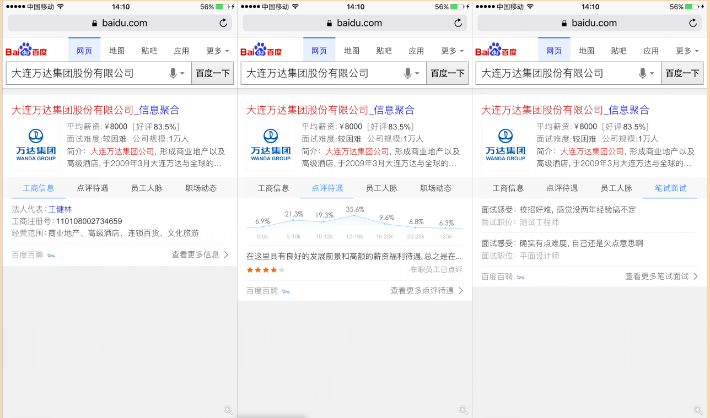
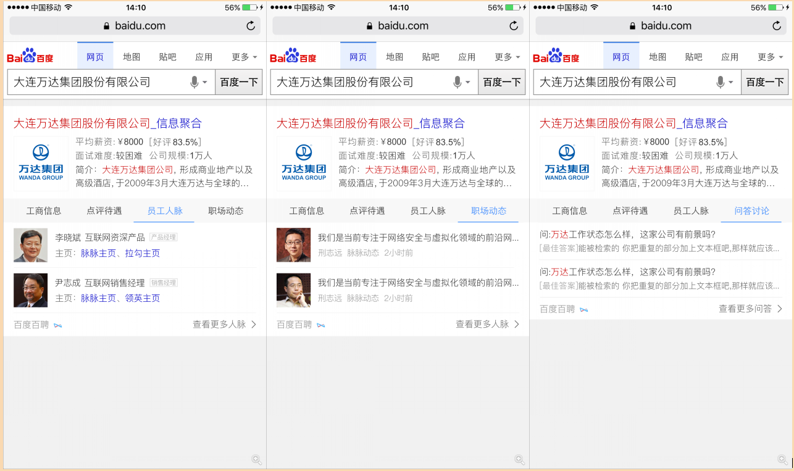

# 刘玲玲

> 从2016-10-17到 2016-10-21

### 本周进展如下： 

###  阿拉丁卡片部分
* 1、优质文章新需求 （周一10.17上线） 
*    效果图： 
*    
* 2、招聘公司名大卡，（开发完成、带测试）
*    模板名： zhp_firm_name
*    测试地址：http://cp01-aladdin-product-06.epc.baidu.com:8003/s?word=%E6%AD%A6%E6%B1%89%E7%9B%88%E7%A7%91%E4%B8%96%E7%BA%AA%E5%95%86%E8%B4%B8%E6%9C%89%E9%99%90%E5%85%AC%E5%8F%B8
*    效果图：
*     
* 3、老模板栅格化
*   wise_shixin (开发中)
*   wise_subway
*   trainnumber

### 招聘中间页部分 （冯斐帆完成）

* 工作内容及进展	招聘中间页问答讨论部分开发
* 一、feed流添加招聘宣讲会入口
* 背景：上周和手百协商后，计划再feed流添加招聘中间页的入口，但是由于手百有返回按钮，所以需要针对from=feed的连接进行兼容处理，具体兼容的内容是隐藏返回按钮。
* 完成情况：中间页已经完成上线，具体入口接入下周进行接入。
* 收益：增加流量入口，具体收益待观察后给出。
* 二、和领英对接公司人脉和动态八卦部分的接口细节
* 背景：目前已经接入的数据是来自脉脉的数据，上周初步和领英的技术进行了对接。这周主要是正对数据接口细节部分进行了讨论。
* 完成情况：前端和领英进行了数据对接，但是存在权限问题，需要后端介入（起初是不需要后端的）
* 收益：预计会增加中间页公司推荐部分5%的pv
* 三、aladin卡片飘红问题修复
* 背景：发现用户误输入特殊字符例如.?等等，在招聘aladin发送异步请求时，返回的结果中会存在飘红问题。
* 模板名：
* zhaopin_jobglb_allzhiwei
* wz_zhaopinexactnew
* zhaopin_addressglb_allzhiwei
* wz_jianzhiexact
* zhaopin_firmglb_all
* 完成情况：之前做的卡片中自定义的飘红函数就存在问题，已经修复，下班前上线完成（今天10.21上线）。
* 收益：确保aladin兼容性更好。

